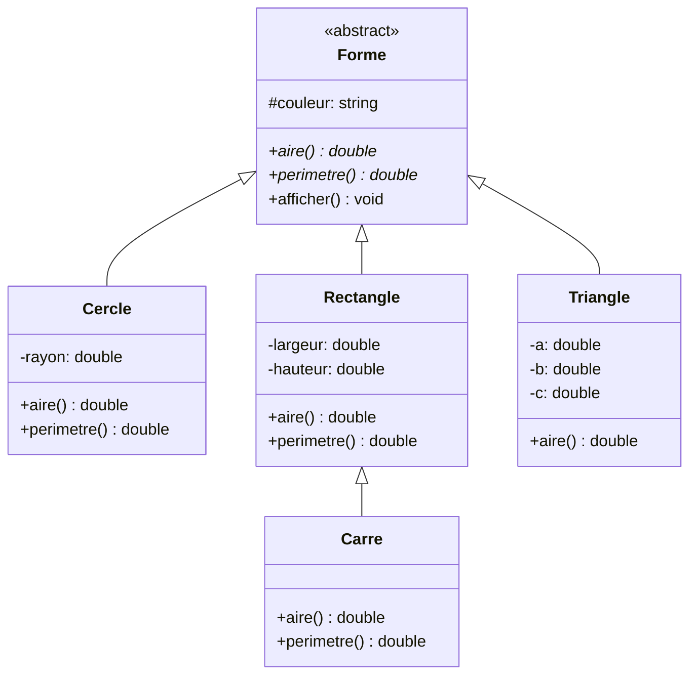
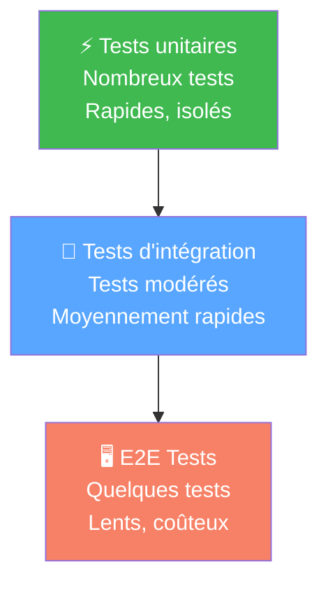

<!-- _class: title -->

# Formation C++ 🚀
## Jour 1 — Fondamentaux du Langage

*C++, Programmation Objet · 5 jours · Niveau débutant–intermédiaire*

---

<!-- _class: toc -->

# 📋 Sommaire — Jour 1

<ol>
  <li>Rappel sur le fonctionnement du C++</li>
  <li>Évolutions des standards</li>
  <li>Tableaux, chaînes et données</li>
  <li>Entrées / Sorties et fichiers</li>
  <li>Programmation orientée objet</li>
  <li>Héritage et polymorphisme</li>
  <li>Abstraction et interfaces</li>
  <li>Testing et optimisation — intro</li>
</ol>

---

<!-- _class: section -->

# 01 · Rappel sur le fonctionnement du C++

Historique, outils, structure d'un programme

---

# 🕰️ Historique du C++

- **1979** : Bjarne Stroustrup commence "C with Classes" chez Bell Labs
- **1983** : Le langage est renommé C++
- **1998** : Premier standard ISO (C++98)
- **2003** : Correction de bugs (C++03)
- **2011** : Révolution majeure avec C++11
- **2014, 2017, 2020, 2023** : Évolutions régulières

> C++ est l'un des langages les plus utilisés au monde, notamment pour les systèmes embarqués, les jeux vidéo et les applications haute performance

---

<!-- _class: table-annotated -->

# 📅 Évolutions des standards C++

| Standard | Année | Apports majeurs |
|---|---|---|
| C++98 | 1998 | Premier standard, STL, templates |
| C++03 | 2003 | Corrections de C++98 |
| C++11 | 2011 | `auto`, lambdas, `nullptr`, threads, smart pointers |
| C++14 | 2014 | Améliorations C++11, `make_unique` |
| C++17 | 2017 | `if constexpr`, structured bindings, `std::optional` |
| C++20 | 2020 | Concepts, coroutines, modules, ranges |
| C++23 | 2023 | `std::print`, `std::expected`, améliorations ranges |

<div class="table-note">
  💡 Cette formation couvre essentiellement C++11/14/17, standards les plus utilisés en production.
</div>

---

<!-- _class: cols-2 -->

# ⚡ C++11 — Révolution du langage

<div class="columns">
<div>

## 🆕 Nouveaux types
- **`auto`** : déduction de type automatique
- **`nullptr`** : pointeur nul typé
- **`enum class`** : énumérations fortement typées
- **`constexpr`** : évaluation à la compilation

</div>
<div>

## 🛠️ Nouvelles fonctionnalités
- **Lambdas** : fonctions anonymes inline
- **Move semantics** : optimisation des copies
- **Smart pointers** : `unique_ptr`, `shared_ptr`
- **Range-based for** : `for(auto& x : v)`

</div>
</div>

---

<!-- _class: cards -->

# 🛠️ Outils de développement C++

<div class="card-grid">
<div class="card">

### 🔨 Compilateurs
g++ (GCC), clang++, MSVC (Windows). Recommandé : g++ 12+ ou clang++ 15+

</div>
<div class="card">

### 🖥️ IDEs
Visual Studio Code + extensions C++, CLion (JetBrains), Visual Studio (Windows)

</div>
<div class="card">

### 📦 Build systems
CMake (standard), Make, Ninja, Meson. CMake recommandé pour les projets multi-plateformes

</div>
<div class="card">

### 🧪 Outils qualité
Valgrind (mémoire), AddressSanitizer, clang-tidy (linting), cppcheck (analyse statique)

</div>
</div>

---

<!-- _class: list-steps -->

# ⚙️ Installation de l'environnement

1. **Installer g++** : `sudo apt install g++` (Linux) ou MinGW (Windows)
2. **Vérifier l'installation** : `g++ --version` → version ≥ 12
3. **Installer CMake** : `sudo apt install cmake` ou cmake.org
4. **Installer VS Code** : code.visualstudio.com + extension C/C++
5. **Tester la compilation** : créer un `main.cpp` et compiler avec `g++ -std=c++17`
6. **Configurer le débogueur** : GDB (Linux/Mac) ou MSVC debugger (Windows)

---

# 🏗️ Structure d'un programme C++

```cpp
// Directives de préprocesseur
#include <iostream>   // bibliothèque standard I/O
#include <string>     // bibliothèque des chaînes

// Espace de noms
using namespace std;

// Déclaration de fonction (prototype)
int addition(int a, int b);

// Point d'entrée du programme
int main() {
    int resultat = addition(3, 5);
    cout << "Résultat : " << resultat << endl;
    return 0;  // 0 = succès
}

// Définition de la fonction
int addition(int a, int b) {
    return a + b;
}
```

---

# 👋 Premier programme — Hello World

```cpp
#include <iostream>

int main() {
    // Affichage sur la sortie standard
    std::cout << "Hello, World!" << std::endl;

    // Avec using namespace std
    using namespace std;
    cout << "Bonjour le monde !" << endl;

    // Avec '\n' (plus performant que endl)
    cout << "C++ est fantastique !\n";

    return 0;
}
```

Compilation et exécution :
```bash
g++ -std=c++17 -o hello main.cpp
./hello
```

---

# 🏷️ Directives de préprocesseur

```cpp
// Inclusion de fichiers d'en-tête
#include <iostream>       // bibliothèque système
#include "monFichier.h"   // fichier local

// Définition de macros
#define PI 3.14159
#define MAX(a, b) ((a) > (b) ? (a) : (b))

// Compilation conditionnelle
#ifdef DEBUG
    std::cout << "Mode debug activé\n";
#endif

// Garde d'inclusion (header guard)
#ifndef MON_HEADER_H
#define MON_HEADER_H
// contenu du header
#endif
```

---

<!-- _class: table-dense -->

# 📊 Types de données fondamentaux

| Type | Taille | Plage de valeurs | Exemple |
|---|---|---|---|
| `bool` | 1 octet | `true` / `false` | `bool actif = true;` |
| `char` | 1 octet | -128 à 127 | `char c = 'A';` |
| `int` | 4 octets | -2.1M à 2.1M | `int n = 42;` |
| `long long` | 8 octets | ±9.2×10¹⁸ | `long long big = 1e18;` |
| `float` | 4 octets | ~7 décimales | `float f = 3.14f;` |
| `double` | 8 octets | ~15 décimales | `double d = 3.14;` |
| `unsigned int` | 4 octets | 0 à 4.3M | `unsigned u = 100u;` |
| `size_t` | 8 octets | 0 à ~1.8×10¹⁹ | `size_t sz = v.size();` |

---

# 📌 Variables, constantes et auto

```cpp
// Déclaration et initialisation
int age = 25;
double prix = 9.99;
bool estActif = true;

// Constantes
const double PI = 3.14159265;
constexpr int MAX_SIZE = 100;  // évalué à la compilation

// Déduction de type automatique (C++11)
auto compteur = 0;       // int
auto moyenne = 3.14;     // double
auto message = "Hello";  // const char*

// Initialisation uniforme (C++11)
int x{42};
double y{3.14};
std::string s{"Bonjour"};
```

---

# ➕ Opérateurs arithmétiques et logiques

```cpp
int a = 10, b = 3;

// Arithmétiques
int somme = a + b;    // 13
int diff  = a - b;    // 7
int prod  = a * b;    // 30
int quot  = a / b;    // 3 (division entière)
int reste = a % b;    // 1 (modulo)

// Comparaison
bool egal = (a == b); // false
bool diff2 = (a != b); // true
bool sup   = (a > b);  // true

// Logiques
bool et  = (a > 0 && b > 0);  // true
bool ou  = (a > 20 || b > 0); // true
bool non = !(a == b);          // true
```

---

# 🔀 Structures de contrôle — if/else

```cpp
int temperature = 25;

// if / else if / else
if (temperature < 0) {
    std::cout << "Il gèle !\n";
} else if (temperature < 15) {
    std::cout << "Il fait frais\n";
} else if (temperature < 30) {
    std::cout << "Température agréable\n";
} else {
    std::cout << "Il fait chaud !\n";
}

// Opérateur ternaire
std::string statut = (temperature > 20) ? "chaud" : "frais";

// if avec initialisation (C++17)
if (int val = calculer(); val > 0) {
    std::cout << "Positif : " << val << "\n";
}
```

---

# 🔄 Switch / Case

```cpp
int jour = 3;

switch (jour) {
    case 1: std::cout << "Lundi\n";    break;
    case 2: std::cout << "Mardi\n";    break;
    case 3: std::cout << "Mercredi\n"; break;
    case 4: std::cout << "Jeudi\n";    break;
    case 5: std::cout << "Vendredi\n"; break;
    case 6:
    case 7: std::cout << "Week-end\n"; break;
    default: std::cout << "Invalide\n"; break;
}

// Switch avec enum class (C++11)
enum class Couleur { Rouge, Vert, Bleu };
Couleur c = Couleur::Vert;
switch (c) {
    case Couleur::Rouge: /* ... */ break;
    case Couleur::Vert:  /* ... */ break;
    case Couleur::Bleu:  /* ... */ break;
}
```

---

# 🔁 Boucle for — les 3 formes

```cpp
// Boucle for classique
for (int i = 0; i < 5; i++) {
    std::cout << i << " ";
}
// Affiche : 0 1 2 3 4

// Range-based for (C++11) — la plus moderne
std::vector<int> nombres = {10, 20, 30, 40, 50};
for (const auto& n : nombres) {
    std::cout << n << " ";
}

// For avec index et élément (C++20)
for (auto [i, n] : std::views::enumerate(nombres)) {
    std::cout << i << ":" << n << " ";
}

// Boucle infinie avec break
for (;;) {
    if (condition) break;
}
```

---

# 🔁 while et do-while

```cpp
// while — condition testée AVANT
int compteur = 0;
while (compteur < 5) {
    std::cout << compteur << " ";
    compteur++;
}

// do-while — condition testée APRÈS (exécution garantie ≥ 1 fois)
int saisie;
do {
    std::cout << "Entrez un nombre positif : ";
    std::cin >> saisie;
} while (saisie <= 0);

// Contrôle de boucle
for (int i = 0; i < 10; i++) {
    if (i == 3) continue;  // saute i=3
    if (i == 7) break;     // arrête à i=7
    std::cout << i << " ";
}
```

---

# 🔧 Fonctions — déclaration et définition

```cpp
// Prototype (déclaration)
double calculerAire(double rayon);
int max(int a, int b);

// Définition
double calculerAire(double rayon) {
    const double PI = 3.14159;
    return PI * rayon * rayon;
}

// Paramètres avec valeurs par défaut
void afficher(std::string msg, bool majuscules = false) {
    if (majuscules) /* convertir */;
    std::cout << msg << "\n";
}

// Passage par référence (modifie l'original)
void doubler(int& valeur) {
    valeur *= 2;
}

// Passage par référence constante (lecture seule)
void afficherNom(const std::string& nom) {
    std::cout << nom << "\n";
}
```

---

# 🔄 Surcharge de fonctions

```cpp
// Même nom, signatures différentes
int additionner(int a, int b) {
    return a + b;
}

double additionner(double a, double b) {
    return a + b;
}

std::string additionner(std::string a, std::string b) {
    return a + b;
}

// Le compilateur choisit automatiquement selon les types
int main() {
    auto r1 = additionner(1, 2);         // → int
    auto r2 = additionner(1.5, 2.5);     // → double
    auto r3 = additionner("Hello ", "!"); // → string
}
```

---

# 📦 Espaces de noms (Namespaces)

```cpp
// Définition d'un namespace
namespace Geometrie {
    const double PI = 3.14159;
    double aire(double r) { return PI * r * r; }
    double perimetre(double r) { return 2 * PI * r; }
}

namespace Physique {
    const double PI = 3.14159;  // pas de conflit !
    double energie(double m, double c) { return m * c * c; }
}

int main() {
    // Accès avec le scope operator ::
    double a = Geometrie::aire(5.0);
    double e = Physique::energie(10, 3e8);

    // using namespace (déconseillé en global)
    using namespace Geometrie;
    double p = perimetre(3.0);
}
```

---

<!-- _class: list-steps -->

# 🔨 Compilation avec g++

1. **Compilation simple** : `g++ main.cpp -o monProgramme`
2. **Standard C++17** : `g++ -std=c++17 main.cpp -o prog`
3. **Mode debug** : `g++ -g -DDEBUG -o prog main.cpp`
4. **Optimisation** : `g++ -O2 -std=c++17 -o prog main.cpp`
5. **Plusieurs fichiers** : `g++ -std=c++17 *.cpp -o prog`
6. **Avec warnings** : `g++ -Wall -Wextra -std=c++17 -o prog main.cpp`

---

# 🧪 TP 1 — Installation et configuration

**Objectif** : Mettre en place l'environnement de développement

- Installer g++, cmake, vscode + extension C/C++
- Créer un projet `hello_cpp` avec `main.cpp`
- Compiler avec `g++ -std=c++17 -Wall -o hello main.cpp`
- Configurer un `CMakeLists.txt` minimal
- Tester le débogueur : breakpoint sur `main()`

**CMakeLists.txt minimal :**
```cmake
cmake_minimum_required(VERSION 3.16)
project(HelloCpp)
set(CMAKE_CXX_STANDARD 17)
add_executable(hello main.cpp)
```

---

# 🧪 TP 1 — Exercices de syntaxe

**Exercice A** : Calculatrice basique
- Déclarer des fonctions `add`, `sub`, `mul`, `div`
- Lire deux nombres et une opération depuis `cin`
- Afficher le résultat

**Exercice B** : FizzBuzz
- Afficher les nombres de 1 à 100
- Multiples de 3 → "Fizz", multiples de 5 → "Buzz", les deux → "FizzBuzz"

**Exercice C** : Suite de Fibonacci
- Calculer les 20 premiers termes
- Stocker dans un tableau d'entiers
- Afficher les valeurs impaires seulement

---

# 🧪 TP 1 — Contrôle de flux avancé

**Exercice D** : Mini-menu interactif
```cpp
// Afficher un menu avec switch
// 1. Calculer l'aire d'un cercle
// 2. Calculer l'hypoténuse
// 3. Quitter
// Boucler jusqu'à choix = 3
```

**Exercice E** : Recherche de palindrome
- Lire une chaîne de caractères
- Vérifier si elle est un palindrome
- Ignorer la casse et les espaces

**Conseil** : Utiliser `std::string` et des boucles pour parcourir les caractères

---

<!-- _class: section -->

# 02 · Tableaux, Chaînes et Gestion des Données

Stockage et manipulation de collections de données

---

# 📐 Tableaux statiques

```cpp
// Déclaration et initialisation
int scores[5] = {90, 85, 72, 98, 60};
double prix[3] = {1.5, 2.0, 3.5};

// Tableau initialisé à zéro
int compteurs[10] = {};  // tous à 0

// Accès aux éléments (index commence à 0)
scores[0] = 95;           // modification
int max = scores[4];      // lecture

// Taille d'un tableau C
int taille = sizeof(scores) / sizeof(scores[0]);  // 5

// Parcours avec for classique
for (int i = 0; i < 5; i++) {
    std::cout << scores[i] << " ";
}
```

---

# 🟦 Tableaux multidimensionnels

```cpp
// Matrice 3×3
int matrice[3][3] = {
    {1, 2, 3},
    {4, 5, 6},
    {7, 8, 9}
};

// Accès
matrice[1][2] = 10;  // ligne 1, colonne 2

// Parcours avec boucles imbriquées
for (int i = 0; i < 3; i++) {
    for (int j = 0; j < 3; j++) {
        std::cout << matrice[i][j] << "\t";
    }
    std::cout << "\n";
}

// Passage à une fonction
void afficher(int m[][3], int lignes);
```

---

# 🧮 Tableaux dynamiques (pointeurs)

```cpp
// Allocation dynamique avec new
int taille;
std::cin >> taille;
int* tableau = new int[taille];

// Remplissage
for (int i = 0; i < taille; i++) {
    tableau[i] = i * 2;
}

// Libération de la mémoire (obligatoire !)
delete[] tableau;
tableau = nullptr;  // bonne pratique

// ⚠️ Risque de fuite mémoire si oubli du delete[]
// → Préférer std::vector en C++ moderne
```

---

# 📦 std::array — tableau sécurisé

```cpp
#include <array>

// std::array<type, taille> — taille fixe à la compilation
std::array<int, 5> notes = {18, 15, 12, 19, 16};

// Taille connue
std::cout << notes.size();   // 5

// Accès sécurisé (lancée une exception si hors bornes)
notes.at(2) = 14;            // sécurisé
notes[2] = 14;               // non sécurisé

// Range-based for
for (const auto& n : notes) {
    std::cout << n << " ";
}

// Fonctions utiles
notes.fill(0);               // tout à 0
auto it = std::find(notes.begin(), notes.end(), 19);
```

---

# 🔤 Chaînes C (C-style strings)

```cpp
#include <cstring>

// Chaîne C = tableau de char terminé par '\0'
char prenom[20] = "Alice";
char nom[] = "Dupont";  // taille automatique

// Longueur (sans le '\0')
int len = strlen(prenom);  // 5

// Copie
char copie[20];
strcpy(copie, prenom);

// Concaténation
char complet[40];
strcpy(complet, prenom);
strcat(complet, " ");
strcat(complet, nom);

// ⚠️ Risque de buffer overflow !
// → Préférer std::string en C++ moderne
```

---

# 📝 std::string — chaîne C++

```cpp
#include <string>

std::string prenom = "Alice";
std::string nom = "Dupont";

// Concaténation
std::string nom_complet = prenom + " " + nom;

// Longueur
size_t len = nom_complet.length();  // ou .size()

// Accès aux caractères
char c = nom_complet[0];       // 'A'
char c2 = nom_complet.at(1);   // 'l' (sécurisé)

// Sous-chaîne : substr(position, longueur)
std::string sub = nom_complet.substr(0, 5);  // "Alice"

// Recherche
size_t pos = nom_complet.find("Dupont");
bool found = (pos != std::string::npos);
```

---

<!-- _class: list-cols -->

# 🛠️ Méthodes essentielles de std::string

- **`length()` / `size()`** : taille de la chaîne
- **`empty()`** : vérifie si vide
- **`clear()`** : vide la chaîne
- **`append(s)`** : ajoute en fin
- **`insert(pos, s)`** : insère à pos
- **`erase(pos, n)`** : supprime n chars
- **`replace(pos, n, s)`** : remplace n chars
- **`find(s)`** : cherche, retourne pos
- **`rfind(s)`** : cherche à rebours
- **`substr(pos, n)`** : sous-chaîne
- **`compare(s)`** : comparaison lexicale
- **`at(i)`** : accès sécurisé
- **`front()` / `back()`** : 1er / dernier char
- **`c_str()`** : conversion en char*

---

# 🔄 Opérations avancées sur std::string

```cpp
#include <string>
#include <algorithm>

std::string texte = "  Bonjour le Monde  ";

// Conversion majuscules/minuscules
std::transform(texte.begin(), texte.end(),
               texte.begin(), ::toupper);

// Suppression des espaces (trim)
texte.erase(0, texte.find_first_not_of(' '));
texte.erase(texte.find_last_not_of(' ') + 1);

// Remplacement global
size_t pos;
while ((pos = texte.find("O")) != std::string::npos)
    texte.replace(pos, 1, "0");

// Conversion string ↔ nombre (C++11)
int n = std::stoi("42");
double d = std::stod("3.14");
std::string s = std::to_string(123);
```

---

# 📤 Entrées/Sorties standard

```cpp
#include <iostream>
#include <string>

// Sortie avec cout
std::cout << "Valeur : " << 42 << "\n";
std::cout << "Pi = " << 3.14159 << std::endl;  // flush

// Entrée avec cin
int age;
std::cout << "Entrez votre âge : ";
std::cin >> age;

// Lecture d'une ligne complète
std::string ligne;
std::cin.ignore();          // ignore le '\n' résiduel
std::getline(std::cin, ligne);

// Entrée avec vérification
if (!(std::cin >> age)) {
    std::cerr << "Erreur de saisie !\n";
    std::cin.clear();
}
```

---

# 🖨️ Formatage avec iomanip

```cpp
#include <iomanip>

double prix = 12.5;
int quantite = 7;

// Largeur et alignement
std::cout << std::setw(10) << std::left << "Produit";
std::cout << std::setw(8) << std::right << "Prix" << "\n";

// Précision décimale
std::cout << std::fixed << std::setprecision(2);
std::cout << prix << "\n";  // 12.50

// Remplissage
std::cout << std::setfill('0') << std::setw(6) << 42;
// Affiche : 000042

// Hexadécimal / Octal
std::cout << std::hex << 255;  // ff
std::cout << std::oct << 255;  // 377
std::cout << std::dec << 255;  // 255 (retour décimal)
```

---

# 📂 Fichiers — ouverture et fermeture

```cpp
#include <fstream>
#include <iostream>

// Écriture dans un fichier
std::ofstream fichierEcriture("data.txt");
if (!fichierEcriture.is_open()) {
    std::cerr << "Impossible d'ouvrir le fichier\n";
    return 1;
}
fichierEcriture << "Ligne 1\n";
fichierEcriture << "Ligne 2\n";
fichierEcriture.close();

// Lecture d'un fichier
std::ifstream fichierLecture("data.txt");
if (fichierLecture.is_open()) {
    std::string ligne;
    while (std::getline(fichierLecture, ligne)) {
        std::cout << ligne << "\n";
    }
    fichierLecture.close();
}
```

---

# 📖 Lecture de fichier — modes avancés

```cpp
#include <fstream>
#include <sstream>

// Lecture d'un fichier CSV
std::ifstream csv("donnees.csv");
std::string ligne;
while (std::getline(csv, ligne)) {
    std::stringstream ss(ligne);
    std::string token;
    while (std::getline(ss, token, ',')) {
        std::cout << token << " | ";
    }
    std::cout << "\n";
}

// Mode binaire
std::ifstream binaire("image.bin", std::ios::binary);
std::vector<char> buffer(
    (std::istreambuf_iterator<char>(binaire)),
    std::istreambuf_iterator<char>()
);
```

---

# 📝 Écriture dans un fichier

```cpp
#include <fstream>

// Mode ajout (append)
std::ofstream log("app.log", std::ios::app);
log << "[2024-01-15] Démarrage de l'application\n";

// Mode écriture + lecture
std::fstream fichier("data.bin", 
                     std::ios::in | std::ios::out | 
                     std::ios::binary);

// Positionnement dans le fichier
fichier.seekg(0, std::ios::beg);  // début pour lecture
fichier.seekp(0, std::ios::end);  // fin pour écriture

// Taille du fichier
fichier.seekg(0, std::ios::end);
std::streamsize taille = fichier.tellg();

// Toujours fermer (ou utiliser RAII)
fichier.close();
```

---

# 🏗️ Structures (struct)

```cpp
// Définition d'une structure
struct Etudiant {
    std::string nom;
    int age;
    double moyenne;
    bool actif;
};

// Utilisation
Etudiant e1 = {"Alice", 20, 16.5, true};
Etudiant e2;
e2.nom = "Bob";
e2.age = 22;

// Tableau de structures
Etudiant promo[30];

// Structure imbriquée
struct Adresse { std::string ville; int codePostal; };
struct Personne {
    std::string nom;
    Adresse adresse;
};
Personne p;
p.adresse.ville = "Paris";
```

---

# 🏷️ enum et enum class

```cpp
// enum classique (C)
enum Couleur { ROUGE, VERT, BLEU };
Couleur c = ROUGE;  // risque de conflit de noms

// enum class (C++11) — fortement typé, recommandé
enum class Direction {
    Nord, Sud, Est, Ouest
};
Direction d = Direction::Nord;

// enum class avec valeurs explicites
enum class CodeHTTP : int {
    OK         = 200,
    Created    = 201,
    NotFound   = 404,
    ServerError= 500
};

CodeHTTP code = CodeHTTP::OK;
int valeur = static_cast<int>(code);  // 200
```

---

# 🧪 TP 2 — Manipulation de données

**Exercice A** : Gestion d'une liste de notes
- Déclarer un `std::array<double, 10>` de notes
- Calculer la moyenne, le min et le max
- Trier les notes par ordre croissant (`std::sort`)

**Exercice B** : Traitement de texte
- Lire un fichier texte ligne par ligne
- Compter les mots, les lignes et les caractères
- Afficher les 5 mots les plus fréquents

**Exercice C** : Annuaire
- Créer une `struct Contact` (nom, prénom, tel, email)
- Saisir 5 contacts depuis `cin`
- Les sauvegarder dans un fichier CSV

---

# 🧪 TP 2 — Structures de données avancées

**Exercice D** : Matrice d'opérations
- Créer une matrice 4×4 d'entiers aléatoires (`rand()`)
- Calculer la transposée
- Calculer la somme de chaque ligne et colonne

**Exercice E** : Gestion d'un inventaire
```cpp
struct Produit {
    std::string reference;
    std::string nom;
    int quantite;
    double prix;
};
```
- Créer un tableau de 10 `Produit`
- Rechercher par référence
- Afficher les produits en rupture de stock (`quantite == 0`)

---

<!-- _class: section -->

# 03 · Programmation Orientée Objet

Classes, encapsulation, héritage et polymorphisme

---

<!-- _class: cards -->

# 🧱 Les 4 piliers de la POO

<div class="card-grid">
<div class="card">

### 🔒 Encapsulation
Regrouper données et méthodes. Protéger l'état interne via les modificateurs d'accès.

</div>
<div class="card">

### 🎭 Abstraction
Exposer uniquement les détails nécessaires. Masquer la complexité interne.

</div>
<div class="card">

### 👨‍👧 Héritage
Réutiliser et étendre des classes existantes. Relation "est-un" entre classes.

</div>
<div class="card">

### 🔄 Polymorphisme
Un objet peut prendre plusieurs formes. Appels dynamiques via fonctions virtuelles.

</div>
</div>

---

<!-- _class: cols-2 -->

# 🏛️ Classe vs Struct en C++

<div class="columns">
<div>

## 📦 `struct`
- Membres **publics par défaut**
- Héritage public par défaut
- Idéal pour les **données simples**
- Compatible avec C
- Exemple : `Point{x, y}`, `Date{j, m, a}`

</div>
<div>

## 🔐 `class`
- Membres **privés par défaut**
- Héritage privé par défaut
- Idéal pour les **objets complexes**
- Encapsulation complète
- Exemple : `BankAccount`, `FileReader`

</div>
</div>

> En pratique : utiliser **`struct`** pour les agrégats de données, **`class`** pour les objets avec comportement

---

# 📋 Déclaration d'une classe C++

```cpp
class Voiture {
private:
    // Attributs (données membres)
    std::string marque;
    int annee;
    double vitesse;
    bool enMarche;

public:
    // Constructeurs
    Voiture(std::string m, int a);

    // Méthodes (comportements)
    void demarrer();
    void arreter();
    void accelerer(double delta);

    // Getters / Setters
    std::string getMarque() const;
    int getAnnee() const;
    double getVitesse() const;
};
```

---

# 🔒 Encapsulation — modificateurs d'accès

```cpp
class CompteBancaire {
private:
    // Inaccessible depuis l'extérieur
    double solde;
    std::string numeroCarte;

protected:
    // Accessible par les classes dérivées
    std::string titulaire;

public:
    // Interface publique
    CompteBancaire(std::string t, double s) 
        : titulaire(t), solde(s) {}

    bool deposer(double montant) {
        if (montant <= 0) return false;
        solde += montant;
        return true;
    }

    double getSolde() const { return solde; }
};
```

---

# 🔑 Getters et Setters

```cpp
class Temperature {
private:
    double celsius;

public:
    // Getter — lecture seule
    double getCelsius() const { return celsius; }
    double getFahrenheit() const { return celsius * 9.0/5.0 + 32; }
    double getKelvin() const { return celsius + 273.15; }

    // Setter — avec validation
    void setCelsius(double val) {
        if (val < -273.15) {
            throw std::invalid_argument("Température invalide");
        }
        celsius = val;
    }

    Temperature(double c = 0.0) : celsius(c) {}
};
```

---

# 🏗️ Constructeur par défaut

```cpp
class Point {
private:
    double x, y;

public:
    // Constructeur par défaut
    Point() : x(0.0), y(0.0) {
        std::cout << "Point créé à l'origine\n";
    }

    // Ou avec valeurs par défaut dans la signature
    // Point(double x = 0.0, double y = 0.0)
    //     : x(x), y(y) {}

    void afficher() const {
        std::cout << "(" << x << ", " << y << ")\n";
    }
};

Point p;          // Utilise le constructeur par défaut
p.afficher();     // (0, 0)
```

---

# 🏗️ Constructeur paramétré et liste d'initialisation

```cpp
class Rectangle {
private:
    double largeur;
    double hauteur;
    std::string couleur;

public:
    // Liste d'initialisation (recommandée)
    Rectangle(double l, double h, std::string c = "blanc")
        : largeur(l), hauteur(h), couleur(std::move(c)) {
        // Corps du constructeur : validations
        if (largeur <= 0 || hauteur <= 0)
            throw std::invalid_argument("Dimensions invalides");
    }

    double getAire() const { return largeur * hauteur; }
    double getPerimetre() const { return 2 * (largeur + hauteur); }
};

Rectangle r(5.0, 3.0, "rouge");
std::cout << r.getAire() << "\n";  // 15
```

---

# 📋 Constructeur de copie

```cpp
class Tableau {
private:
    int* data;
    int taille;

public:
    Tableau(int n) : taille(n), data(new int[n]()) {}

    // Constructeur de copie (deep copy)
    Tableau(const Tableau& autre)
        : taille(autre.taille), data(new int[autre.taille]) {
        std::copy(autre.data, autre.data + taille, data);
    }

    // Opérateur d'affectation par copie
    Tableau& operator=(const Tableau& autre) {
        if (this != &autre) {
            delete[] data;
            taille = autre.taille;
            data = new int[taille];
            std::copy(autre.data, autre.data + taille, data);
        }
        return *this;
    }

    ~Tableau() { delete[] data; }
};
```

---

# 💥 Destructeur

```cpp
class GestionnaireFichier {
private:
    std::FILE* fichier;
    std::string nom;

public:
    GestionnaireFichier(const std::string& path)
        : nom(path) {
        fichier = std::fopen(path.c_str(), "r");
        if (!fichier)
            throw std::runtime_error("Impossible d'ouvrir : " + path);
        std::cout << "Fichier ouvert : " << nom << "\n";
    }

    // Destructeur — appelé automatiquement à la fin de vie
    ~GestionnaireFichier() {
        if (fichier) {
            std::fclose(fichier);
            std::cout << "Fichier fermé : " << nom << "\n";
        }
    }
    // Principe RAII : ressource liée à la durée de vie de l'objet
};
```

---

# 📊 Membres statiques

```cpp
class Compteur {
private:
    static int nombreInstances;  // partagé entre toutes les instances
    int id;

public:
    Compteur() : id(++nombreInstances) {
        std::cout << "Instance " << id << " créée\n";
    }

    ~Compteur() {
        --nombreInstances;
        std::cout << "Instance " << id << " détruite\n";
    }

    // Méthode statique : accessible sans instance
    static int getNombreInstances() {
        return nombreInstances;
    }
};

// Définition en dehors de la classe
int Compteur::nombreInstances = 0;

std::cout << Compteur::getNombreInstances();  // 0
```

---

# 🔒 Méthodes const

```cpp
class Vecteur2D {
private:
    double x, y;

public:
    Vecteur2D(double x, double y) : x(x), y(y) {}

    // Méthodes const — ne modifient pas l'objet
    double getX() const { return x; }
    double getY() const { return y; }
    double norme() const { return std::sqrt(x*x + y*y); }

    // Méthodes non-const — modifient l'objet
    void normaliser() {
        double n = norme();
        x /= n; y /= n;
    }

    // Affichage
    void afficher() const {
        std::cout << "(" << x << ", " << y << ")\n";
    }
};

const Vecteur2D v(3, 4);
// v.normaliser();  // ERREUR : méthode non-const sur objet const
std::cout << v.norme();  // OK : méthode const
```

---

# ➕ Surcharge d'opérateurs

```cpp
class Complexe {
public:
    double reel, imag;
    Complexe(double r = 0, double i = 0) : reel(r), imag(i) {}

    // Opérateur + (addition)
    Complexe operator+(const Complexe& autre) const {
        return {reel + autre.reel, imag + autre.imag};
    }

    // Opérateur == (comparaison)
    bool operator==(const Complexe& autre) const {
        return reel == autre.reel && imag == autre.imag;
    }

    // Opérateur << (affichage) — fonction amie
    friend std::ostream& operator<<(std::ostream& os,
                                    const Complexe& c) {
        os << c.reel << " + " << c.imag << "i";
        return os;
    }
};
```

---

# 👨‍👧 Héritage simple

```cpp
// Classe de base (parent)
class Animal {
protected:
    std::string nom;
    int age;

public:
    Animal(std::string n, int a) : nom(n), age(a) {}
    void manger() { std::cout << nom << " mange\n"; }
    void dormir() { std::cout << nom << " dort\n"; }

    // Méthode virtuelle pour le polymorphisme
    virtual void parler() {
        std::cout << nom << " fait un son\n";
    }
    virtual ~Animal() = default;
};

// Classe dérivée (enfant)
class Chien : public Animal {
public:
    Chien(std::string n, int a) : Animal(n, a) {}
    void parler() override {
        std::cout << nom << " dit : Woof!\n";
    }
    void rapporter() { std::cout << nom << " rapporte la balle\n"; }
};
```

---

<!-- _class: table-annotated -->

# 🔐 Types d'accès en héritage

| Accès base | `public` hérit. | `protected` hérit. | `private` hérit. |
|---|---|---|---|
| `public` | public | protected | private |
| `protected` | protected | protected | private |
| `private` | inaccessible | inaccessible | inaccessible |

<div class="table-note">
  💡 L'héritage <strong>public</strong> (le plus courant) préserve les relations d'accès. L'héritage <strong>protected</strong> est rare. L'héritage <strong>private</strong> signifie "implémenté en termes de" (composition cachée).
</div>

---

# 🏗️ Constructeurs et héritage

```cpp
class Vehicule {
protected:
    std::string marque;
    int annee;
public:
    Vehicule(std::string m, int a)
        : marque(std::move(m)), annee(a) {}
    virtual ~Vehicule() = default;
};

class Moto : public Vehicule {
private:
    int cylindree;
public:
    // Appel explicite du constructeur parent avec :
    Moto(std::string m, int a, int cc)
        : Vehicule(m, a), cylindree(cc) {}

    void afficher() const {
        std::cout << marque << " (" << annee
                  << ") - " << cylindree << "cc\n";
    }
};

Moto m("Yamaha", 2022, 600);
m.afficher();
```

---

# 🔄 virtual et override

```cpp
class Forme {
public:
    virtual double aire() const = 0;  // méthode virtuelle pure
    virtual double perimetre() const = 0;
    virtual void afficher() const {
        std::cout << "Forme : aire=" << aire() << "\n";
    }
    virtual ~Forme() = default;
};

class Cercle : public Forme {
    double rayon;
public:
    Cercle(double r) : rayon(r) {}
    double aire() const override {  // override signale l'intention
        return 3.14159 * rayon * rayon;
    }
    double perimetre() const override {
        return 2 * 3.14159 * rayon;
    }
};
```

---

# 🔄 Polymorphisme en action

```cpp
#include <vector>
#include <memory>

class Forme { /* ... */ };
class Cercle : public Forme { /* ... */ };
class Rectangle : public Forme { /* ... */ };
class Triangle : public Forme { /* ... */ };

int main() {
    // Polymorphisme via pointeurs/références
    std::vector<std::unique_ptr<Forme>> formes;
    formes.push_back(std::make_unique<Cercle>(5.0));
    formes.push_back(std::make_unique<Rectangle>(4.0, 3.0));
    formes.push_back(std::make_unique<Triangle>(3.0, 4.0, 5.0));

    // Appel polymorphe — la bonne méthode est appelée
    double total = 0;
    for (const auto& f : formes) {
        total += f->aire();      // dispatch dynamique
        f->afficher();
    }
    std::cout << "Aire totale : " << total << "\n";
}
```

---

# 🏛️ Classe abstraite et méthode pure

```cpp
// Classe abstraite : contient au moins une méthode virtuelle pure
class Figure {
protected:
    std::string couleur;

public:
    Figure(std::string c) : couleur(c) {}

    // Méthodes virtuelles pures (= 0)
    virtual double aire() const = 0;
    virtual void dessiner() const = 0;

    // Méthode concrète (partagée par tous)
    std::string getCouleur() const { return couleur; }

    virtual ~Figure() = default;
};

// IMPOSSIBLE : Figure f;  // Erreur ! classe abstraite
// POSSIBLE :
class Carre : public Figure {
    double cote;
public:
    Carre(double c, std::string col) : Figure(col), cote(c) {}
    double aire() const override { return cote * cote; }
    void dessiner() const override { /* ... */ }
};
```

---

# 🔌 Interface en C++

```cpp
// Interface = classe abstraite pure (sans données membres)
class Serialisable {
public:
    virtual std::string serialiser() const = 0;
    virtual void deserialiser(const std::string& data) = 0;
    virtual ~Serialisable() = default;
};

class Loggable {
public:
    virtual void log(const std::string& msg) const = 0;
    virtual ~Loggable() = default;
};

// Implémentation de plusieurs interfaces
class Utilisateur : public Serialisable, public Loggable {
    std::string nom;
public:
    std::string serialiser() const override {
        return "{\"nom\":\"" + nom + "\"}";
    }
    void deserialiser(const std::string& data) override { /* ... */ }
    void log(const std::string& msg) const override {
        std::cout << "[USER:" << nom << "] " << msg << "\n";
    }
};
```

---

<!-- _class: diagram -->

# 🏗️ Hiérarchie — Formes géométriques



---

# 🎭 RTTI — dynamic_cast

```cpp
#include <typeinfo>

class Animal { public: virtual ~Animal() = default; };
class Chien : public Animal {
public: void aboyer() { std::cout << "Woof!\n"; }
};
class Chat : public Animal {
public: void miauler() { std::cout << "Miaou!\n"; }
};

void parler(Animal* a) {
    // Tentative de cast dynamique
    if (Chien* d = dynamic_cast<Chien*>(a)) {
        d->aboyer();  // c'est un Chien
    } else if (Chat* c = dynamic_cast<Chat*>(a)) {
        c->miauler(); // c'est un Chat
    }

    // Vérification du type réel
    std::cout << typeid(*a).name() << "\n";
}
```

---

# 🧪 TP 3 — Création de classes simples

**Exercice A** : Classe `CompteBancaire`
- Attributs privés : `titulaire`, `solde`, `numeroCompte`
- Méthodes : `deposer()`, `retirer()` (avec vérification), `getsolde()`
- Constructeur avec validation du solde initial ≥ 0

**Exercice B** : Classe `Date`
- Attributs : `jour`, `mois`, `annee`
- Validation complète dans le setter
- Opérateur `<<` pour l'affichage
- Méthode `estBissextile()` const

**Exercice C** : Classe `Pile<int>` (stack)
- Utiliser un `std::array<int, 100>` en interne
- Méthodes : `push()`, `pop()`, `peek()`, `isEmpty()`, `size()`

---

# 🧪 TP 3 — Héritage et polymorphisme

**Exercice D** : Hiérarchie de véhicules
```
Vehicule (marque, vitesseMax, carburant)
├── Voiture (nbPortes, typeBoite)
│   ├── VoitureElectrique (autonomieKm)
│   └── VoitureHybride (modeHybride)
└── Moto (cylindree, typeMoto)
```
- Méthode virtuelle `descriptionTechnique()` dans chaque classe
- Stocker dans `vector<unique_ptr<Vehicule>>`
- Afficher toutes les descriptions

**Exercice E** : Système de formes
- Implémenter les classes du diagramme précédent
- Calculer l'aire totale d'une collection de formes
- Trier les formes par aire croissante

---

# 🧪 TP 3 — Cas d'usage avancés

**Exercice F** : Patron de conception simple — Singleton

```cpp
class Configuration {
private:
    static Configuration* instance;
    std::map<std::string, std::string> params;
    Configuration() {}  // constructeur privé

public:
    static Configuration* getInstance() {
        if (!instance) instance = new Configuration();
        return instance;
    }
    void set(const std::string& k, const std::string& v);
    std::string get(const std::string& k) const;
};
```

- Implémenter le Singleton thread-safe avec `std::once_flag`
- Charger la configuration depuis un fichier `.ini`

---

<!-- _class: section -->

# 04 · Testing et Optimisation

Tests unitaires, profiling et bonnes pratiques

---

<!-- _class: cards -->

# 🧪 Pourquoi tester son code ?

<div class="card-grid">
<div class="card">

### 🐛 Détection précoce
Trouver les bugs avant qu'ils n'atteignent la production. Coût 100× plus faible qu'en prod.

</div>
<div class="card">

### 🔄 Refactoring sûr
Modifier le code sans crainte de régressions. Les tests confirment que le comportement est préservé.

</div>
<div class="card">

### 📖 Documentation vivante
Les tests décrivent le comportement attendu. Ils servent de spécification exécutable.

</div>
<div class="card">

### ⚡ Confiance et vitesse
Déployer plus fréquemment avec confiance. Feedback immédiat sur les changements.

</div>
</div>

---

<!-- _class: diagram-legend -->

# 🏗️ Pyramide des tests

<div class="diag-wrap">



<div class="legend">

### 🎯 Répartition cible
- **70%** Tests unitaires
- **20%** Tests d'intégration
- **10%** Tests E2E

### ✅ Tests unitaires
- Testent une seule unité
- Isolés (pas de dépendances)
- Rapides (< 1ms)
- Nombreux (>1000)

</div>
</div>

---

# 🎯 Catch2 — installation et configuration

```cmake
# CMakeLists.txt avec Catch2
cmake_minimum_required(VERSION 3.16)
project(MonProjet)
set(CMAKE_CXX_STANDARD 17)

# Méthode 1 : FetchContent (automatique)
include(FetchContent)
FetchContent_Declare(
  Catch2
  GIT_REPOSITORY https://github.com/catchorg/Catch2.git
  GIT_TAG v3.4.0
)
FetchContent_MakeAvailable(Catch2)

add_executable(tests tests/test_calcul.cpp)
target_link_libraries(tests Catch2::Catch2WithMain)
```

---

# 🧪 Catch2 — Premier test

```cpp
#include <catch2/catch_test_macros.hpp>
#include "CompteBancaire.hpp"

TEST_CASE("Compte bancaire - dépôt", "[compte]") {

    // Arrangement
    CompteBancaire compte("Alice", 1000.0);

    SECTION("Dépôt valide augmente le solde") {
        compte.deposer(500.0);
        REQUIRE(compte.getSolde() == 1500.0);
    }

    SECTION("Dépôt négatif est refusé") {
        REQUIRE_FALSE(compte.deposer(-100.0));
        REQUIRE(compte.getSolde() == 1000.0);
    }

    SECTION("Dépôt de zéro est refusé") {
        REQUIRE_FALSE(compte.deposer(0));
    }
}
```

---

# 🧪 Catch2 — Matchers et assertions

```cpp
#include <catch2/matchers/catch_matchers_string.hpp>
#include <catch2/matchers/catch_matchers_vector.hpp>

TEST_CASE("Vérifications avec matchers", "[matchers]") {
    std::string msg = "Hello, World!";

    // Matchers sur chaînes
    REQUIRE_THAT(msg, Catch::Matchers::Contains("World"));
    REQUIRE_THAT(msg, Catch::Matchers::StartsWith("Hello"));
    REQUIRE_THAT(msg, Catch::Matchers::EndsWith("!"));

    // Matchers sur collections
    std::vector<int> v = {1, 2, 3, 4, 5};
    REQUIRE_THAT(v, Catch::Matchers::Contains(3));
    REQUIRE_THAT(v, Catch::Matchers::SizeIs(5));

    // Vérification d'exception
    REQUIRE_THROWS_AS(
        CompteBancaire("", -100), std::invalid_argument);
}
```

---

# 🧪 GoogleTest — introduction

```cmake
# CMakeLists.txt avec GoogleTest
include(FetchContent)
FetchContent_Declare(
  googletest
  GIT_REPOSITORY https://github.com/google/googletest.git
  GIT_TAG v1.14.0
)
FetchContent_MakeAvailable(googletest)

add_executable(tests_gtest tests/test_calcul.cpp)
target_link_libraries(tests_gtest GTest::gtest_main)
include(GoogleTest)
gtest_discover_tests(tests_gtest)
```

Exécution :
```bash
cmake --build . && ./tests_gtest --gtest_filter="*Compte*"
```

---

# 🧪 GoogleTest — Premier test

```cpp
#include <gtest/gtest.h>
#include "Calculatrice.hpp"

// Fixture de test (setup/teardown)
class CalculatriceTest : public ::testing::Test {
protected:
    Calculatrice calc;

    void SetUp() override {
        // Appelé avant chaque test
        calc = Calculatrice();
    }
    void TearDown() override {
        // Appelé après chaque test
    }
};

TEST_F(CalculatriceTest, AdditionEntiers) {
    EXPECT_EQ(calc.additionner(2, 3), 5);
    EXPECT_EQ(calc.additionner(-1, 1), 0);
    EXPECT_EQ(calc.additionner(0, 0), 0);
}

TEST_F(CalculatriceTest, DivisionParZero) {
    EXPECT_THROW(calc.diviser(10, 0), std::invalid_argument);
}
```

---

<!-- _class: list-tree -->

# 📁 Organisation des fichiers de tests

- **Structure recommandée**
  - `src/` — code source principal
  - `include/` — fichiers d'en-têtes
  - `tests/` — tous les tests
  - `CMakeLists.txt` — configuration build
- **tests/**
  - `test_compte_bancaire.cpp`
  - `test_calculatrice.cpp`
  - `test_vecteur2d.cpp`
  - `mocks/` — objets mock
- **Nommage des tests**
  - `ClasseTestée_MethodeTestée_ScénarioAttendu`
  - Exemple : `Compte_Deposer_MontantPositifAugmenteSolde`

---

<!-- _class: list-steps -->

# ⚡ Principes d'optimisation C++

1. **Mesurer d'abord** : identifier les goulots avec un profiler avant d'optimiser
2. **Algorithmes > micro-optimisations** : O(n log n) vs O(n²) fait la différence
3. **Cache-friendly** : accès mémoire séquentiels (préfère `vector` à `list`)
4. **Move semantics** : éviter les copies inutiles avec `std::move`
5. **Éviter les allocations** : réutiliser les buffers, préallouer avec `reserve()`
6. **Compiler avec `-O2`** : l'optimisateur fait beaucoup de travail automatiquement

---

# 🔍 Profiling avec gprof et perf

```bash
# Compilation avec profiling
g++ -pg -O2 -std=c++17 -o monProg main.cpp

# Exécution (génère gmon.out)
./monProg

# Analyse avec gprof
gprof monProg gmon.out > rapport.txt
cat rapport.txt
```

Avec perf (Linux) :
```bash
# Compilation debug symbols
g++ -g -O2 -std=c++17 -o monProg main.cpp

# Profiling avec perf
perf record ./monProg
perf report
```

---

# 🔍 Valgrind — détection des fuites mémoire

```bash
# Vérification des fuites mémoire
valgrind --leak-check=full ./monProg

# Sortie typique
# ==1234== HEAP SUMMARY:
# ==1234==   in use at exit: 40 bytes in 1 blocks
# ==1234==   total heap usage: 5 allocs, 4 frees, 72,784 bytes allocated
# ==1234==
# ==1234== 40 bytes in 1 blocks are definitely lost in loss record 1 of 1
# ==1234==    at 0x4C2FB0F: malloc (in /usr/lib/valgrind/...)
# ==1234==    by 0x10917B: main (main.cpp:8)

# Avec AddressSanitizer (plus rapide)
g++ -fsanitize=address -g -o monProg main.cpp
./monProg
```

---

<!-- _class: table-annotated -->

# 📊 Complexité algorithmique — Big O

| Complexité | Nom | Exemple C++ | n=1000 |
|---|---|---|---|
| O(1) | Constante | `vector::operator[]` | 1 op |
| O(log n) | Logarithmique | `map::find()` | ~10 op |
| O(n) | Linéaire | `vector::find()` | 1 000 op |
| O(n log n) | Linéarithmique | `std::sort()` | ~10 000 op |
| O(n²) | Quadratique | Tri par insertion | 1 000 000 op |
| O(2ⁿ) | Exponentielle | Fibonacci naïf | Trop lent ! |

<div class="table-note">
  ⚠️ Choisir la bonne structure de données est crucial : préférer <code>unordered_map</code> (O(1)) à <code>map</code> (O(log n)) pour les lookups fréquents.
</div>

---

# 🧪 TP 4 — Tests unitaires

**Exercice A** : Tester la classe `Date`
- Écrire 10 tests pour la classe `Date` (Catch2 ou GoogleTest)
- Couvrir : création valide, création invalide, bissextile, comparaison
- Objectif : 100% de couverture des branches

**Exercice B** : Tests paramétrés avec GoogleTest
```cpp
class AdditionTest : public ::testing::TestWithParam<
    std::tuple<int, int, int>> {};

TEST_P(AdditionTest, Addition) {
    auto [a, b, expected] = GetParam();
    EXPECT_EQ(additionner(a, b), expected);
}
INSTANTIATE_TEST_SUITE_P(Values, AdditionTest,
    ::testing::Values(
        std::make_tuple(1, 2, 3),
        std::make_tuple(-1, 1, 0)));
```

---

# 🧪 TP 4 — Optimisation et déploiement

**Exercice C** : Comparer les performances

| Structure | `push_back` | `find` | `sort` |
|---|---|---|---|
| `std::list<int>` | O(1) | O(n) | O(n log n) |
| `std::vector<int>` | O(1)* | O(n) | O(n log n) |
| `std::set<int>` | O(log n) | O(log n) | déjà trié |

- Mesurer avec `std::chrono::high_resolution_clock`
- Comparer `list` vs `vector` pour 1M d'insertions
- Profiler avec Valgrind pour détecter les fuites

**Exercice D** : CI/CD intro
- Créer un fichier `.github/workflows/build.yml`
- Compiler et exécuter les tests automatiquement à chaque push

---

<!-- _class: list-cols -->

# 📝 Synthèse — Jour 1

- **C++ moderne** : standards C++11/14/17 sont la norme en 2024
- **Compilation** : `g++ -std=c++17 -Wall -O2`
- **Types fondamentaux** : `int`, `double`, `bool`, `auto`
- **Tableaux** : préférer `std::array` aux tableaux C
- **Chaînes** : préférer `std::string` aux `char*`
- **Fichiers** : `ifstream`, `ofstream` avec RAII
- **Classes** : encapsulation, constructeurs, destructeur
- **Héritage** : `virtual`, `override`, `final`
- **Polymorphisme** : dispatch dynamique via `virtual`
- **Interfaces** : classes abstraites pures
- **Tests** : Catch2 ou GoogleTest, fixture de test
- **Profiling** : Valgrind, gprof, `perf`

---

# ❓ Questions — Ressources

**Pour aller plus loin :**

- 📖 *The C++ Programming Language* — Bjarne Stroustrup
- 📖 *Effective Modern C++* — Scott Meyers
- 🌐 cppreference.com — référence exhaustive
- 🌐 isocpp.org — actualités et guidelines

**Exercices supplémentaires :**

- Résoudre 3 problèmes sur LeetCode/Codeforces en C++
- Implémenter une liste chaînée générique
- Créer un mini-interpréteur d'expressions mathématiques

**Demain — Jour 2 :** Gestion de la mémoire approfondie, STL complète, Design Patterns

---

# 🔑 nullptr — le pointeur nul typé

```cpp
// Avant C++11 : NULL était un entier (0)
void f(int* p) { std::cout << "pointeur\n"; }
void f(int  n) { std::cout << "entier\n"; }

f(NULL);     // ❌ Ambiguïté : lequel appeler ?
f(nullptr);  // ✅ Sans ambiguïté : version pointeur

// nullptr est de type nullptr_t — jamais un entier
int* p = nullptr;
if (p == nullptr)   { /* pointeur nul */ }
if (p)              { /* non-nul (booléen implicite) */ }

// Avec templates
template<typename T>
void init(T* ptr) {
    if (ptr == nullptr)
        throw std::invalid_argument("Pointeur nul");
}
```

---

# 🧩 Initialisation uniforme — brace-init

```cpp
// Avant C++11 : syntaxes inconsistantes
int a = 5;
int b(5);
int arr[] = {1, 2, 3};
std::vector<int> v;  // puis push_back...

// C++11 : initialisation uniforme avec {}
int x{42};
double d{3.14};
std::string s{"Hello"};
std::vector<int> v{1, 2, 3, 4, 5};
std::map<std::string,int> m{{"a",1},{"b",2}};

// Avantage : détecte les narrowing conversions
int y{3.14};      // ERREUR de compilation ! (narrowing)
int z = 3.14;     // OK mais valeur tronquée (bug silencieux)

// Constructeur avec std::initializer_list
std::vector<int> v1(5);     // 5 éléments à 0
std::vector<int> v2{5};     // 1 élément : 5
```

---

# 🔢 Opérateurs de comparaison — C++20

```cpp
// C++20 : opérateur <=> (spaceship operator)
#include <compare>

class Version {
    int major, minor, patch;
public:
    Version(int maj, int min, int pat)
        : major(maj), minor(min), patch(pat) {}

    // Génère automatiquement <, <=, >, >=, ==, !=
    auto operator<=>(const Version& o) const = default;
};

Version v1{1, 2, 3};
Version v2{1, 3, 0};

if (v1 < v2)  std::cout << "v1 est plus ancienne\n";
if (v1 != v2) std::cout << "versions différentes\n";

// Sort automatiquement grâce à <=>
std::sort(versions.begin(), versions.end());
```

---

# 🌊 Range-based for — cas avancés

```cpp
#include <vector>
#include <map>

std::vector<int> v = {1, 2, 3, 4, 5};

// Modifier les éléments : utiliser auto&
for (auto& elem : v) elem *= 2;  // {2, 4, 6, 8, 10}

// Lecture seule : const auto&
for (const auto& elem : v) std::cout << elem;

// Avec index (C++20 enumerate)
#include <ranges>
for (auto [i, val] : std::views::enumerate(v)) {
    std::cout << i << ":" << val << " ";
}

// map : structured binding
std::map<std::string, int> scores{{"Alice",18},{"Bob",15}};
for (const auto& [nom, score] : scores) {
    std::cout << nom << " → " << score << "\n";
}
```

---

# 📦 constexpr — programmation à la compilation

```cpp
// constexpr : évalué à la compilation si possible
constexpr int TAILLE_MAX = 100;
constexpr double PI = 3.14159265358979;

// Fonction constexpr (C++11)
constexpr int factorielle(int n) {
    return n <= 1 ? 1 : n * factorielle(n-1);
}

constexpr int f5 = factorielle(5);  // calculé à la compilation !
static_assert(f5 == 120, "Erreur de calcul");

// constexpr if (C++17)
template<typename T>
void afficher(T val) {
    if constexpr (std::is_integral_v<T>)
        std::cout << "entier: " << val;
    else if constexpr (std::is_floating_point_v<T>)
        std::cout << "flottant: " << std::fixed << val;
    else
        std::cout << "autre: " << val;
}
```

---

# 📌 Attributs C++11/14/17

```cpp
// [[nodiscard]] : avertit si la valeur n'est pas utilisée
[[nodiscard]] int calculer() { return 42; }

calculer();         // Warning : résultat ignoré !
int r = calculer(); // OK

// [[deprecated]] : marquer du code obsolète
[[deprecated("Utiliser nouvelleFonction() à la place")]]
void ancienneFonction() {}

// [[maybe_unused]] : supprimer le warning "variable inutilisée"
void traitement([[maybe_unused]] int debug_id) {
    // debug_id utilisé seulement en mode DEBUG
}

// [[likely]] / [[unlikely]] (C++20)
if ([[likely]] condition_frequente) {
    // branche optimisée par le compilateur
}

// [[fallthrough]] dans switch
switch (val) {
    case 1:
        [[fallthrough]];  // intentionnel, pas un bug !
    case 2: traiter(); break;
}
```

---

# 🧵 std::string_view — référence légère vers une chaîne

```cpp
#include <string_view>

// string_view : vue non-possédante sur une chaîne
// Zéro copie, zéro allocation

void afficher(std::string_view sv) {
    // Accepte : std::string, const char*, literal
    std::cout << sv.substr(0, 5) << "\n";
}

afficher("Hello, World!");        // littéral C
afficher(std::string("Bonjour")); // std::string
afficher(std::string_view("Salut", 5)); // sous-chaîne

// Performances : évite les copies inutiles
void traiterNom(const std::string& nom);  // copie possible
void traiterNom(std::string_view nom);    // toujours zéro copie ✅

// Attention : string_view ne possède pas les données
// Ne pas stocker une string_view pointant vers un temporaire !
std::string_view dangereux = std::string("temp");  // ❌ dangling !
```

---

# 🗝️ Mot-clés modernes — résumé

| Mot-clé | C++ | Description |
|---|---|---|
| `auto` | C++11 | Déduction automatique de type |
| `nullptr` | C++11 | Pointeur nul typé |
| `constexpr` | C++11 | Évaluation à la compilation |
| `override` | C++11 | Signale la surcharge virtuelle |
| `final` | C++11 | Interdit l'héritage/surcharge |
| `noexcept` | C++11 | Garantit l'absence d'exception |
| `[[nodiscard]]` | C++17 | Valeur de retour obligatoire |
| `[[likely]]` | C++20 | Hint de branche au compilateur |
| `<=>`  | C++20 | Comparaison trois voies |
| `requires` | C++20 | Contraintes sur les templates |

---

# 🧪 Exercice bonus — Refactoring C++98 → C++17

**Convertir ce code C++98 en C++ moderne :**

```cpp
// C++98 — à moderniser
class GestList {
    std::vector<int>* data;
    int* err_code;
public:
    GestList() { data = new std::vector<int>(); err_code = NULL; }
    ~GestList() { delete data; delete err_code; }
    bool ajouter(int val) {
        if (val < 0) { err_code = new int(-1); return false; }
        data->push_back(val); return true;
    }
    int getTaille() { return data->size(); }
};
```

Objectifs : smart pointers, `nullptr`, `optional`, `nodiscard`, `const`, `noexcept`, structured binding pour l'API

---

# 🏃 Exercice — Mini-projet guidé Jour 1

**Objectif** : Créer un carnet de contacts en C++

```
Fonctionnalités :
1. Ajouter un contact (nom, prenom, tel, email)
2. Rechercher par nom (case-insensitive)
3. Afficher tous les contacts triés alphabétiquement
4. Supprimer un contact par index
5. Sauvegarder/charger depuis un fichier CSV

Contraintes techniques :
- struct Contact avec opérateur <<
- std::vector<Contact> comme stockage
- std::sort avec lambda custom
- std::find_if pour la recherche
- std::fstream pour la persistance
- Gestion des erreurs avec exceptions
```

---

# 🔄 Récapitulatif des concepts fondamentaux

**Hiérarchie des apprentissages du Jour 1 :**

```
Fondamentaux
├── Types & variables (int, double, auto, constexpr)
├── Structures de contrôle (if, switch, for, while)
├── Fonctions (surcharge, valeurs par défaut, références)
└── Namespaces

Données
├── Tableaux (statiques, std::array)
├── Chaînes (std::string, string_view)
└── Fichiers (fstream, CSV)

Orienté Objet
├── Classes (encapsulation, membres, méthodes)
├── Constructeurs & destructeur
├── Héritage & polymorphisme
└── Abstraction & interfaces

Tests
├── Catch2 / GoogleTest
└── Principes d'optimisation
```

---

# ❓ Q&A — Questions fréquentes Jour 1

**Q : Quand utiliser `struct` plutôt que `class` ?**
→ `struct` pour les agrégats de données simples sans invariants. `class` dès qu'il y a des comportements et de l'encapsulation.

**Q : Est-ce que `auto` est toujours recommandé ?**
→ Oui pour les iterateurs et les types longs. Non quand le type précis améliore la lisibilité (ex: `int`, `bool`).

**Q : Faut-il toujours déclarer le destructeur `virtual` ?**
→ Oui dans toute classe qui sera utilisée comme classe de base polymorphique. Sinon, la destruction est incomplète.

**Q : Peut-on hériter de plusieurs classes en C++ ?**
→ Oui, C++ supporte l'héritage multiple. À utiliser avec précaution (diamond problem, virtual inheritance).


---

# 🔑 Initialiser une classe — les 3 formes

```cpp
class Point {
public:
    double x, y;
    Point(double x, double y) : x(x), y(y) {}
};

// 1. Initialisation directe
Point p1(3.0, 4.0);

// 2. Initialisation uniforme (C++11) — recommandée
Point p2{3.0, 4.0};

// 3. Copie
Point p3 = p2;

// Piège : vexing parse — cette ligne déclare une FONCTION !
Point p4();   // ❌ Déclare une fonction retournant Point
Point p5{};   // ✅ Construit un Point avec valeurs par défaut

// Initialisation des types primitifs
int a{};      // 0
double d{};   // 0.0
bool b{};     // false
int* p{};     // nullptr
```

---

# 🔁 Itérateurs — vue d'ensemble rapide

```cpp
#include <vector>
#include <iterator>

std::vector<int> v = {10, 20, 30, 40, 50};

// Les 5 catégories d'itérateurs (du moins au plus capable)
// Input → Forward → Bidirectional → Random Access → Contiguous

// begin/end : bornes standard
for (auto it = v.begin(); it != v.end(); ++it)
    std::cout << *it << " ";

// Fonctions libres (recommandées — fonctionnent avec les tableaux C)
for (auto it = std::begin(v); it != std::end(v); ++it)
    std::cout << *it << " ";

// make_move_iterator : déplacement lors de la copie
std::vector<std::string> src = {"a","b","c"};
std::vector<std::string> dst(
    std::make_move_iterator(src.begin()),
    std::make_move_iterator(src.end()));
// src est maintenant vide (move)
```


---

<!-- _class: end -->

# 🎯 Fin du Jour 1

Bonne pratique et à demain !

*Formation C++ · Jour 1 / 5 · Fondamentaux du Langage*
