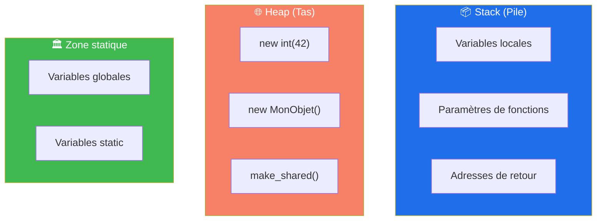
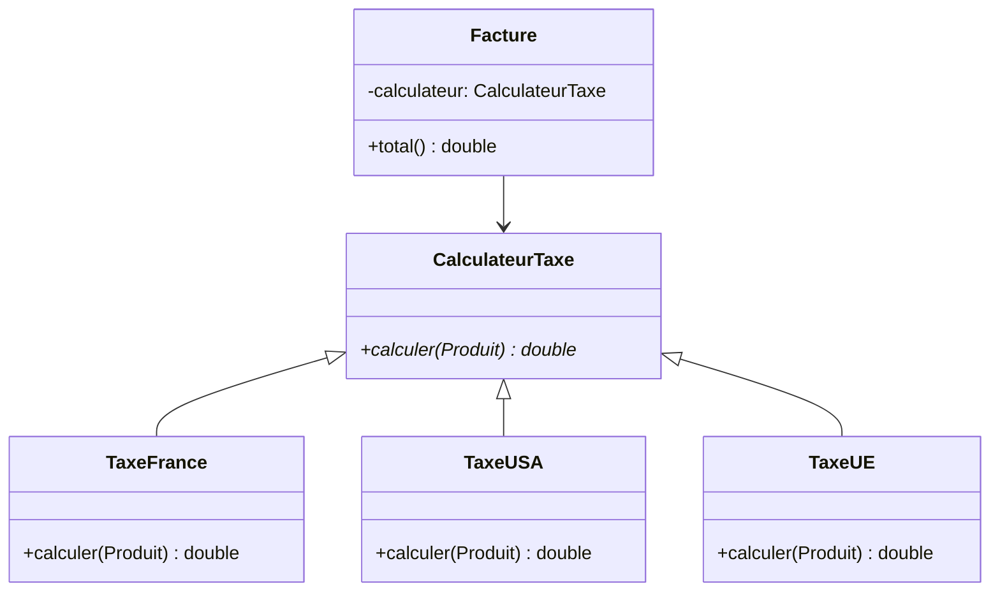

<!-- _class: title -->

# Formation C++ 🧠
## Jour 2 — Mémoire, STL & Design Patterns

*Gestion avancée des ressources · STL complète · Patterns de conception*

---

<!-- _class: toc -->

# 📋 Sommaire — Jour 2

<ol>
  <li>Stack vs Heap — modèle mémoire</li>
  <li>Pointeurs et références</li>
  <li>Smart pointers (RAII)</li>
  <li>Move semantics</li>
  <li>STL — Conteneurs séquentiels</li>
  <li>STL — Conteneurs associatifs</li>
  <li>STL — Algorithmes</li>
  <li>Design Patterns classiques</li>
</ol>

---

<!-- _class: section -->

# 05 · Gestion de la Mémoire en C++

Allocation dynamique, RAII et smart pointers

---

<!-- _class: diagram-legend -->

# 🗂️ Modèle mémoire C++ — Stack vs Heap

<div class="diag-wrap">



<div class="legend">

### 📦 Stack
- Allocation/libération **automatique**
- Taille **fixe** (≈1–8 Mo)
- Accès **ultra-rapide**
- Pas de fuite possible

### 🌐 Heap
- Allocation **manuelle** (`new`)
- Taille **dynamique**
- Accès plus lent
- Risque de **fuite mémoire**

</div>
</div>

---

# 📌 Pointeurs — bases essentielles

```cpp
int valeur = 42;

// Déclaration d'un pointeur
int* ptr = &valeur;    // ptr contient l'adresse de valeur

// Déréférencement
std::cout << *ptr;     // 42 — accès à la valeur pointée
*ptr = 100;            // modifie valeur via le pointeur
std::cout << valeur;   // 100

// Pointeur nul (C++11 : nullptr remplace NULL)
int* pNull = nullptr;
if (pNull != nullptr) {
    std::cout << *pNull;  // ne s'exécute pas
}

// Pointeur constant
const int* pConst = &valeur;    // valeur non modifiable via ptr
int* const pFixed = &valeur;    // adresse non modifiable
const int* const pBoth = &valeur; // ni l'un ni l'autre
```

---

# 🔗 Pointeurs — arithmétique et tableaux

```cpp
int tableau[5] = {10, 20, 30, 40, 50};

// Le nom du tableau EST un pointeur vers le premier élément
int* ptr = tableau;

// Arithmétique de pointeurs
std::cout << *ptr;      // 10 (tableau[0])
std::cout << *(ptr+1);  // 20 (tableau[1])
std::cout << *(ptr+4);  // 50 (tableau[4])
ptr++;                  // avance d'un int (4 octets)
std::cout << *ptr;      // 20

// Équivalence tableau/pointeur
tableau[2] == *(tableau + 2);  // true
ptr[0] == *ptr;                // true

// Pointeur sur pointeur
int** ptrPtr = &ptr;
std::cout << **ptrPtr;  // valeur pointée par ptr
```

---

# 🔄 Références vs Pointeurs

```cpp
int x = 10;

// Référence : alias de la variable (doit être initialisée)
int& ref = x;
ref = 20;  // modifie x directement
std::cout << x;  // 20

// Pointeur : adresse de la variable (peut être nullptr)
int* ptr = &x;
*ptr = 30;
std::cout << x;  // 30
```

| Critère | Référence | Pointeur |
|---|---|---|
| Syntaxe | `int& r = x` | `int* p = &x` |
| Nullable | Non (toujours valide) | Oui (`nullptr`) |
| Réaffectable | Non | Oui |
| Déréférencement | Automatique | Explicite `*p` |
| Usage recommandé | Paramètres de fonctions | Ownership dynamique |

---

# ⚠️ Allocation dynamique — new / delete

```cpp
// Allocation d'un entier sur le tas
int* n = new int(42);
std::cout << *n;  // 42
delete n;         // libération OBLIGATOIRE
n = nullptr;      // bonne pratique

// Allocation d'un tableau dynamique
int taille = 10;
int* tab = new int[taille]();  // () = initialisé à 0
tab[3] = 99;
delete[] tab;   // delete[] pour les tableaux !
tab = nullptr;

// Problèmes classiques
int* p = new int(5);
// delete p;  // oubli → FUITE MÉMOIRE
// delete p; delete p;  // double free → UNDEFINED BEHAVIOR
// int* q = p; delete p; *q = 1;  // use-after-free → UB
```

---

# 🛡️ Principe RAII

> **Resource Acquisition Is Initialization** : lier la durée de vie d'une ressource à celle d'un objet C++

```cpp
// ❌ SANS RAII — risque de fuite
void sansRAII() {
    int* data = new int[1000];
    traitement(data);   // si exception ici → fuite !
    delete[] data;      // jamais atteint en cas d'exception
}

// ✅ AVEC RAII — automatiquement sûr
void avecRAII() {
    std::vector<int> data(1000);  // libéré automatiquement
    traitement(data);  // exception → destructeur appelé quand même
}                      // libération garantie à la sortie du scope
```

Le destructeur est **toujours** appelé, même en cas d'exception → ressource **toujours** libérée.

---

# 🔒 unique_ptr — propriété exclusive

```cpp
#include <memory>

// Création (préférer make_unique)
auto ptr = std::make_unique<int>(42);
auto obj = std::make_unique<Voiture>("Tesla", 2023);

// Accès comme un pointeur ordinaire
std::cout << *ptr;          // 42
obj->demarrer();

// Libération automatique à la fin du scope (pas de delete !)

// Transfert de propriété (move)
auto ptr2 = std::move(ptr);  // ptr est maintenant nullptr
// std::cout << *ptr;        // ERREUR : ptr est nullptr

// Dans une fonction
std::unique_ptr<Voiture> creerVoiture() {
    return std::make_unique<Voiture>("BMW", 2024);
}
auto v = creerVoiture();  // ownership transféré

// Tableau dynamique avec unique_ptr
auto tab = std::make_unique<int[]>(100);
```

---

# 🔗 shared_ptr — propriété partagée

```cpp
#include <memory>

// Création
auto sp1 = std::make_shared<std::string>("Bonjour");
std::cout << sp1.use_count();  // 1

{
    auto sp2 = sp1;  // copie : partage la propriété
    auto sp3 = sp1;
    std::cout << sp1.use_count();  // 3
    // sp2 et sp3 détruits ici → compteur décrémenté
}

std::cout << sp1.use_count();  // 1
// sp1 détruit → compteur = 0 → objet libéré

// shared_ptr dans un vecteur
std::vector<std::shared_ptr<Forme>> formes;
formes.push_back(std::make_shared<Cercle>(5.0));
formes.push_back(std::make_shared<Rectangle>(4.0, 3.0));
// toutes les formes libérées automatiquement
```

---

# 👁️ weak_ptr — référence sans propriété

```cpp
#include <memory>

// weak_ptr évite les cycles de références
class Noeud {
public:
    std::string valeur;
    std::shared_ptr<Noeud> enfant;
    std::weak_ptr<Noeud> parent;  // weak_ptr pour éviter le cycle !
};

// Utilisation de weak_ptr
auto sp = std::make_shared<int>(42);
std::weak_ptr<int> wp = sp;

std::cout << wp.use_count();    // ne compte pas : 1 (sp seulement)
std::cout << wp.expired();      // false

// Accès via lock() (vérifie que l'objet existe encore)
if (auto locked = wp.lock()) {
    std::cout << *locked;  // 42 — accès sûr
}

sp.reset();                     // libère l'objet
std::cout << wp.expired();      // true
```

---

<!-- _class: table-annotated -->

# 📊 Comparatif des smart pointers

| Smart pointer | Propriété | Copiable | Movable | Usage |
|---|---|---|---|---|
| `unique_ptr` | Exclusive | ❌ | ✅ | Ressource unique |
| `shared_ptr` | Partagée | ✅ | ✅ | Ressource partagée |
| `weak_ptr` | Aucune | ✅ | ✅ | Observer, casser cycles |

<div class="table-note">
  💡 Règle d'or : préférer <strong>unique_ptr</strong> par défaut. Utiliser <strong>shared_ptr</strong> uniquement si le partage est nécessaire. Ne jamais mélanger smart pointers et raw pointers sur le même objet.
</div>

---

# ⚡ Move Semantics — le problème

```cpp
// Avant C++11 : copie coûteuse !
std::vector<int> creerGrandVecteur() {
    std::vector<int> v(1000000);
    // remplir v...
    return v;  // ← copie de 1 million d'éléments !
}

auto v = creerGrandVecteur();  // copie inutile

// ❌ Copie profonde (deep copy)
class Tampon {
    char* data; size_t taille;
public:
    Tampon(const Tampon& autre) {  // constructeur de copie
        taille = autre.taille;
        data = new char[taille];
        std::copy(autre.data, autre.data + taille, data);
        // ↑ copie de TOUTES les données
    }
};
```

---

# ⚡ Move Semantics — la solution C++11

```cpp
class Tampon {
    char* data; size_t taille;
public:
    // Constructeur de déplacement (move constructor)
    Tampon(Tampon&& autre) noexcept
        : data(autre.data), taille(autre.taille) {
        autre.data = nullptr;  // vole les ressources !
        autre.taille = 0;
    }

    // Opérateur de déplacement
    Tampon& operator=(Tampon&& autre) noexcept {
        if (this != &autre) {
            delete[] data;
            data = autre.data;
            taille = autre.taille;
            autre.data = nullptr;
        }
        return *this;
    }
    ~Tampon() { delete[] data; }
};

Tampon a(1000000);
Tampon b = std::move(a);  // déplacement, pas copie — O(1) !
```

---

# ➡️ std::move et rvalue references

```cpp
// std::move : cast vers rvalue reference
std::string s1 = "Hello, World!";
std::string s2 = std::move(s1);  // s1 est vidé, s2 a les données
std::cout << s1;  // "" (état valide mais non-spécifié)
std::cout << s2;  // "Hello, World!"

// Rvalue reference (&&)
void traiter(std::string&& s) {
    // s est une ressource temporaire, on peut la "voler"
    monVecteur.push_back(std::move(s));
}

// Perfect forwarding avec std::forward
template<typename T>
void wrapper(T&& arg) {
    fonction(std::forward<T>(arg));  // préserve la catégorie de valeur
}
```

---

# 🧪 TP 5 — Gestion de la mémoire

**Exercice A** : Classe `Buffer` avec move semantics
- Implémenter un buffer de bytes (`uint8_t*`)
- Constructeur(s), copie deep, move, destructeur
- Vérifier avec Valgrind : zéro fuite mémoire

**Exercice B** : Smart pointers dans une hiérarchie
- Créer un arbre n-aire avec `shared_ptr<Noeud>`
- Chaque nœud a un `weak_ptr<Noeud>` vers son parent
- Vérifier qu'il n'y a pas de cycle mémoire

**Exercice C** : Réécrire du code existant
- Remplacer tous les `new`/`delete` par des smart pointers
- Mesurer la différence de performance avec `std::chrono`
- Documenter les cas où `unique_ptr` est préféré à `shared_ptr`

---

# 🧪 TP 5 — Analyse de fuites

**Exercice D** : Déboguer un code bugué

```cpp
// Trouver et corriger les 4 problèmes :
void fonctionBuguee() {
    int* a = new int(5);
    int* b = new int[10];
    int* c = nullptr;
    
    *c = 42;               // Bug 1
    delete b;              // Bug 2  
    delete a;
    delete a;              // Bug 3
    
    Ressource* r = new Ressource();
    if (!r->initialiser()) return;  // Bug 4
    r->utiliser();
    delete r;
}
```

Utiliser Valgrind et AddressSanitizer pour confirmer les corrections

---

<!-- _class: section -->

# 06 · Introduction à la STL

Conteneurs, itérateurs et algorithmes standards

---

<!-- _class: cards -->

# 📚 La Standard Template Library

<div class="card-grid">
<div class="card">

### 📦 Conteneurs séquentiels
`vector`, `array`, `deque`, `list`, `forward_list`. Stockage ordonné avec index ou itérateurs.

</div>
<div class="card">

### 🗺️ Conteneurs associatifs
`map`, `set`, `multimap`, `multiset`. Accès par clé, triés automatiquement.

</div>
<div class="card">

### ⚡ Conteneurs hash
`unordered_map`, `unordered_set`. Accès O(1) en moyenne, non triés.

</div>
<div class="card">

### 🔧 Algorithmes
`sort`, `find`, `transform`, `accumulate`, `copy`. 100+ algorithmes génériques.

</div>
</div>

---

# 📐 std::vector — le conteneur roi

```cpp
#include <vector>

std::vector<int> v;
v.push_back(10);
v.push_back(20);
v.push_back(30);

// Pré-allocation (évite les réallocations)
std::vector<double> w;
w.reserve(1000);  // réserve de la capacité
w.resize(500, 0.0);  // 500 éléments initialisés à 0

// Accès
int x = v[1];           // non sécurisé
int y = v.at(1);        // sécurisé (exception si hors bornes)
int& front = v.front(); // premier élément
int& back  = v.back();  // dernier élément

// Modification
v.insert(v.begin() + 1, 15);  // insère 15 à l'index 1
v.erase(v.begin() + 2);       // supprime l'élément à l'index 2
v.clear();                     // vide le vecteur

// Taille vs capacité
std::cout << v.size();     // nb d'éléments
std::cout << v.capacity(); // mémoire allouée
```

---

# 🔗 std::list et std::deque

```cpp
#include <list>
#include <deque>

// list : liste doublement chaînée
// ✅ Insertion/suppression O(1) n'importe où
// ❌ Pas d'accès aléatoire, mauvaise localité cache
std::list<int> lst = {1, 2, 3, 4, 5};
auto it = std::find(lst.begin(), lst.end(), 3);
lst.insert(it, 99);    // insère avant 3
lst.erase(it);         // supprime 3
lst.sort();            // tri intégré

// deque : double-ended queue
// ✅ push_front ET push_back en O(1)
// ✅ Accès aléatoire O(1)
// ❌ Plus lente que vector pour les accès séquentiels
std::deque<std::string> file;
file.push_back("Alice");
file.push_front("Bob");   // pas possible avec vector
std::string premier = file.front();
file.pop_front();
```

---

# 🗺️ std::map — dictionnaire trié

```cpp
#include <map>

// map<Clé, Valeur> — trié par clé, clés uniques
std::map<std::string, int> ages;
ages["Alice"] = 30;
ages["Bob"]   = 25;
ages.insert({"Charlie", 28});
ages.emplace("Diana", 22);  // plus efficace

// Accès
int age = ages["Alice"];         // crée l'entrée si inexistante
int age2 = ages.at("Alice");     // exception si absent

// Vérification d'existence
if (ages.count("Alice"))     std::cout << "Existe\n";
if (ages.find("Eve") != ages.end()) std::cout << "Existe\n";

// Parcours (ordre alphabétique)
for (const auto& [nom, age] : ages) {  // structured bindings C++17
    std::cout << nom << " : " << age << "\n";
}

// Suppression
ages.erase("Bob");
```

---

# ⚡ std::unordered_map — hash table

```cpp
#include <unordered_map>

// unordered_map — O(1) en moyenne, non trié
std::unordered_map<std::string, int> freq;

std::string texte = "bonjour monde bonjour";
for (const auto& mot : split(texte)) {
    freq[mot]++;  // incrémente ou crée à 0
}

// Accès identique à map
std::cout << freq["bonjour"];  // 2

// Performance
// map       : O(log n) find/insert
// unordered_map : O(1) amortie find/insert

// Réserver de la capacité (évite les rehashing)
freq.reserve(10000);
freq.max_load_factor(0.25);  // moins de collisions

// Vérifier et insérer en une opération
auto [it, inserted] = freq.emplace("test", 0);
if (inserted) std::cout << "Nouveau mot\n";
```

---

# 🔵 std::set et ses variantes

```cpp
#include <set>
#include <unordered_set>

// set — éléments uniques, triés
std::set<int> s = {5, 3, 1, 4, 1, 5};
// Contient : {1, 3, 4, 5} (doublons supprimés, trié)

s.insert(2);   // {1, 2, 3, 4, 5}
s.erase(3);    // {1, 2, 4, 5}
bool found = s.count(4);  // true

// multiset — éléments non uniques, triés
std::multiset<int> ms = {1, 2, 2, 3, 3, 3};
std::cout << ms.count(3);  // 3

// unordered_set — O(1), non trié
std::unordered_set<std::string> mots;
mots.insert("hello");
mots.insert("world");
bool existe = mots.contains("hello");  // C++20 : true
```

---

# 📚 Adaptateurs de conteneurs

```cpp
#include <stack>
#include <queue>
#include <queue>  // priority_queue aussi

// stack (LIFO) — par défaut basée sur deque
std::stack<int> pile;
pile.push(1); pile.push(2); pile.push(3);
std::cout << pile.top();  // 3
pile.pop();

// queue (FIFO) — file d'attente
std::queue<std::string> file;
file.push("Alice"); file.push("Bob");
std::cout << file.front();  // "Alice"
file.pop();

// priority_queue — max-heap par défaut
std::priority_queue<int> pq;
pq.push(5); pq.push(1); pq.push(3);
std::cout << pq.top();  // 5 (le max)
pq.pop();

// min-heap
std::priority_queue<int, std::vector<int>, std::greater<int>> minHeap;
```

---

# 🧭 Itérateurs — navigation dans les conteneurs

```cpp
#include <vector>
#include <iterator>

std::vector<int> v = {10, 20, 30, 40, 50};

// Types d'itérateurs
auto it = v.begin();    // itérateur vers le premier élément
auto end = v.end();     // itérateur APRÈS le dernier

// Navigation
std::cout << *it;       // 10 (déréférencement)
++it;                   // avance
std::cout << *it;       // 20

// Itérateur inverse
for (auto rit = v.rbegin(); rit != v.rend(); ++rit)
    std::cout << *rit << " ";  // 50 40 30 20 10

// Itérateur constant (read-only)
for (auto cit = v.cbegin(); cit != v.cend(); ++cit)
    std::cout << *cit;

// std::advance et std::distance
std::advance(it, 3);             // avance de 3
int dist = std::distance(v.begin(), it);  // distance
```

---

# 🔧 Algorithmes STL — sort, find, count

```cpp
#include <algorithm>
#include <vector>

std::vector<int> v = {5, 3, 1, 4, 2};

// Tri
std::sort(v.begin(), v.end());          // croissant
std::sort(v.begin(), v.end(),
    std::greater<int>());               // décroissant
std::sort(v.begin(), v.end(),
    [](int a, int b) { return a > b; }); // custom lambda

// Recherche
auto it = std::find(v.begin(), v.end(), 3);
if (it != v.end()) std::cout << "Trouvé!\n";

// Recherche binaire (sur tableau trié)
bool found = std::binary_search(v.begin(), v.end(), 4);

// Comptage
int nb = std::count(v.begin(), v.end(), 3);
int nb2 = std::count_if(v.begin(), v.end(),
    [](int x) { return x > 3; });
```

---

# 🔧 Algorithmes STL — transform, accumulate

```cpp
#include <algorithm>
#include <numeric>
#include <vector>

std::vector<int> v = {1, 2, 3, 4, 5};
std::vector<int> result(v.size());

// transform : applique une fonction à chaque élément
std::transform(v.begin(), v.end(), result.begin(),
    [](int x) { return x * x; });
// result : {1, 4, 9, 16, 25}

// Transformation sur deux conteneurs
std::transform(v.begin(), v.end(), result.begin(),
               result.begin(), std::plus<int>());

// accumulate : réduction
int somme = std::accumulate(v.begin(), v.end(), 0);
int produit = std::accumulate(v.begin(), v.end(), 1,
    [](int acc, int x) { return acc * x; });

// min_element, max_element
auto [minIt, maxIt] = std::minmax_element(v.begin(), v.end());
std::cout << *minIt << " " << *maxIt;
```

---

# 🔧 Algorithmes STL — copy, fill, remove

```cpp
#include <algorithm>
#include <vector>

std::vector<int> src = {1, 2, 3, 4, 5};
std::vector<int> dst(5);

// copy
std::copy(src.begin(), src.end(), dst.begin());

// fill
std::fill(dst.begin(), dst.end(), 0);

// generate
int n = 0;
std::generate(dst.begin(), dst.end(), [&n]{ return n++; });

// remove (idiome erase-remove)
std::vector<int> v = {1, 2, 3, 2, 4, 2, 5};
auto newEnd = std::remove(v.begin(), v.end(), 2);
v.erase(newEnd, v.end());  // {1, 3, 4, 5}

// unique (supprime les doublons consécutifs)
std::sort(v.begin(), v.end());
v.erase(std::unique(v.begin(), v.end()), v.end());
```

---

# 🔧 STL avec lambdas — combinaisons puissantes

```cpp
#include <algorithm>
#include <vector>
#include <string>

struct Employe {
    std::string nom;
    double salaire;
    std::string departement;
};

std::vector<Employe> equipe = {
    {"Alice", 55000, "Dev"},
    {"Bob",   48000, "Dev"},
    {"Carol", 62000, "RH"},
};

// Trier par salaire décroissant
std::sort(equipe.begin(), equipe.end(),
    [](const Employe& a, const Employe& b) {
        return a.salaire > b.salaire;
    });

// Trouver le premier Dev
auto dev = std::find_if(equipe.begin(), equipe.end(),
    [](const Employe& e) { return e.departement == "Dev"; });
```

---

# 🧪 TP 6 — STL en pratique

**Exercice A** : Gestionnaire d'inventaire
- `unordered_map<string, int>` pour le stock
- Ajouter, retirer des articles, gérer les ruptures
- Trier par quantité et par nom

**Exercice B** : Analyse de texte
- Lire un fichier et compter la fréquence de chaque mot
- Stocker dans `map<string, int>`
- Afficher le top 10 des mots les plus fréquents

**Exercice C** : File de priorité
- Implémenter un système de tickets de support
- Chaque ticket a une priorité (1-5) et une description
- Traiter par ordre de priorité avec `priority_queue`

---

# 🧪 TP 6 — Algorithmes avancés

**Exercice D** : Pipeline de traitement de données

```cpp
std::vector<int> donnees = /* 10000 entiers aléatoires */;

// Pipeline :
// 1. Filtrer les nombres pairs (remove_if)
// 2. Prendre les 100 plus grands (partial_sort)
// 3. Calculer la moyenne (accumulate)
// 4. Afficher les 10 premiers (for_each)
```

**Exercice E** : Comparaison de performances
- Mesurer le temps d'insertion de 1M d'éléments dans :
  - `vector`, `list`, `deque`, `set`, `unordered_set`
- Mesurer le temps de recherche de 10K éléments
- Documenter les conclusions

---

<!-- _class: section -->

# 07 · Patterns Avancés et Conception

Design patterns classiques et bonnes pratiques

---

<!-- _class: cards -->

# 🏗️ Catégories de Design Patterns

<div class="card-grid">
<div class="card">

### 🏭 Créationnels
Instanciation d'objets. **Singleton**, **Factory Method**, **Abstract Factory**, **Builder**, Prototype.

</div>
<div class="card">

### 🔩 Structuraux
Composition d'objets. **Adapter**, **Decorator**, **Composite**, **Facade**, Proxy, Bridge.

</div>
<div class="card">

### 🔄 Comportementaux
Communication entre objets. **Observer**, **Strategy**, **Command**, **Iterator**, Template Method.

</div>
<div class="card">

### 📏 Principes SOLID
Single Responsibility, Open/Closed, Liskov Substitution, Interface Segregation, Dependency Inversion.

</div>
</div>

---

# 🔒 Singleton — instance unique

```cpp
#include <mutex>

class Database {
private:
    static std::unique_ptr<Database> instance;
    static std::once_flag initFlag;
    std::string connexion;

    Database(const std::string& url) : connexion(url) {}

public:
    // Thread-safe avec call_once
    static Database& getInstance() {
        std::call_once(initFlag, []() {
            instance = std::unique_ptr<Database>(
                new Database("postgresql://localhost/mydb"));
        });
        return *instance;
    }

    void executer(const std::string& query) { /* ... */ }

    // Interdire copie et move
    Database(const Database&) = delete;
    Database& operator=(const Database&) = delete;
};
```

---

# 🏭 Factory Method

```cpp
// Interface du produit
class Connexion {
public:
    virtual void connecter() = 0;
    virtual void envoyer(const std::string& data) = 0;
    virtual ~Connexion() = default;
};

class ConnexionTCP : public Connexion {
public:
    void connecter() override { std::cout << "TCP connect\n"; }
    void envoyer(const std::string& d) override { /* ... */ }
};

class ConnexionHTTP : public Connexion {
public:
    void connecter() override { std::cout << "HTTP connect\n"; }
    void envoyer(const std::string& d) override { /* ... */ }
};

// Factory
std::unique_ptr<Connexion> creerConnexion(const std::string& type) {
    if (type == "tcp")  return std::make_unique<ConnexionTCP>();
    if (type == "http") return std::make_unique<ConnexionHTTP>();
    throw std::invalid_argument("Type inconnu : " + type);
}
```

---

# 🏗️ Abstract Factory

```cpp
// Interfaces des produits
class Bouton { public: virtual void dessiner() = 0; };
class Fenetre { public: virtual void afficher() = 0; };

// Produits Windows
class BoutonWindows : public Bouton {
    void dessiner() override { std::cout << "[Windows Button]\n"; }
};
class FenetreWindows : public Fenetre {
    void afficher() override { std::cout << "[Windows Window]\n"; }
};

// Abstract Factory
class UIFactory {
public:
    virtual std::unique_ptr<Bouton> creerBouton() = 0;
    virtual std::unique_ptr<Fenetre> creerFenetre() = 0;
    virtual ~UIFactory() = default;
};

class WindowsUIFactory : public UIFactory {
public:
    std::unique_ptr<Bouton> creerBouton() override {
        return std::make_unique<BoutonWindows>();
    }
    std::unique_ptr<Fenetre> creerFenetre() override {
        return std::make_unique<FenetreWindows>();
    }
};
```

---

# 🏗️ Builder Pattern

```cpp
class Requete {
public:
    std::string url;
    std::string methode;
    std::map<std::string, std::string> headers;
    std::string body;
    int timeout;
};

class RequeteBuilder {
    Requete req;
public:
    RequeteBuilder& url(const std::string& u) {
        req.url = u; return *this;
    }
    RequeteBuilder& methode(const std::string& m) {
        req.methode = m; return *this;
    }
    RequeteBuilder& header(const std::string& k, const std::string& v) {
        req.headers[k] = v; return *this;
    }
    RequeteBuilder& body(const std::string& b) {
        req.body = b; return *this;
    }
    RequeteBuilder& timeout(int t) { req.timeout = t; return *this; }
    Requete build() { return req; }
};

// Utilisation fluide
auto r = RequeteBuilder()
    .url("https://api.example.com/users")
    .methode("POST")
    .header("Content-Type", "application/json")
    .body(R"({"name":"Alice"})")
    .timeout(5000)
    .build();
```

---

# 🔌 Adapter Pattern

```cpp
// Interface cible (ce que le client attend)
class Logger {
public:
    virtual void log(const std::string& msg) = 0;
    virtual ~Logger() = default;
};

// Classe existante (incompatible)
class AncienSystemeLog {
public:
    void ecrireLog(int niveau, const char* msg) {
        printf("[%d] %s\n", niveau, msg);
    }
};

// Adaptateur
class AdaptateurLog : public Logger {
    AncienSystemeLog ancien;
public:
    void log(const std::string& msg) override {
        ancien.ecrireLog(1, msg.c_str());
    }
};

// Le client utilise l'interface Logger
void traitement(Logger& log) {
    log.log("Démarrage du traitement");
}
```

---

# 🎨 Decorator Pattern

```cpp
// Interface de base
class Composant {
public:
    virtual std::string operation() const = 0;
    virtual ~Composant() = default;
};

class ComposantConcret : public Composant {
public:
    std::string operation() const override { return "Composant"; }
};

// Décorateur de base
class Decorateur : public Composant {
protected:
    std::unique_ptr<Composant> composant;
public:
    Decorateur(std::unique_ptr<Composant> c)
        : composant(std::move(c)) {}
    std::string operation() const override {
        return composant->operation();
    }
};

// Décorateurs concrets
class DecorateurA : public Decorateur {
public:
    using Decorateur::Decorateur;
    std::string operation() const override {
        return "A(" + composant->operation() + ")";
    }
};
```

---

# 👁️ Observer Pattern

```cpp
#include <vector>
#include <functional>

// Observer avec std::function (approche moderne)
class Evenement {
    std::vector<std::function<void(const std::string&)>> abonnes;

public:
    void subscribe(std::function<void(const std::string&)> handler) {
        abonnes.push_back(std::move(handler));
    }

    void publier(const std::string& data) {
        for (auto& h : abonnes) h(data);
    }
};

// Utilisation
int main() {
    Evenement evt;
    evt.subscribe([](const std::string& d) {
        std::cout << "Handler 1: " << d << "\n";
    });
    evt.subscribe([](const std::string& d) {
        std::cout << "Handler 2: " << d << "\n";
    });
    evt.publier("Connexion établie");
}
```

---

# 🎯 Strategy Pattern

```cpp
// Interface Stratégie
class StrategieTriement {
public:
    virtual void trier(std::vector<int>& v) = 0;
    virtual ~StrategieTriement() = default;
};

class TriRapide : public StrategieTriement {
public:
    void trier(std::vector<int>& v) override {
        std::sort(v.begin(), v.end());
    }
};

class TriParInsertion : public StrategieTriement {
public:
    void trier(std::vector<int>& v) override { /* ... */ }
};

// Contexte
class Trieur {
    std::unique_ptr<StrategieTriement> strategie;
public:
    void setStrategie(std::unique_ptr<StrategieTriement> s) {
        strategie = std::move(s);
    }
    void trier(std::vector<int>& v) { strategie->trier(v); }
};
```

---

# 📋 Command Pattern

```cpp
// Interface Commande
class Commande {
public:
    virtual void executer() = 0;
    virtual void annuler() = 0;
    virtual ~Commande() = default;
};

class CommandeInsertion : public Commande {
    std::string& texte;
    std::string contenu;
    size_t position;
public:
    CommandeInsertion(std::string& t, std::string c, size_t p)
        : texte(t), contenu(c), position(p) {}
    void executer() override { texte.insert(position, contenu); }
    void annuler() override  { texte.erase(position, contenu.size()); }
};

// Gestionnaire de commandes (avec undo)
class Historique {
    std::stack<std::unique_ptr<Commande>> hist;
public:
    void executer(std::unique_ptr<Commande> cmd) {
        cmd->executer();
        hist.push(std::move(cmd));
    }
    void annuler() {
        if (!hist.empty()) { hist.top()->annuler(); hist.pop(); }
    }
};
```

---

<!-- _class: diagram -->

# 🏗️ SOLID — Open/Closed Principle



---

# 🧪 TP 7 — Implémentation de patterns

**Exercice A** : Factory + Singleton combinés
- `LoggerFactory` singleton qui produit des loggers
- Stratégies : `ConsoleLogger`, `FileLogger`, `JsonLogger`
- Choisir la stratégie via un fichier de config

**Exercice B** : Observer pour un système d'alertes
- `CapteurTemperature` publie des mesures
- `AlerteEmail`, `AlerteSMS`, `AlerteDashboard` s'abonnent
- Déclencher une alerte si température > 80°C

**Exercice C** : Builder pour une requête SQL
```cpp
auto query = SQLBuilder()
    .select({"id", "nom", "email"})
    .from("utilisateurs")
    .where("age > 18")
    .orderBy("nom", ASC)
    .limit(50)
    .build();
// → "SELECT id, nom, email FROM utilisateurs WHERE age > 18 ORDER BY nom ASC LIMIT 50"
```

---

# 🧪 TP 7 — Patterns avancés avec templates

**Exercice D** : Strategy générique avec templates

```cpp
// Strategy sans héritage via templates (zero-cost abstraction)
template<typename StrategieTriement>
class Trieur {
    StrategieTriement strategie;
public:
    void trier(std::vector<int>& v) {
        strategie(v);  // operator() ou fonction
    }
};

struct TriCroissant {
    void operator()(std::vector<int>& v) {
        std::sort(v.begin(), v.end());
    }
};

Trieur<TriCroissant> trieur;  // no virtual dispatch, no allocation
```

- Comparer les performances : héritage vs templates
- Documenter quand chaque approche est préférable

---

<!-- _class: section -->

# 08 · Testing Avancé et Optimisation

Mocks, tests paramétrés et stratégies de refactoring

---

# 🎭 Google Mock — introduction

```cpp
#include <gmock/gmock.h>

// Interface à mocker
class BDDRepository {
public:
    virtual std::optional<Utilisateur>
        findById(int id) = 0;
    virtual bool save(const Utilisateur& u) = 0;
    virtual ~BDDRepository() = default;
};

// Mock généré
class MockBDDRepository : public BDDRepository {
public:
    MOCK_METHOD(std::optional<Utilisateur>,
                findById, (int id), (override));
    MOCK_METHOD(bool, save,
                (const Utilisateur& u), (override));
};
```

---

# 🎭 Google Mock — configuration et assertions

```cpp
#include <gtest/gtest.h>
#include <gmock/gmock.h>

TEST(ServiceTest, EnvoyerEmailQuandUtilisateurCree) {
    MockBDDRepository mockRepo;
    MockEmailService mockEmail;
    UserService service(mockRepo, mockEmail);

    Utilisateur alice{"Alice", "alice@example.com"};

    // Configurer le mock
    EXPECT_CALL(mockRepo, save(alice))
        .Times(1)
        .WillOnce(::testing::Return(true));

    EXPECT_CALL(mockEmail, envoyer("alice@example.com", ::testing::_))
        .Times(1);

    // Exécuter
    ASSERT_TRUE(service.creerUtilisateur(alice));

    // Les expectations sont vérifiées automatiquement
}
```

---

# 🔢 Tests paramétrés avec GoogleTest

```cpp
#include <gtest/gtest.h>

// Paramètres : (entrée, résultat_attendu)
class TestIsPrime
    : public ::testing::TestWithParam<std::pair<int,bool>> {};

TEST_P(TestIsPrime, VerifierNombrePremier) {
    auto [n, expected] = GetParam();
    EXPECT_EQ(isPrime(n), expected);
}

INSTANTIATE_TEST_SUITE_P(
    NombresPremiers,
    TestIsPrime,
    ::testing::Values(
        std::make_pair(1,  false),
        std::make_pair(2,  true),
        std::make_pair(3,  true),
        std::make_pair(4,  false),
        std::make_pair(17, true),
        std::make_pair(100, false)
    )
);
```

---

# 🔢 Tests paramétrés avec Catch2

```cpp
#include <catch2/catch_test_macros.hpp>
#include <catch2/generators/catch_generators.hpp>

TEST_CASE("Validateur d'email", "[validation]") {
    auto [email, valide] = GENERATE(table<std::string, bool>({
        {"alice@example.com",  true},
        {"bob.smith@co.org",   true},
        {"invalide",           false},
        {"@domain.com",        false},
        {"alice@",             false},
        {"alice@domain",       false},
    }));

    INFO("Email testé : " << email);
    REQUIRE(validerEmail(email) == valide);
}
```

---

# 📊 Couverture de code

```bash
# Compilation avec gcov
g++ -fprofile-arcs -ftest-coverage -g -o tests tests/*.cpp
./tests

# Générer le rapport de couverture
gcov src/*.cpp
lcov --capture --directory . --output-file coverage.info
genhtml coverage.info --output-directory rapport_couverture/

# Afficher dans le terminal
gcovr --root . --print-summary
```

Métriques de couverture :
- **Line coverage** : % de lignes exécutées
- **Branch coverage** : % de branches (if/else) testées
- **Function coverage** : % de fonctions appelées

> Objectif : 80%+ de couverture pour du code de production

---

# 🔄 Stratégies de refactoring

```cpp
// ❌ Avant refactoring
void traiter(std::vector<int>& v, int mode) {
    if (mode == 1) {
        for (int i = 0; i < v.size(); i++) v[i] *= 2;
    } else if (mode == 2) {
        for (int i = 0; i < v.size(); i++) v[i] += 10;
    } else if (mode == 3) {
        for (int i = 0; i < v.size(); i++) v[i] = v[i] * v[i];
    }
}

// ✅ Après refactoring (Extract Function + Strategy)
void multiplierPar2(std::vector<int>& v) {
    std::transform(v.begin(), v.end(), v.begin(),
                   [](int x) { return x * 2; });
}
void ajouterDix(std::vector<int>& v) {
    std::transform(v.begin(), v.end(), v.begin(),
                   [](int x) { return x + 10; });
}
void carrer(std::vector<int>& v) {
    std::transform(v.begin(), v.end(), v.begin(),
                   [](int x) { return x * x; });
}
```

---

# 🧪 TP 8 — Tests avancés

**Exercice A** : Mocks pour un service de paiement
- Interfaces : `IPaiementGateway`, `IEmailService`, `ILogger`
- Mock toutes les dépendances de `ServicePaiement`
- Tester : paiement réussi, paiement refusé, erreur réseau

**Exercice B** : Tests de régression
- Créer 20 tests paramétrés pour une fonction `calculerTTC()`
- Couvrir : TVA 5.5%, 10%, 20%, taux nul, montant négatif

**Exercice C** : Améliorer la couverture
- Analyser le rapport gcovr d'un code existant
- Identifier les branches non couvertes
- Écrire les tests manquants pour atteindre 90% de couverture

---

# 🔧 Optimisation des performances

```cpp
#include <chrono>

// Mesurer le temps d'exécution
auto debut = std::chrono::high_resolution_clock::now();

// ... code à mesurer ...
traitement(donnees);

auto fin = std::chrono::high_resolution_clock::now();
auto duree = std::chrono::duration_cast<std::chrono::microseconds>
    (fin - debut);
std::cout << "Durée : " << duree.count() << " µs\n";

// Benchmark simple
void benchmarker(const std::string& nom, std::function<void()> fn) {
    const int N = 1000;
    auto debut = std::chrono::high_resolution_clock::now();
    for (int i = 0; i < N; i++) fn();
    auto fin = std::chrono::high_resolution_clock::now();
    auto total = std::chrono::duration<double>(fin - debut).count();
    std::cout << nom << " : " << (total / N * 1e6) << " µs/call\n";
}
```

---

# 🔧 TP 8 — Optimisation et refactoring

**Exercice D** : Identifier les goulots d'étranglement

Analyser ce code et optimiser :
```cpp
// Code à optimiser
std::vector<std::string> filtrer(
    const std::vector<std::string>& données,
    const std::string& prefixe) {
    
    std::vector<std::string> resultat;
    for (int i = 0; i < données.size(); i++) {
        std::string s = données[i];  // copie inutile ?
        if (s.find(prefixe) == 0) {
            resultat.push_back(s);   // copie inutile ?
        }
    }
    return resultat;
}
```
- Profiler avec `perf` ou `gprof`
- Appliquer les optimisations C++17
- Mesurer le gain de performance obtenu

---

<!-- _class: list-cols -->

# 📝 Synthèse — Jour 2

- **Stack** : variables locales, rapide, automatique
- **Heap** : allocation `new`/`delete`, risque de fuite
- **RAII** : ressource liée à la durée de vie de l'objet
- **unique_ptr** : propriété exclusive, zéro overhead
- **shared_ptr** : propriété partagée, compteur de ref
- **move semantics** : `std::move`, constructeur de déplacement
- **vector** : conteneur principal, accès O(1), cache-friendly
- **map / unordered_map** : O(log n) vs O(1) lookup
- **Algorithmes** : `sort`, `find`, `transform`, `accumulate`
- **Singleton** : instance unique thread-safe
- **Factory** : création sans connaître la classe concrète
- **Observer** : notification d'événements
- **Mocks** : isoler les dépendances en test

---

# 📄 std::string_view — performances

```cpp
#include <string_view>

// Comparer les performances
void compter_mots_v1(const std::string& texte) {
    // Chaque appel peut copier la string
    auto mots = split(texte, ' ');
}

void compter_mots_v2(std::string_view texte) {
    // Zéro copie — juste un pointeur + taille
    // Idéal pour les fonctions read-only
}

// Méthodes de string_view
std::string_view sv = "Hello, World!";
sv.remove_prefix(7);  // "World!" (modifie la vue, pas la string)
sv.remove_suffix(1);  // "World"
bool starts = sv.starts_with("Wor");  // C++20
auto pos = sv.find("ld");             // position

// ⚠️ Ne JAMAIS stocker une string_view vers un temporaire
auto mauvais = [](){ return std::string_view(std::string("temp")); };
```

---

# 📁 std::filesystem — manipulation de fichiers (C++17)

```cpp
#include <filesystem>
namespace fs = std::filesystem;

// Informations sur un chemin
fs::path p = "/home/user/documents/rapport.pdf";
std::cout << p.filename();   // rapport.pdf
std::cout << p.stem();       // rapport
std::cout << p.extension();  // .pdf
std::cout << p.parent_path(); // /home/user/documents

// Opérations sur les fichiers
fs::exists(p);               // true/false
fs::file_size(p);            // taille en octets
fs::copy("src.txt", "dst.txt");
fs::rename("ancien.txt", "nouveau.txt");
fs::remove("fichier.tmp");
fs::create_directories("a/b/c");  // crée récursivement

// Parcours d'un répertoire
for (const auto& entry : fs::directory_iterator(".")) {
    if (entry.is_regular_file())
        std::cout << entry.path() << " ("
                  << entry.file_size() << " bytes)\n";
}
```

---

# 📁 std::filesystem — opérations avancées

```cpp
#include <filesystem>
namespace fs = std::filesystem;

// Parcours récursif
for (const auto& entry :
     fs::recursive_directory_iterator("src/")) {
    if (entry.path().extension() == ".cpp")
        std::cout << entry.path() << "\n";
}

// Copie récursive avec options
fs::copy("source/", "destination/",
    fs::copy_options::recursive |
    fs::copy_options::overwrite_existing);

// Espace disque disponible
auto space = fs::space("/");
std::cout << "Disponible : "
          << space.available / (1024*1024) << " Mo\n";

// Gestion des erreurs sans exception
std::error_code ec;
if (!fs::exists("fichier.txt", ec)) {
    std::cerr << "Erreur : " << ec.message() << "\n";
}
```

---

# ⏱️ std::chrono — mesure du temps

```cpp
#include <chrono>
using namespace std::chrono;
using namespace std::chrono_literals;

// Durées typées
auto d1 = 5s;         // 5 secondes
auto d2 = 100ms;      // 100 millisecondes
auto d3 = 500us;      // 500 microsecondes

// Mesure de performance
auto debut = high_resolution_clock::now();
traitement();
auto fin = high_resolution_clock::now();

auto duree = duration_cast<microseconds>(fin - debut);
std::cout << duree.count() << " µs\n";

// Date et heure système
auto maintenant = system_clock::now();
auto temps_t = system_clock::to_time_t(maintenant);
std::cout << std::ctime(&temps_t);

// Sleep typé
std::this_thread::sleep_for(200ms);
std::this_thread::sleep_until(maintenant + 1s);
```

---

# 🔍 Algorithmes STL avancés

```cpp
#include <algorithm>
#include <numeric>
#include <vector>

std::vector<int> v = {1, 2, 3, 4, 5, 6, 7, 8, 9, 10};

// partial_sort : trier seulement les N premiers
std::partial_sort(v.begin(), v.begin() + 3, v.end());
// {1, 2, 3, ...reste non trié}

// nth_element : O(n), pivot à la bonne position
std::nth_element(v.begin(), v.begin() + 4, v.end());
// v[4] est la 5e plus petite valeur

// rotate : décaler les éléments
std::rotate(v.begin(), v.begin() + 3, v.end());
// {4, 5, 6, 7, 8, 9, 10, 1, 2, 3}

// inclusive_scan / exclusive_scan (C++17)
std::vector<int> scan(v.size());
std::inclusive_scan(v.begin(), v.end(), scan.begin());
// {1, 3, 6, 10, 15, 21, 28, 36, 45, 55}

// reduce (parallélisable, C++17)
int total = std::reduce(v.begin(), v.end(), 0);
```

---

# 🔍 std::algorithm — recherche avancée

```cpp
#include <algorithm>
#include <vector>

std::vector<int> v = {1, 3, 5, 7, 9, 11, 13};  // trié

// lower_bound : premier élément >= valeur
auto it = std::lower_bound(v.begin(), v.end(), 7);
// *it = 7, index = 3

// upper_bound : premier élément > valeur
auto it2 = std::upper_bound(v.begin(), v.end(), 7);
// *it2 = 9, index = 4

// equal_range : paire [lower, upper]
auto [lo, hi] = std::equal_range(v.begin(), v.end(), 7);

// partition : séparer selon un prédicat
std::vector<int> data = {1, 4, 2, 8, 5, 3, 7, 6};
auto pivot = std::partition(data.begin(), data.end(),
    [](int x) { return x < 5; });
// Avant pivot : {1, 4, 2, 3} | Après : {8, 5, 7, 6}

// is_partitioned, is_sorted
bool trié = std::is_sorted(v.begin(), v.end());
```

---

# 📦 Performances des conteneurs STL

| Opération | `vector` | `list` | `deque` | `set` | `unordered_set` |
|---|---|---|---|---|---|
| `push_back` | O(1)* | O(1) | O(1) | — | — |
| `insert` (milieu) | O(n) | O(1) | O(n) | O(log n) | O(1)* |
| `find` | O(n) | O(n) | O(n) | O(log n) | O(1)* |
| `erase` (milieu) | O(n) | O(1) | O(n) | O(log n) | O(1)* |
| Accès `[i]` | O(1) | O(n) | O(1) | — | — |
| Cache-friendly | ✅✅✅ | ❌ | ✅✅ | ❌ | ❌ |

`*` = amorti. Règle pratique : **vector par défaut**, changer si mesure prouve une meilleure option.

---

# 📦 Flat containers — C++23

```cpp
#include <flat_map>  // C++23
#include <flat_set>

// flat_map : stocké dans un vector trié
// Plus rapide que map pour les petites tailles (<100 éléments)
// Meilleures performances cache
std::flat_map<std::string, int> ages;
ages["Alice"] = 30;
ages["Bob"]   = 25;

// Equivalent à map pour l'API
for (const auto& [nom, age] : ages)
    std::cout << nom << ": " << age << "\n";

// Avantages sur map :
// ✅ Mémoire contiguë (cache-friendly)
// ✅ Itération rapide
// ❌ Insertion plus lente (shift)
// ❌ Invalidation d'itérateurs lors des insertions

// Quand utiliser ?
// Petit nombre d'éléments + beaucoup de lectures + peu d'insertions
```

---

# 🔄 Template Method Pattern

```cpp
// Template Method : squelette d'algorithme dans la classe de base
class GenerateurRapport {
public:
    // TEMPLATE METHOD — squelette fixe
    std::string generer() {
        return ouvrirDocument()
             + collecterDonnees()
             + formaterContenu()
             + fermerDocument();
    }

protected:
    virtual std::string ouvrirDocument() = 0;
    virtual std::string collecterDonnees() = 0;
    virtual std::string formaterContenu() = 0;
    virtual std::string fermerDocument()  = 0;
};

class RapportPDF : public GenerateurRapport {
    std::string ouvrirDocument() override { return "%PDF-1.4\n"; }
    std::string collecterDonnees() override { return queryBDD(); }
    std::string formaterContenu() override { return formatPDF(); }
    std::string fermerDocument() override  { return "%%EOF\n"; }
};
```

---

# 🔄 Iterator Pattern personnalisé

```cpp
class PlageDates {
    std::chrono::system_clock::time_point debut, fin;

public:
    PlageDates(std::chrono::system_clock::time_point d,
               std::chrono::system_clock::time_point f)
        : debut(d), fin(f) {}

    struct Iterateur {
        std::chrono::system_clock::time_point courant;
        using iterator_category = std::forward_iterator_tag;
        using value_type = std::chrono::system_clock::time_point;

        Iterateur& operator++() {
            courant += std::chrono::days(1); return *this;
        }
        bool operator!=(const Iterateur& o) const {
            return courant != o.courant;
        }
        value_type operator*() const { return courant; }
    };

    Iterateur begin() { return {debut}; }
    Iterateur end()   { return {fin}; }
};
// for (auto jour : PlageDates(debut, fin)) { ... }
```

---

# 🔗 Chain of Responsibility

```cpp
class Handler {
    std::unique_ptr<Handler> suivant;
public:
    Handler& setSuivant(std::unique_ptr<Handler> h) {
        suivant = std::move(h);
        return *suivant;
    }

    virtual void traiter(int requete) {
        if (suivant) suivant->traiter(requete);
    }
    virtual ~Handler() = default;
};

class HandlerPetit : public Handler {
    void traiter(int r) override {
        if (r < 10) std::cout << "Petite requête: " << r;
        else Handler::traiter(r);
    }
};

class HandlerMoyen : public Handler {
    void traiter(int r) override {
        if (r < 100) std::cout << "Requête moyenne: " << r;
        else Handler::traiter(r);
    }
};
```

---

# 🏛️ Facade Pattern

```cpp
// Sous-systèmes complexes
class CPU    { public: void demarrer(); void charger(long pos); };
class Memoire{ public: void charger(long pos, long taille); };
class Disque { public: long lireSecteur(long lba, long nb); };

// Facade : interface simple
class Ordinateur {
    CPU cpu;
    Memoire memoire;
    Disque disque;

public:
    void allumer() {
        // Coordonne les sous-systèmes sans exposer leur complexité
        long secteur = disque.lireSecteur(0, 1);
        memoire.charger(0x7c00, 512);
        cpu.charger(0x7c00);
        cpu.demarrer();
    }
};

// Client : utilise seulement la Facade
int main() {
    Ordinateur pc;
    pc.allumer();  // Simple !
}
```

---

# 🔄 State Pattern

```cpp
class Lecteur; // Forward declaration

class EtatLecteur {
public:
    virtual void play(Lecteur&)  = 0;
    virtual void pause(Lecteur&) = 0;
    virtual void stop(Lecteur&)  = 0;
    virtual ~EtatLecteur() = default;
};

class EtatLecture : public EtatLecteur {
public:
    void play(Lecteur&) override { std::cout << "Déjà en lecture\n"; }
    void pause(Lecteur& l) override;  // change état → EtatPause
    void stop(Lecteur& l) override;   // change état → EtatArret
};

class Lecteur {
    std::unique_ptr<EtatLecteur> etat;
public:
    Lecteur();
    void changerEtat(std::unique_ptr<EtatLecteur> e) {
        etat = std::move(e);
    }
    void play()  { etat->play(*this); }
    void pause() { etat->pause(*this); }
    void stop()  { etat->stop(*this); }
};
```

---

# 🎭 Test Doubles — les 5 types

| Type | Description | Usage |
|---|---|---|
| **Dummy** | Objet passé mais jamais utilisé | Remplir une signature |
| **Stub** | Retourne des valeurs prédéfinies | Simuler des résultats |
| **Spy** | Enregistre les appels | Vérifier les interactions |
| **Mock** | Préconfiguré avec des expectations | Vérifier le comportement |
| **Fake** | Implémentation simplifiée | BDD en mémoire, serveur simulé |

```cpp
// Fake : base de données en mémoire
class FakeLivreRepository : public ILivreRepository {
    std::unordered_map<std::string, Livre> donnees;
public:
    void sauvegarder(const Livre& l) override {
        donnees[l.getISBN()] = l;
    }
    std::optional<Livre> trouver(const std::string& isbn) const override {
        auto it = donnees.find(isbn);
        if (it == donnees.end()) return std::nullopt;
        return it->second;
    }
};
```

---

# 🧟 Mutation Testing

```cpp
// Principe : introduire des bugs (mutations) dans le code
// Un bon test DOIT échouer si le code est muté

// Code original
bool estPremier(int n) {
    if (n < 2) return false;
    for (int i = 2; i * i <= n; i++)
        if (n % i == 0) return false;
    return true;
}

// Mutations typiques à détecter :
// n < 2  →  n <= 2   (mutation de frontière)
// == 0   →  != 0     (mutation de condition)
// return false → return true (mutation de retour)
// i * i <= n → i * i < n  (mutation de comparaison)
```

**Outil** : `mutmut` (Python) ou `Mutate++` pour C++

Un test qui ne détecte aucune mutation est **superficiel** — il exécute le code sans vraiment le valider.

---

# 📊 Google Benchmark

```cpp
#include <benchmark/benchmark.h>

// Définir un benchmark
static void BM_vector_push_back(benchmark::State& state) {
    for (auto _ : state) {
        std::vector<int> v;
        for (int i = 0; i < state.range(0); i++)
            v.push_back(i);
        benchmark::DoNotOptimize(v);
    }
}

static void BM_vector_reserved(benchmark::State& state) {
    for (auto _ : state) {
        std::vector<int> v;
        v.reserve(state.range(0));  // avec réservation
        for (int i = 0; i < state.range(0); i++)
            v.push_back(i);
        benchmark::DoNotOptimize(v);
    }
}

BENCHMARK(BM_vector_push_back)->RangeMultiplier(10)->Range(100, 100000);
BENCHMARK(BM_vector_reserved)->RangeMultiplier(10)->Range(100, 100000);
BENCHMARK_MAIN();
```

---

# 📊 Google Benchmark — résultats

```bash
# Compiler et exécuter
cmake -DBENCHMARK=ON ..
cmake --build . && ./benchmarks

# Résultats typiques :
# -------------------------------------------------------
# Benchmark            Time   CPU  Iterations
# -------------------------------------------------------
# BM_vector_push_back/100   1234 ns  1230 ns   512000
# BM_vector_reserved/100     456 ns   453 ns  1500000
# BM_vector_push_back/10000 45678 ns 45200 ns    15000
# BM_vector_reserved/10000   2345 ns  2340 ns   289000

# Options utiles
./benchmarks --benchmark_filter="vector"
./benchmarks --benchmark_out=results.json
./benchmarks --benchmark_repetitions=5
```

La version avec `reserve()` est **5-20× plus rapide** selon la taille !

---

# 🔧 TP Bonus — Benchmark comparatif STL

**Exercice** : Mesurer et comparer les conteneurs

```cpp
// À mesurer (Google Benchmark) pour N = 100, 1K, 10K, 100K :
// 1. Insertion séquentielle : vector vs list vs deque
// 2. Recherche : map vs unordered_map vs vector+sort
// 3. Tri : sort(vector) vs set insertion
// 4. Parcours : vector vs list (cache impact)

// Attendu :
// - vector 5-10× plus rapide que list (cache)
// - unordered_map 10× plus rapide que map pour find
// - sort(vector) < 2× plus rapide que list::sort
```

Documenter les résultats dans un tableau et **justifier les choix** de conteneurs dans le projet bibliothèque du Jour 5.

---

# 🔄 TP Bonus — Implémenter les patterns manquants

**Médiateur (Mediator)** : Les composants communiquent via un objet central

```cpp
class Mediateur {
public:
    virtual void notifier(class Composant* sender,
                          const std::string& event) = 0;
};

class Formulaire : public Mediateur {
    BoutonSoumettre* btn;
    ChampTexte* champ;
public:
    void notifier(Composant* sender, const std::string& ev) override {
        if (sender == champ && ev == "changed")
            btn->setEnabled(!champ->isEmpty());
        else if (sender == btn && ev == "click")
            validerFormulaire();
    }
};
```

**Proxy** : Contrôle l'accès à un objet réel (lazy loading, cache, log)

---

# 📊 Synthèse des patterns — quand les utiliser ?

| Pattern | Problème résolu | Exemple concret |
|---|---|---|
| **Singleton** | Instance unique globale | Config, Logger |
| **Factory** | Créer sans connaître le type | Parser, Plugin |
| **Builder** | Construire des objets complexes | QueryBuilder, Config |
| **Observer** | Notification d'événements | UI, EventBus |
| **Strategy** | Algorithme interchangeable | Tri, Compression |
| **Command** | Action encapsulée + undo | Éditeur, Transaction |
| **Decorator** | Ajouter des responsabilités | Middleware, Logger |
| **Facade** | Simplifier une interface | SDK, Framework |
| **State** | Comportement selon état | Protocoles, UI |
| **Chain** | Traitement en chaîne | Middleware HTTP |

---

# 🔧 TP Final Jour 2 — Système de notifications

Implémenter un système de notifications modulaire :

```
NotificationService
├── Observer Pattern : abonnés (Email, SMS, Push, WebSocket)
├── Strategy Pattern : templates de messages
├── Chain of Responsibility : filtres (spam, rate-limit, priority)
├── Factory : créer le bon canal selon le type d'alerte
└── Builder : construire les notifications configurées

Tests requis :
- 20 tests unitaires avec mocks pour chaque composant
- Benchmark : 10K notifications en < 100ms
- Valgrind : zéro fuite mémoire
```

---

# 📝 Synthèse étendue — Jour 2

**Ce que vous savez maintenant faire :**

```
Mémoire
├── Stack vs Heap (allocation, durée de vie)
├── RAII (ressource = objet C++)
├── unique_ptr / shared_ptr / weak_ptr
└── Move semantics (std::move, constructeur &&)

STL
├── Conteneurs : vector, list, map, set, unordered_*
├── Algorithmes : sort, find, transform, accumulate
├── string_view, filesystem, chrono (C++17)
└── Performances et choix du bon conteneur

Design Patterns
├── Créationnels : Singleton, Factory, Builder
├── Structuraux : Adapter, Decorator, Facade
└── Comportementaux : Observer, Strategy, Command, State

Tests
├── Mocks avec GoogleMock
├── Mutation testing
└── Google Benchmark
```


---

# 🔧 std::tuple — ensemble hétérogène

```cpp
#include <tuple>

// Créer un tuple
auto personne = std::make_tuple(std::string("Alice"), 30, true);

// Accéder par index
std::string nom = std::get<0>(personne);
int age         = std::get<1>(personne);

// Accéder par type (C++14 — si type unique dans le tuple)
std::string n = std::get<std::string>(personne);

// Structured binding (C++17) — le plus lisible
auto [n2, a2, actif] = personne;
std::cout << n2 << " a " << a2 << " ans\n";

// Retourner plusieurs valeurs depuis une fonction
std::tuple<int, double, std::string> analyser(const std::string& s) {
    return {s.size(), s.size() * 1.5, s.substr(0, 3)};
}
auto [taille, score, prefix] = analyser("hello");
```

---

# 🔧 std::function vs templates

```cpp
#include <functional>

// std::function : type-erased callable
// Accepte: lambda, fonction, foncteur, méthode liée
std::function<int(int, int)> op;
op = [](int a, int b) { return a + b; };
op = std::plus<int>{};
op = &ma_fonction;

// Stocker dans un conteneur
std::map<std::string, std::function<double(double)>> fonctions;
fonctions["carré"] = [](double x) { return x*x; };
fonctions["racine"] = [](double x) { return std::sqrt(x); };

// ⚠️ std::function a un overhead (allocation, indirect call)
// Pour des hot paths, préférer les templates :
template<typename Fn>
int appeler(Fn fn, int x) { return fn(x); }  // zéro overhead

// Règle : std::function pour les APIs publiques et le stockage
//         templates pour les hot paths internes
```

---

# 📊 Algorithmes de tri — comparatif

```cpp
#include <algorithm>
#include <vector>

std::vector<int> v = {5, 3, 1, 4, 2};

// std::sort — quicksort / introsort — O(n log n) moyen
std::sort(v.begin(), v.end());

// std::stable_sort — merge sort — O(n log n) garanti, stable
std::stable_sort(v.begin(), v.end());

// std::partial_sort — trier seulement les k premiers
std::partial_sort(v.begin(), v.begin()+3, v.end());

// std::nth_element — pivot à position n — O(n) amortie
std::nth_element(v.begin(), v.begin()+2, v.end());

// std::sort avec comparateur lambda
std::sort(v.begin(), v.end(), std::greater<int>{});

// std::ranges::sort (C++20)
std::ranges::sort(v);
std::ranges::sort(v, std::greater<>{});
```

---

# 🔗 std::span — vue sur un tableau (C++20)

```cpp
#include <span>

// span : vue non-possédante sur des données contiguës
// Accepte: array, vector, pointeur+taille

void afficher(std::span<const int> donnees) {
    for (auto x : donnees) std::cout << x << " ";
}

std::vector<int> v = {1, 2, 3, 4, 5};
std::array<int, 3> a = {10, 20, 30};
int raw[] = {7, 8, 9};

afficher(v);            // OK
afficher(a);            // OK
afficher(raw);          // OK
afficher({raw, 3});     // OK avec pointeur + taille

// Sous-span
std::span<int> s = v;
auto debut = s.first(3);   // {1, 2, 3}
auto fin   = s.last(2);    // {4, 5}
auto milieu = s.subspan(1, 3); // {2, 3, 4}
```

---

# 🔄 Proxy Pattern

```cpp
// Proxy : contrôle l'accès à un objet réel
class ImageReelle {
    std::string fichier;
    std::vector<uint8_t> pixels;
public:
    ImageReelle(const std::string& f) : fichier(f) {
        // Chargement coûteux
        pixels = chargerDepuisDisk(f);
        std::cout << "Image chargée : " << f << "\n";
    }
    void afficher() const { /* rendu */ }
};

// Proxy avec chargement paresseux (lazy loading)
class ProxyImage {
    std::string fichier;
    mutable std::unique_ptr<ImageReelle> image;
public:
    ProxyImage(std::string f) : fichier(std::move(f)) {}

    void afficher() const {
        if (!image) {
            // Chargement à la première utilisation seulement
            image = std::make_unique<ImageReelle>(fichier);
        }
        image->afficher();
    }
};
```

---

# 🔄 Flyweight Pattern — partager les données immuables

```cpp
// Flyweight : partager les données partagées (state intrinsèque)
// Utile quand on a beaucoup d'objets similaires

class ForetFlyweight {
    // Données PARTAGÉES entre tous les arbres du même type
    struct TypeArbre {
        std::string espece;
        std::vector<uint8_t> texture;
        float hauteurMoyenne;
    };

    // Cache des types d'arbres
    static std::map<std::string, std::shared_ptr<TypeArbre>> types;

public:
    static std::shared_ptr<TypeArbre> getType(const std::string& e) {
        if (!types.count(e))
            types[e] = std::make_shared<TypeArbre>(charger(e));
        return types[e];
    }
};

struct Arbre {
    float x, y;  // données UNIQUES par arbre
    std::shared_ptr<ForetFlyweight::TypeArbre> type;  // partagé !
};
// 100 000 arbres → 100 000 paires (x,y) + 5 TypeArbre partagés
```

---

# 🔄 Memento Pattern — undo/redo

```cpp
// Memento : capturer et restaurer l'état interne
class Editeur {
    std::string contenu;
    int curseur;

public:
    struct Memento {
        std::string contenu;
        int curseur;
    };

    Memento sauvegarder() const {
        return {contenu, curseur};
    }

    void restaurer(const Memento& m) {
        contenu = m.contenu;
        curseur = m.curseur;
    }

    void taper(const std::string& texte) {
        contenu.insert(curseur, texte);
        curseur += texte.size();
    }
};

// Gestionnaire d'historique
class Historique {
    std::stack<Editeur::Memento> pile;
public:
    void push(Editeur::Memento m) { pile.push(std::move(m)); }
    std::optional<Editeur::Memento> undo() {
        if (pile.empty()) return std::nullopt;
        auto m = pile.top(); pile.pop(); return m;
    }
};
```

---

# 🏋️ TP Bonus Jour 2 — Conteneur custom

**Implémenter `HashMap<K,V>` from scratch :**

```cpp
template<typename K, typename V,
         typename Hash = std::hash<K>>
class HashMap {
    struct Entree { K cle; V valeur; bool occupee{false}; };
    std::vector<Entree> table;
    size_t nb_elements{0};
    float max_load{0.75f};
    Hash hasher;

public:
    explicit HashMap(size_t capacite = 16);

    void insert(K cle, V valeur);
    std::optional<V> find(const K& cle) const;
    bool erase(const K& cle);
    size_t size() const { return nb_elements; }
    float load_factor() const;

private:
    void rehash(size_t nouvelle_capacite);
    size_t probe(const K& cle, size_t debut) const;
};
```

- Utiliser l'open addressing (linear probing)
- Rehash automatique quand `load_factor > 0.75`
- Benchmarker contre `std::unordered_map`

---

# 📊 Comparatif Testing : Catch2 vs GoogleTest

| Critère | Catch2 | GoogleTest |
|---|---|---|
| Setup | Header-only possible | Bibliothèque à lier |
| Syntaxe | `REQUIRE`, `CHECK` naturels | `ASSERT_*`, `EXPECT_*` |
| Fixtures | `TEST_CASE_METHOD` | `TEST_F` |
| Mocks | Pas inclus (utiliser trompeloeil) | GoogleMock inclus |
| Tests paramétrés | `GENERATE` | `TEST_P` + `INSTANTIATE` |
| Benchmark | Catch2 benchmark inclus | Google Benchmark séparé |
| Rapport | Console, JUnit XML | Console, JUnit XML, JSON |
| Recommandation | Projets personnels, libs | Projets corporate, Google stack |

---

# 🔧 Test de performance — Catch2 Benchmark

```cpp
#include <catch2/benchmark/catch_benchmark.hpp>

TEST_CASE("Benchmark tri", "[benchmark]") {
    std::vector<int> data(10000);
    std::iota(data.begin(), data.end(), 0);

    BENCHMARK("std::sort aléatoire") {
        auto v = data;
        std::shuffle(v.begin(), v.end(), gen);
        std::sort(v.begin(), v.end());
        return v;
    };

    BENCHMARK("std::sort déjà trié") {
        auto v = data;
        std::sort(v.begin(), v.end());
        return v;
    };

    BENCHMARK("std::stable_sort") {
        auto v = data;
        std::shuffle(v.begin(), v.end(), gen);
        std::stable_sort(v.begin(), v.end());
        return v;
    };
}
// Exécuter : ./tests "[benchmark]" --benchmark-samples 100
```

---

# 🔍 Debugging avec LLDB

```bash
# LLDB (alternative macOS/Clang à GDB)
lldb ./mon_programme

# Commandes équivalentes GDB → LLDB
# break main         → breakpoint set --name main
# run                → process launch
# next               → thread step-over
# step               → thread step-in
# continue           → process continue
# print var          → frame variable var
# bt                 → thread backtrace
# quit               → quit

# Fonctionnalités spéciales LLDB
(lldb) po obj         # print object (appelle description())
(lldb) expr compteur = 42  # modifier une variable en cours d'exécution
(lldb) watchpoint set variable compteur  # watchpoint
(lldb) thread list    # lister tous les threads
(lldb) frame select 2 # sélectionner un frame de la pile
```

---

# 📝 Synthèse patterns — les 3 catégories en pratique

**Quand j'ai un problème de CRÉATION :**
- **Factory** : je veux créer sans connaître le type concret
- **Builder** : mon objet a beaucoup de paramètres optionnels
- **Singleton** : je veux une unique instance globale

**Quand j'ai un problème de STRUCTURE :**
- **Adapter** : deux interfaces incompatibles à réconcilier
- **Decorator** : ajouter des responsabilités dynamiquement
- **Facade** : simplifier un sous-système complexe
- **Proxy** : contrôler l'accès (lazy, cache, log, security)

**Quand j'ai un problème de COMPORTEMENT :**
- **Observer** : notifier N objets d'un changement
- **Strategy** : algorithme interchangeable à runtime
- **Command** : action encapsulée + undo/redo
- **State** : comportement différent selon l'état interne


---

# 📦 std::deque — double-ended queue en détail

```cpp
#include <deque>

std::deque<int> d;

// Ajout aux deux extrémités en O(1) amorti
d.push_back(10);   d.push_back(20);   d.push_back(30);
d.push_front(5);   d.push_front(1);

// d = {1, 5, 10, 20, 30}

// Accès aléatoire O(1) (comme vector)
std::cout << d[2];   // 10
std::cout << d.at(4); // 30

// Suppression aux extrémités O(1)
d.pop_front();  // supprime 1
d.pop_back();   // supprime 30

// Bonne localité de cache ? Moins bonne que vector (stockage segmenté)
// Usage typique : file de travail où on enfile et on défile

// std::queue est basé sur std::deque par défaut
std::queue<std::string> tâches;
tâches.push("tâche1");
std::cout << tâches.front();
tâches.pop();
```

---

# 🔧 Algorithme erase-remove — idiome C++

```cpp
#include <algorithm>
#include <vector>

std::vector<int> v = {1, 2, 3, 2, 4, 2, 5, 2};

// L'idiome erase-remove : supprimer les éléments correspondants
// 1. remove : déplace les éléments à garder en début, retourne "new end"
// 2. erase  : supprime de "new end" à la fin

auto newEnd = std::remove(v.begin(), v.end(), 2);
v.erase(newEnd, v.end());
// v = {1, 3, 4, 5}

// Avec prédicat (remove_if)
v = {1, 2, 3, 4, 5, 6};
v.erase(
    std::remove_if(v.begin(), v.end(),
        [](int x) { return x % 2 == 0; }),
    v.end()
);
// v = {1, 3, 5}

// C++20 : std::erase et std::erase_if (plus concis)
std::erase(v, 3);
std::erase_if(v, [](int x){ return x > 2; });
```

---

# 📊 Résumé des algorithmes STL essentiels

| Algorithme | Complexité | Description |
|---|---|---|
| `sort` | O(n log n) | Tri introsort (non-stable) |
| `stable_sort` | O(n log n) | Tri stable (préserve l'ordre relatif) |
| `find` | O(n) | Première occurrence |
| `binary_search` | O(log n) | Présence (tableau trié) |
| `lower_bound` | O(log n) | Borne inférieure (tableau trié) |
| `count_if` | O(n) | Compte les éléments vérifiant le prédicat |
| `transform` | O(n) | Applique une fonction à chaque élément |
| `accumulate` | O(n) | Réduit avec une opération |
| `max_element` | O(n) | Itérateur vers le maximum |
| `rotate` | O(n) | Rotation des éléments |
| `unique` | O(n) | Supprime les doublons consécutifs |

---

# 📝 TP Final Jour 2 — Synthèse complète

**Mini-projet : Système de cache distribué simplifié**

```cpp
// Implémenter un cache distribué en mémoire (Redis-like)

class CacheDistribue {
public:
    // SET key value [EX seconds]
    void set(const std::string& key, const std::string& value,
             std::optional<std::chrono::seconds> ttl = std::nullopt);

    // GET key → optional<string>
    std::optional<std::string> get(const std::string& key);

    // DEL key
    bool del(const std::string& key);

    // KEYS pattern (* pour tout)
    std::vector<std::string> keys(const std::string& pattern = "*");

    // EXPIRE key seconds
    bool expire(const std::string& key, std::chrono::seconds ttl);
};
// Implémenter avec : unordered_map + shared_mutex + thread expiration
```

---

# 🔄 Révision rapide — Quiz Jour 2

**Questions flash (2 minutes) :**

1. Quelle est la différence entre `unique_ptr` et `shared_ptr` ?
2. Quelle complexité pour `map::find()` vs `unordered_map::find()` ?
3. Quel algorithme pour supprimer des éléments d'un `vector` ?
4. Quel pattern pour créer un objet sans connaître son type concret ?
5. Quel pattern pour notifier N objets d'un changement d'état ?
6. Quelle est la garantie de `vector::push_back()` en cas d'exception ?
7. Quand utiliser `weak_ptr` ?
8. Quelle différence entre `std::sort` et `std::stable_sort` ?

---

# 🔬 Deep Dive — shared_ptr internals

```cpp
// shared_ptr stocke 2 pointeurs :
// 1. Pointeur vers la donnée
// 2. Pointeur vers le control block

struct ControlBlock {
    std::atomic<int> use_count;   // nb de shared_ptr
    std::atomic<int> weak_count;  // nb de weak_ptr + 1
    void (*deleter)(void*);        // custom deleter optionnel
};

// make_shared : UNE SEULE allocation (donnée + control block)
auto sp = std::make_shared<int>(42);
//  → allocation: [int(42) | ControlBlock]

// shared_ptr(new int(42)) : DEUX allocations
auto sp2 = std::shared_ptr<int>(new int(42));
//  → allocation 1: int(42)
//  → allocation 2: ControlBlock séparé

// Préférer make_shared pour les performances !
// Seule exception : custom deleter ou allocateur
```


---

# 🔄 Récapitulatif patterns — quiz éclair Jour 2

**Associer chaque situation au bon pattern :**

| Situation | Pattern |
|---|---|
| Plusieurs algorithmes de tri interchangeables | Strategy |
| Notifier automatiquement une IU lors d'un changement de données | Observer |
| Construire une requête SQL avec des options optionnelles | Builder |
| Une seule connexion à la base de données dans toute l'appli | Singleton |
| Wrapper une vieille API C pour la rendre compatible C++ | Adapter |
| Ajouter du logging sans modifier les classes existantes | Decorator |
| Simplifier l'accès à un sous-système audio complexe | Facade |
| Encapsuler et annuler des actions dans un éditeur | Command |


---

<!-- _class: end -->

# 🎯 Fin du Jour 2

Demain : Templates, Exceptions et Intégration de projets !

*Formation C++ · Jour 2 / 5 · Mémoire, STL & Design Patterns*
