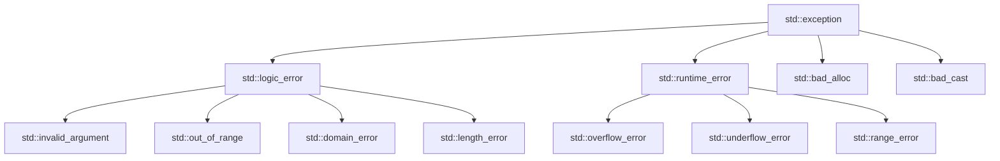
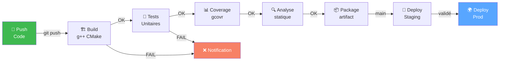

<!-- _class: title -->

# Formation C++ ⚙️
## Jour 3 — Templates, Exceptions & Intégration

*Programmation générique · Robustesse · Projets professionnels*

---

<!-- _class: toc -->

# 📋 Sommaire — Jour 3

<ol>
  <li>Templates de fonctions</li>
  <li>Templates de classes</li>
  <li>Spécialisation et concepts</li>
  <li>Gestion des exceptions</li>
  <li>Exceptions avancées et robustesse</li>
  <li>Organisation d'un projet multifichiers</li>
  <li>CMake et gestion des dépendances</li>
  <li>CI/CD et automatisation</li>
</ol>

---

<!-- _class: section -->

# 09 · Programmation Générique et Templates

Écrire du code paramétrique réutilisable

---

# 🤔 Pourquoi les templates ?

```cpp
// ❌ Sans templates : duplication de code
int max(int a, int b)       { return a > b ? a : b; }
double max(double a, double b) { return a > b ? a : b; }
float max(float a, float b)    { return a > b ? a : b; }
// ... à refaire pour chaque type !

// ✅ Avec templates : un seul code pour tous les types
template<typename T>
T max(T a, T b) {
    return a > b ? a : b;
}

// Utilisation — le compilateur génère le bon code
int    r1 = max(3, 5);         // T = int
double r2 = max(3.14, 2.71);   // T = double
std::string r3 = max(std::string("A"), std::string("B")); // T = string
```

---

# 🔧 Templates de fonctions — syntaxe

```cpp
// Déclaration avec typename (ou class, équivalent)
template<typename T>
T somme(T a, T b) { return a + b; }

// Plusieurs paramètres de type
template<typename T, typename U>
auto convertir(T val) { return static_cast<U>(val); }

// Paramètre non-type (valeur entière)
template<int N>
int multiplier(int val) { return val * N; }

// Déduction automatique de type
auto r1 = somme(1, 2);         // T déduit : int
auto r2 = somme(1.0, 2.0);     // T déduit : double
auto r3 = multiplier<5>(10);   // retourne 50

// Instanciation explicite
auto r4 = somme<float>(1, 2);  // forcé à float
```

---

# 🔧 Template de fonction — exemple complet

```cpp
#include <algorithm>
#include <vector>

// Template pour trier n'importe quel conteneur
template<typename Container>
void trierEtAfficher(Container& c) {
    std::sort(c.begin(), c.end());
    for (const auto& elem : c) {
        std::cout << elem << " ";
    }
    std::cout << "\n";
}

// Template avec prédicat custom
template<typename Container, typename Predicat>
Container filtrer(const Container& c, Predicat pred) {
    Container resultat;
    std::copy_if(c.begin(), c.end(),
                 std::back_inserter(resultat), pred);
    return resultat;
}

// Utilisation
std::vector<int> v = {5, 2, 8, 1, 9};
trierEtAfficher(v);  // 1 2 5 8 9

auto pairs = filtrer(v, [](int x) { return x % 2 == 0; });
```

---

# 🏗️ Templates de classes

```cpp
// Classe générique Paire
template<typename T1, typename T2>
class Paire {
    T1 premier;
    T2 second;
public:
    Paire(T1 p, T2 s) : premier(p), second(s) {}

    T1 getPremier() const { return premier; }
    T2 getSecond()  const { return second; }

    void afficher() const {
        std::cout << "(" << premier << ", " << second << ")\n";
    }
};

// Utilisation
Paire<int, std::string> p1(42, "Alice");
Paire<double, bool> p2(3.14, true);

// Déduction de type (CTAD, C++17)
Paire p3(10, 3.14);  // Paire<int, double> déduit automatiquement

p1.afficher();  // (42, Alice)
```

---

# 📦 Template de classe — Pile générique

```cpp
template<typename T, size_t CAPACITE = 100>
class Pile {
    T elements[CAPACITE];
    size_t sommet = 0;

public:
    void push(const T& val) {
        if (sommet >= CAPACITE)
            throw std::overflow_error("Pile pleine");
        elements[sommet++] = val;
    }

    T pop() {
        if (sommet == 0)
            throw std::underflow_error("Pile vide");
        return elements[--sommet];
    }

    const T& peek() const {
        if (sommet == 0) throw std::underflow_error("Pile vide");
        return elements[sommet - 1];
    }

    bool empty() const { return sommet == 0; }
    size_t size()  const { return sommet; }
};

Pile<int> pileInt;
Pile<std::string, 50> pileStr;
```

---

# 🎯 Spécialisation de templates

```cpp
// Template générique
template<typename T>
class Stockage {
public:
    void stocker(T val) {
        std::cout << "Stockage générique: " << val << "\n";
    }
};

// Spécialisation totale pour bool
template<>
class Stockage<bool> {
    uint8_t bits = 0;
    int compteur = 0;
public:
    void stocker(bool val) {
        bits |= (val << compteur++);
        std::cout << "Stockage bool optimisé (bitfield)\n";
    }
};

// Spécialisation partielle pour pointeurs
template<typename T>
class Stockage<T*> {
public:
    void stocker(T* ptr) {
        std::cout << "Stockage pointeur @ " << ptr << "\n";
    }
};
```

---

# 🔗 Templates variadiques

```cpp
// Base de la récursion (fin de récursion)
void print() { std::cout << "\n"; }

// Template variadique — accepte N arguments
template<typename T, typename... Args>
void print(T first, Args... rest) {
    std::cout << first << " ";
    print(rest...);  // récursion avec le reste
}

// Utilisation
print(1, 2.5, "hello", true);  // "1 2.5 hello 1"

// Fold expressions (C++17) — plus simple
template<typename... Args>
auto somme(Args... args) {
    return (args + ...);  // fold expression
}

auto s = somme(1, 2, 3, 4, 5);  // 15
auto s2 = somme(1.5, 2.5, 3.0); // 7.0
```

---

# 🧩 SFINAE — Substitution Failure Is Not An Error

```cpp
#include <type_traits>

// Activer un template seulement si T est un entier
template<typename T,
    typename = std::enable_if_t<std::is_integral_v<T>>>
T diviserPar2(T val) { return val / 2; }

// Version pour les flottants
template<typename T,
    typename = std::enable_if_t<std::is_floating_point_v<T>>>
T diviserPar2(T val) { return val / 2.0; }

// Vérifier si T est additionnable (SFINAE avancé)
template<typename T, typename = void>
struct estAdditionnable : std::false_type {};

template<typename T>
struct estAdditionnable<T,
    std::void_t<decltype(std::declval<T>() + std::declval<T>())>>
    : std::true_type {};

static_assert(estAdditionnable<int>::value);     // true
static_assert(!estAdditionnable<std::FILE>::value); // false
```

---

# ✅ Concepts C++20 — SFINAE lisible

```cpp
#include <concepts>

// Définir un concept
template<typename T>
concept Numerique = std::integral<T> || std::floating_point<T>;

template<typename T>
concept Comparable = requires(T a, T b) {
    { a < b } -> std::convertible_to<bool>;
    { a == b } -> std::convertible_to<bool>;
};

// Utiliser les concepts — syntaxe claire
template<Numerique T>
T carre(T x) { return x * x; }

template<Comparable T>
T maximum(T a, T b) { return a > b ? a : b; }

// Erreur claire à la compilation si le type ne convient pas
// carre(std::string{"hello"});
// → error: constraints not satisfied for 'Numerique'
```

---

# 🧮 Métaprogrammation — calcul à la compilation

```cpp
// Factorielle calculée à la compilation
template<int N>
struct Factorielle {
    static constexpr int valeur = N * Factorielle<N-1>::valeur;
};

template<>
struct Factorielle<0> {
    static constexpr int valeur = 1;
};

// Utilisation : zéro coût au runtime !
constexpr int f5 = Factorielle<5>::valeur;  // 120

// Version moderne avec constexpr (C++14)
constexpr int factorielle(int n) {
    return n <= 1 ? 1 : n * factorielle(n - 1);
}

static_assert(factorielle(5) == 120);  // vérifié à la compilation
constexpr auto f10 = factorielle(10);  // calculé à la compilation
```

---

# 🧪 TP 9 — Templates en pratique

**Exercice A** : Conteneur `TableauDynamique<T>`
- Template de classe avec allocation dynamique
- Méthodes : `push_back`, `pop_back`, `at`, `size`, `clear`
- Implémentation du constructeur de copie + move
- Tester avec `int`, `double`, `std::string`, `Etudiant`

**Exercice B** : Algorithmes génériques
```cpp
// Implémenter ces templates :
template<typename Container, typename T>
bool contient(const Container& c, const T& val);

template<typename Container, typename Fn>
auto transformer(const Container& c, Fn fn);

template<typename Container, typename T>
T reduire(const Container& c, T init,
          std::function<T(T,T)> fn);
```

---

# 🧪 TP 9 — Spécialisation et concepts

**Exercice C** : Sérialiseur générique
```cpp
template<typename T>
class Serialiseur {
public:
    std::string toJson(const T& val);
    T fromJson(const std::string& json);
};

// Spécialiser pour : int, double, string, bool, vector<T>
```

**Exercice D** : Concept `Persistable`
```cpp
template<typename T>
concept Persistable = requires(T obj, std::ostream& os) {
    { obj.serialize(os) } -> std::same_as<void>;
    { T::deserialize(std::declval<std::istream&>()) } -> std::same_as<T>;
    { obj.getId() } -> std::convertible_to<int>;
};
```
- Écrire une classe `Etudiant` satisfaisant `Persistable`
- Écrire `sauvegarder<Persistable T>` et `charger<Persistable T>`

---

<!-- _class: section -->

# 10 · Gestion des Exceptions et Robustesse

Signaler, propager et gérer les erreurs

---

# ⚠️ Mécanisme try/catch/throw

```cpp
#include <stdexcept>

// Lancer une exception
void diviser(int a, int b) {
    if (b == 0)
        throw std::invalid_argument("Division par zéro !");
    std::cout << a / b;
}

// Capturer une exception
int main() {
    try {
        diviser(10, 0);   // lance une exception
        diviser(10, 2);   // non atteint
    }
    catch (const std::invalid_argument& e) {
        std::cerr << "Argument invalide : " << e.what() << "\n";
    }
    catch (const std::exception& e) {
        std::cerr << "Erreur : " << e.what() << "\n";
    }
    catch (...) {
        std::cerr << "Erreur inconnue !\n";
    }
    std::cout << "Après le try-catch\n";  // toujours exécuté
}
```

---

<!-- _class: diagram -->

# 🏗️ Hiérarchie des exceptions standard



---

# ✏️ Exceptions personnalisées

```cpp
#include <stdexcept>

// Classe d'exception personnalisée
class ErreurBDD : public std::runtime_error {
    int codeErreur;
    std::string requete;

public:
    ErreurBDD(int code, const std::string& msg,
              const std::string& req)
        : std::runtime_error(msg),
          codeErreur(code), requete(req) {}

    int getCode() const { return codeErreur; }
    const std::string& getRequete() const { return requete; }
};

// Utilisation
try {
    throw ErreurBDD(1045, "Accès refusé",
                   "SELECT * FROM users");
}
catch (const ErreurBDD& e) {
    std::cerr << "BDD [" << e.getCode() << "] : "
              << e.what() << "\n";
    std::cerr << "Requête : " << e.getRequete() << "\n";
}
```

---

# 🏗️ Hiérarchie d'exceptions métier

```cpp
// Classe de base des exceptions métier
class ExceptionMetier : public std::exception {
    std::string message;
    std::string code;

public:
    ExceptionMetier(std::string c, std::string m)
        : code(std::move(c)), message(std::move(m)) {}

    const char* what() const noexcept override {
        return message.c_str();
    }
    const std::string& getCode() const { return code; }
};

// Exceptions spécialisées
class ErreurValidation : public ExceptionMetier {
public:
    std::string champ;
    ErreurValidation(std::string c, std::string m, std::string ch)
        : ExceptionMetier(c, m), champ(ch) {}
};

class ErreurAutorisations : public ExceptionMetier {
public:
    ErreurAutorisations(const std::string& ressource)
        : ExceptionMetier("AUTH_001",
          "Accès interdit à : " + ressource) {}
};
```

---

# 🔒 noexcept — garantie de non-exception

```cpp
// noexcept : la fonction ne lancera jamais d'exception
// Le compilateur peut optimiser davantage
void fonctionSure() noexcept {
    // garanti sans exception
    int x = 5 + 3;
}

// noexcept conditionnel
template<typename T>
void echanger(T& a, T& b) noexcept(
    noexcept(T(std::move(a))) &&  // est-ce que move T est noexcept ?
    noexcept(a = std::move(b))
) {
    T tmp = std::move(a);
    a = std::move(b);
    b = std::move(tmp);
}

// Vérifier si une expression est noexcept
static_assert(noexcept(fonctionSure()));

// IMPORTANT : les destructeurs sont noexcept par défaut
// Ne jamais lancer d'exception depuis un destructeur !
```

---

# 🛡️ Garanties de sécurité des exceptions

```cpp
class Vecteur {
    int* data;
    size_t taille;

public:
    // Garantie FORTE : si exception, état inchangé
    void push_back(int val) {
        int* nouveau = new int[taille + 1];  // peut jeter
        std::copy(data, data + taille, nouveau);
        nouveau[taille] = val;
        delete[] data;     // ne peut pas jeter
        data = nouveau;    // ne peut pas jeter
        taille++;
    }
    // ✅ Si new échoue → data/taille inchangés
    // ✅ Après new : seules des opérations noexcept
};
```

| Garantie | Description |
|---|---|
| **Nothrow** | Jamais d'exception (`noexcept`) |
| **Forte** | Succès ou état inchangé (rollback) |
| **Basique** | Pas de fuite, état valide mais non spécifié |
| **Aucune** | État indéfini après exception |

---

# 🔄 Propagation et re-lancement

```cpp
void niveauBas() {
    throw std::runtime_error("Erreur réseau");
}

void niveauMoyen() {
    try {
        niveauBas();
    }
    catch (const std::exception& e) {
        // Enrichir le contexte et relancer
        throw std::runtime_error(
            std::string("Service indisponible : ") + e.what());
    }
}

void niveauHaut() {
    try {
        niveauMoyen();
    }
    catch (const std::exception& e) {
        // Relancer l'exception courante sans la copier
        std::cerr << "Erreur interceptée : " << e.what() << "\n";
        throw;  // relancer tel quel
    }
}
```

---

# 📊 Impact performance et bonnes pratiques

```cpp
// ✅ Exceptions pour les cas EXCEPTIONNELS
Utilisateur trouver(int id) {
    auto it = bdd.find(id);
    if (it == bdd.end())
        throw std::out_of_range("Utilisateur introuvable: "
                                + std::to_string(id));
    return it->second;
}

// ✅ Valeur de retour pour les cas courants
std::optional<Utilisateur> chercher(int id) noexcept {
    auto it = bdd.find(id);
    if (it == bdd.end()) return std::nullopt;
    return it->second;
}

// ❌ NE PAS utiliser les exceptions pour le flux normal
for (int i = 0; ; i++) {
    try { get(i); }
    catch(...) { break; }  // MAUVAISE PRATIQUE — très lent
}
```

---

# 🧪 TP 10 — Robustesse des exceptions

**Exercice A** : Calculatrice robuste
- Exceptions : `DivisionParZero`, `SyntaxeInvalide`, `DepassementCapacite`
- Garantie forte sur toutes les opérations
- Chaque exception doit hériter d'une `ExceptionCalcul`

**Exercice B** : Gestionnaire de fichier robuste
```cpp
class FichierConfig {
public:
    void charger(const std::string& path);  // throws: FileNotFound, ParseError
    void sauvegarder(const std::string& path) noexcept(false);
    std::string get(const std::string& cle) const;
    void set(const std::string& cle, const std::string& val);
};
```
- Écrire les classes d'exceptions
- Garantie forte sur `charger` (pas de modification si erreur)
- 15 tests unitaires couvrant tous les cas d'erreur

---

# 🧪 TP 10 — Bonnes pratiques de gestion d'erreurs

**Exercice C** : Comparer les stratégies de gestion d'erreurs

| Stratégie | Avantages | Inconvénients |
|---|---|---|
| Exceptions | Code propre, propagation | Coût en performance |
| `std::optional` | Rapide, expressif | Nesting possible |
| `std::expected` (C++23) | Type résultat explicite | C++23 requis |
| Code de retour | Zéro overhead | Verbeux, facile à ignorer |

- Implémenter une fonction `connecterBDD` avec chaque stratégie
- Mesurer les performances pour 10 000 appels
- Documenter les recommandations pour votre équipe

---

<!-- _class: section -->

# 11 · Intégration de Projets Complexes

Architecture multifichiers, CMake et dépendances

---

<!-- _class: list-tree -->

# 📁 Structure d'un projet C++ professionnel

- **mon_projet/**
  - `CMakeLists.txt` — configuration principale du build
  - `README.md`, `LICENSE`, `.gitignore`
  - **src/** — code source
    - `main.cpp`, `application.cpp`
  - **include/** — headers publics
    - `mon_projet/api.hpp`, `mon_projet/types.hpp`
  - **lib/** — bibliothèques internes
    - `core/`, `utils/`, `network/`
  - **tests/** — tous les tests
    - `unit/`, `integration/`, `fixtures/`
  - **docs/** — documentation
    - `Doxyfile`, `pages/`
  - **cmake/** — modules CMake personnalisés
  - **build/** — répertoire de build (ignoré par git)

---

# 🔤 Headers (.hpp) et implémentation (.cpp)

```cpp
// ======= include/calculatrice.hpp =======
#pragma once  // protection contre les inclusions multiples

#include <string>
#include <stdexcept>

class Calculatrice {
    double memoire;

public:
    Calculatrice();
    double additionner(double a, double b);
    double diviser(double a, double b);
    void  memoriser(double val);
    double rappelerMemoire() const;
};

// ======= src/calculatrice.cpp =======
#include "calculatrice.hpp"

Calculatrice::Calculatrice() : memoire(0.0) {}

double Calculatrice::additionner(double a, double b) { return a + b; }

double Calculatrice::diviser(double a, double b) {
    if (b == 0) throw std::invalid_argument("Division par zéro");
    return a / b;
}
```

---

# ⚙️ CMakeLists.txt — projet complet

```cmake
cmake_minimum_required(VERSION 3.20)
project(MonProjet VERSION 1.2.0 LANGUAGES CXX)

# Standard C++
set(CMAKE_CXX_STANDARD 17)
set(CMAKE_CXX_STANDARD_REQUIRED ON)
set(CMAKE_CXX_EXTENSIONS OFF)

# Options de compilation
add_compile_options(-Wall -Wextra -Wpedantic)
if(CMAKE_BUILD_TYPE STREQUAL "Debug")
    add_compile_options(-g -fsanitize=address)
    add_link_options(-fsanitize=address)
endif()

# Bibliothèque principale
add_library(monProjetLib
    src/calculatrice.cpp
    src/gestionnaire.cpp
)
target_include_directories(monProjetLib PUBLIC include)

# Exécutable
add_executable(monProjet src/main.cpp)
target_link_libraries(monProjet PRIVATE monProjetLib)

# Tests
enable_testing()
add_subdirectory(tests)
```

---

# 📦 CMake — gestion des dépendances

```cmake
# Méthode 1 : FetchContent (téléchargement automatique)
include(FetchContent)
FetchContent_Declare(
    nlohmann_json
    GIT_REPOSITORY https://github.com/nlohmann/json.git
    GIT_TAG v3.11.3
)
FetchContent_MakeAvailable(nlohmann_json)
target_link_libraries(monProjet PRIVATE nlohmann_json::nlohmann_json)

# Méthode 2 : find_package (bibliothèque système)
find_package(OpenSSL REQUIRED)
target_link_libraries(monProjet PRIVATE OpenSSL::SSL OpenSSL::Crypto)

# Méthode 3 : vcpkg (gestionnaire de paquets)
# (requiert CMAKE_TOOLCHAIN_FILE=vcpkg/scripts/buildsystems/vcpkg.cmake)
find_package(fmt CONFIG REQUIRED)
target_link_libraries(monProjet PRIVATE fmt::fmt)
```

---

# 📦 Conan — gestionnaire de paquets C++

```ini
# conanfile.txt
[requires]
nlohmann_json/3.11.3
catch2/3.4.0
spdlog/1.12.0
boost/1.84.0

[generators]
CMakeDeps
CMakeToolchain
```

```bash
# Installation des dépendances
conan install . --output-folder=build --build=missing

# Build avec CMake
cd build
cmake .. -DCMAKE_TOOLCHAIN_FILE=conan_toolchain.cmake \
         -DCMAKE_BUILD_TYPE=Release
cmake --build .
```

---

# 🔗 Bibliothèques statiques et dynamiques

```cmake
# Bibliothèque statique (.a / .lib)
add_library(monLib STATIC
    src/utils.cpp
    src/network.cpp
)

# Bibliothèque dynamique (.so / .dll)
add_library(monLibDyn SHARED
    src/utils.cpp
    src/network.cpp
)
set_target_properties(monLibDyn PROPERTIES
    VERSION 1.2.0
    SOVERSION 1
)

# Header-only library (INTERFACE)
add_library(monHeaderLib INTERFACE)
target_include_directories(monHeaderLib
    INTERFACE include)
```

---

# 📝 Documentation avec Doxygen

```cpp
/**
 * @brief Calculatrice scientifique avec gestion de la mémoire
 * 
 * Fournit les opérations arithmétiques et transcendantes.
 * Toutes les opérations préservent la valeur en mémoire.
 * 
 * @author Alice Martin
 * @version 2.0
 * @since C++17
 */
class Calculatrice {
public:
    /**
     * @brief Division de deux nombres réels
     * @param a Dividende
     * @param b Diviseur (doit être ≠ 0)
     * @return Quotient a/b
     * @throws std::invalid_argument si b == 0
     * @note Précision limitée aux double IEEE 754
     */
    double diviser(double a, double b);
};
```

---

# ⚙️ Doxyfile — configuration

```ini
# Doxyfile (généré par doxygen -g)
PROJECT_NAME     = "Mon Projet C++"
PROJECT_VERSION  = "1.2.0"
OUTPUT_DIRECTORY = docs/generated

# Sources à documenter
INPUT            = src include
FILE_PATTERNS    = *.cpp *.hpp *.h
RECURSIVE        = YES

# Format de sortie
GENERATE_HTML    = YES
GENERATE_LATEX   = NO
HTML_OUTPUT      = html

# Extraction
EXTRACT_ALL      = YES
EXTRACT_PRIVATE  = YES

# Diagrammes de classes (requiert Graphviz)
HAVE_DOT         = YES
CLASS_DIAGRAMS   = YES
CALL_GRAPH       = YES
```

```bash
doxygen Doxyfile
firefox docs/generated/html/index.html
```

---

# 🧪 TP 11 — Structuration d'un projet

**Exercice A** : Créer un projet "Bibliothèque"

Structure minimale à mettre en place :
```
bibliotheque/
├── CMakeLists.txt
├── include/bibliotheque/
│   ├── livre.hpp
│   ├── auteur.hpp
│   └── catalogue.hpp
├── src/
│   ├── livre.cpp
│   ├── auteur.cpp
│   └── catalogue.cpp
└── tests/
    ├── CMakeLists.txt
    └── test_catalogue.cpp
```
- Classes : `Livre`, `Auteur`, `Catalogue`
- Opérations CRUD sur le catalogue
- Persistance JSON avec `nlohmann_json`

---

# 🧪 TP 11 — Intégration et dépendances

**Exercice B** : Ajouter des dépendances réelles
- Intégrer `spdlog` pour le logging structuré
- Intégrer `nlohmann_json` pour la sérialisation
- Configurer un `Doxyfile` et générer la doc

**Exercice C** : CMake avancé
```cmake
# Ajouter dans CMakeLists.txt :
# 1. Option BUILD_TESTS (ON/OFF)
# 2. Option BUILD_DOCS
# 3. Target install pour déploiement
# 4. Packaging avec CPack
install(TARGETS monProjet DESTINATION bin)
install(DIRECTORY include/ DESTINATION include)
include(CPack)
```

---

<!-- _class: section -->

# 12 · Testing, CI/CD et Synthèse

Automatisation, intégration continue et déploiement

---

# 🔗 Tests d'intégration vs tests unitaires

```cpp
// ✅ Test UNITAIRE : une seule unité, tout mocké
TEST(CalculatriceTest, Diviser) {
    Calculatrice calc;
    EXPECT_DOUBLE_EQ(calc.diviser(10.0, 2.0), 5.0);
    EXPECT_THROW(calc.diviser(1, 0), std::invalid_argument);
}

// ✅ Test d'INTÉGRATION : plusieurs composants réels
TEST(CatalogueIntegrationTest, AjouterEtRechercher) {
    BDDSQLite bdd(":memory:");  // base de test en RAM
    Catalogue catalogue(bdd);
    Livre livre("978-0-321-56384-2", "Clean Code", "Martin");

    catalogue.ajouter(livre);
    auto trouve = catalogue.chercher("978-0-321-56384-2");

    ASSERT_TRUE(trouve.has_value());
    EXPECT_EQ(trouve->getTitre(), "Clean Code");
}
```

---

<!-- _class: diagram-legend -->

# 🔄 Pipeline CI/CD C++

<div class="diag-wrap">



<div class="legend">

### 🎯 Étapes clés
- **Build** : compilation + warnings
- **Tests** : unitaires + intégration
- **Coverage** : minimum 80%
- **Static analysis** : cppcheck, clang-tidy
- **Package** : archive déployable

### ⏱️ Durée cible
- Build : < 2 min
- Tests : < 5 min
- Analyse : < 3 min
- Total : < 10 min

</div>
</div>

---

# ⚙️ GitHub Actions — workflow C++

```yaml
# .github/workflows/ci.yml
name: C++ CI

on: [push, pull_request]

jobs:
  build-and-test:
    runs-on: ubuntu-latest
    steps:
    - uses: actions/checkout@v4

    - name: Install dependencies
      run: sudo apt-get install -y cmake g++ valgrind

    - name: Configure CMake
      run: cmake -B build -DCMAKE_BUILD_TYPE=Debug
                 -DBUILD_TESTS=ON

    - name: Build
      run: cmake --build build --parallel

    - name: Run tests
      run: cd build && ctest --output-on-failure

    - name: Check coverage
      run: gcovr --fail-under-line 80
```

---

# ⚙️ GitHub Actions — matrice de compilation

```yaml
jobs:
  build:
    strategy:
      matrix:
        os: [ubuntu-latest, windows-latest, macos-latest]
        compiler: [gcc-12, clang-15]
        build_type: [Debug, Release]
        exclude:
          - os: windows-latest
            compiler: gcc-12

    runs-on: ${{ matrix.os }}
    steps:
    - uses: actions/checkout@v4

    - name: Configure
      run: cmake -B build
                 -DCMAKE_CXX_COMPILER=${{ matrix.compiler }}
                 -DCMAKE_BUILD_TYPE=${{ matrix.build_type }}

    - name: Build and Test
      run: cmake --build build && ctest --test-dir build
```

---

# 🔍 Analyse statique de code

```bash
# cppcheck — analyse statique portable
cppcheck --enable=all --std=c++17 \
         --suppress=missingInclude \
         --error-exitcode=1 \
         src/

# clang-tidy — basé sur Clang
clang-tidy src/*.cpp -- -std=c++17 -I include/
# Checks: modernize-*, bugprone-*, performance-*, readability-*

# clang-format — formatage automatique
clang-format -i -style=Google src/*.cpp include/*.hpp

# Intégrer dans CMake
find_program(CLANG_TIDY NAMES clang-tidy)
if(CLANG_TIDY)
    set(CMAKE_CXX_CLANG_TIDY ${CLANG_TIDY};
        --checks=modernize-*,bugprone-*)
endif()
```

---

# 🐳 Docker pour C++ — environnement reproductible

```dockerfile
# Dockerfile pour l'environnement de build
FROM ubuntu:22.04

RUN apt-get update && apt-get install -y \
    cmake ninja-build \
    g++-12 clang-15 \
    valgrind \
    libgtest-dev \
    && rm -rf /var/lib/apt/lists/*

WORKDIR /app
COPY . .

RUN cmake -B build -G Ninja \
          -DCMAKE_BUILD_TYPE=Release \
          -DBUILD_TESTS=ON
RUN cmake --build build
RUN cd build && ctest --output-on-failure
```

```bash
docker build -t mon_projet_cpp .
docker run --rm mon_projet_cpp
```

---

# 🔧 Outils de qualité — tableau récapitulatif

| Outil | Rôle | Intégration CI |
|---|---|---|
| **Valgrind** | Fuites mémoire, erreurs mémoire | `valgrind --error-exitcode=1` |
| **AddressSanitizer** | Bugs mémoire à l'exécution | Flag `-fsanitize=address` |
| **cppcheck** | Analyse statique | `cppcheck --error-exitcode=1` |
| **clang-tidy** | Règles de style et bugs | `--checks=*` |
| **gcovr/lcov** | Couverture de code | `--fail-under-line 80` |
| **clang-format** | Formatage uniforme | `--dry-run --Werror` |
| **SonarQube** | Qualité complète | Plugin Sonar |

---

# 🧪 TP 12 — Tests d'intégration

**Exercice A** : Tests d'intégration complets
- Créer un `DockerCompose` avec la BDD de test
- Écrire 10 tests d'intégration pour `Catalogue`
- Tester les cas limites : BDD vide, 10K livres, connexion perdue

**Exercice B** : Pipeline GitHub Actions
- Fork le projet sur GitHub
- Créer `.github/workflows/ci.yml`
- Activer : build Debug+Release, tests, couverture, cppcheck
- Badge de statut dans le `README.md`

**Exercice C** : Mesurer la qualité
- Lancer `cppcheck` et corriger tous les warnings
- Atteindre 85% de couverture de code
- Corriger tous les problèmes reportés par `clang-tidy`

---

# 🧪 TP 12 — CI/CD et automatisation

**Exercice D** : Déploiement automatisé

```yaml
# Ajouter dans ci.yml — déploiement conditionnel
deploy:
  needs: [build-and-test]
  if: github.ref == 'refs/heads/main'
  runs-on: ubuntu-latest
  steps:
    - name: Build release package
      run: |
        cmake --build build --config Release
        cpack --build build -G DEB
    
    - name: Upload artifact
      uses: actions/upload-artifact@v4
      with:
        name: mon-projet-deb
        path: build/*.deb
    
    - name: Create GitHub Release
      uses: softprops/action-gh-release@v1
      with:
        files: build/*.deb
```

---

<!-- _class: list-cols -->

# 📝 Synthèse — Jour 3

- **Templates fonctions** : généricité sans copier/coller
- **Templates classes** : conteneurs et algorithmes génériques
- **Spécialisation** : cas particuliers performants
- **Variadic** : fonctions à N arguments (`Args...`)
- **Concepts (C++20)** : contraintes lisibles sur les types
- **try/catch/throw** : mécanisme d'exceptions
- **Exceptions perso** : hériter de `std::exception`
- **noexcept** : garantie + optimisation du compilateur
- **Garantie forte** : état inchangé en cas d'erreur
- **Headers/cpp** : séparation déclaration/définition
- **CMake** : build system standard C++ moderne
- **FetchContent** : dépendances automatiques
- **GitHub Actions** : CI/CD en YAML
- **clang-tidy** : qualité et modernisation du code

---

# 🔬 Type Traits — introspection de types

```cpp
#include <type_traits>

// Vérifications de catégorie
static_assert(std::is_integral_v<int>);
static_assert(std::is_floating_point_v<double>);
static_assert(std::is_class_v<std::string>);
static_assert(std::is_pointer_v<int*>);
static_assert(std::is_reference_v<int&>);

// Transformations de types
using T1 = std::remove_const_t<const int>;   // int
using T2 = std::add_pointer_t<double>;        // double*
using T3 = std::remove_reference_t<int&>;     // int
using T4 = std::decay_t<const int[]>;         // int* (array decay)

// Vérifications de propriétés
static_assert(std::is_constructible_v<std::string, const char*>);
static_assert(std::is_copy_assignable_v<std::vector<int>>);
static_assert(std::is_trivially_copyable_v<int>);
static_assert(!std::is_trivially_copyable_v<std::string>);
```

---

# 🔬 Type Traits — enable_if et concepts

```cpp
#include <type_traits>
#include <concepts>

// enable_if : activer une surcharge sous condition
template<typename T,
    std::enable_if_t<std::is_arithmetic_v<T>, int> = 0>
T abs_val(T x) { return x < 0 ? -x : x; }

// Concepts C++20 : syntaxe plus claire
template<typename T>
concept Arithmetique = std::is_arithmetic_v<T>;

template<Arithmetique T>
T abs_val2(T x) { return x < 0 ? -x : x; }

// Concept avec requires
template<typename T>
concept Sérialisable = requires(T obj, std::ostream& os) {
    { obj.serialize() } -> std::convertible_to<std::string>;
    { T::fromString(std::string{}) } -> std::same_as<T>;
};

// Utilisation comme type constraint
void sauvegarder(const Sérialisable auto& obj) {
    fichier << obj.serialize();
}
```

---

# 🏗️ CRTP — Curiously Recurring Template Pattern

```cpp
// CRTP : classe dérivée passée en paramètre template à la base
template<typename Derived>
class Base {
public:
    void methode() {
        // Appel statique (pas de virtual dispatch !)
        static_cast<Derived*>(this)->implementation();
    }

    Derived& commeObjet() {
        return *static_cast<Derived*>(this);
    }
};

class Enfant : public Base<Enfant> {
public:
    void implementation() {
        std::cout << "Enfant::implementation()\n";
    }
};

// Utilisations classiques du CRTP :
// 1. Polymorphisme statique (zéro coût vtable)
// 2. Mixin : ajouter des fonctionnalités via héritage template
// 3. Comptage d'instances par classe
// 4. Opérateurs dérivés automatiquement
```

---

# 🏗️ CRTP — mixin et opérateurs

```cpp
// CRTP pour générer les opérateurs de comparaison
template<typename T>
class Comparable {
public:
    bool operator<=(const T& rhs) const {
        return !(static_cast<const T*>(this)->operator>(rhs));
    }
    bool operator>=(const T& rhs) const {
        return !(static_cast<const T*>(this)->operator<(rhs));
    }
    bool operator!=(const T& rhs) const {
        return !(static_cast<const T*>(this)->operator==(rhs));
    }
};

// Implémenter seulement < et ==, obtenir tous les autres gratuitement
class Temperature : public Comparable<Temperature> {
    double celsius;
public:
    Temperature(double c) : celsius(c) {}
    bool operator<(const Temperature& o) const { return celsius < o.celsius; }
    bool operator==(const Temperature& o) const { return celsius == o.celsius; }
};

Temperature t1{20.0}, t2{25.0};
bool b = (t1 <= t2);   // généré par CRTP !
```

---

# 🏛️ Policy-Based Design

```cpp
// Politique de log
struct LogConsole {
    void log(const std::string& msg) {
        std::cout << "[LOG] " << msg << "\n";
    }
};

struct LogFichier {
    std::ofstream f{"app.log"};
    void log(const std::string& msg) { f << msg << "\n"; }
};

struct PasDeLog {
    void log(const std::string&) {}  // NOP
};

// Politique de mutex
struct MutexReel { std::mutex m; void lock(){m.lock();} void unlock(){m.unlock();} };
struct PasDeMutex { void lock(){} void unlock(){} };

// Classe paramétrique par politiques
template<typename LogPolicy = LogConsole,
         typename LockPolicy = MutexReel>
class Cache {
    LogPolicy logger;
    LockPolicy lock;
    std::unordered_map<std::string, std::string> donnees;
public:
    void set(const std::string& k, const std::string& v) {
        lock.lock();
        donnees[k] = v;
        logger.log("SET " + k);
        lock.unlock();
    }
};
```

---

# 📦 Modules C++20 — adieu les headers

```cpp
// ======= mon_module.cppm =======
export module MonModule;

export class Calculatrice {
public:
    double additionner(double a, double b) { return a + b; }
    double diviser(double a, double b);
};

export constexpr double PI = 3.14159265;

// Fonctions non-exportées restent privées au module
double helperInterne(double x) { return x * x; }

// ======= main.cpp =======
import MonModule;
import <iostream>;

int main() {
    Calculatrice c;
    std::cout << c.additionner(1, 2) << "\n";  // 3
    std::cout << PI << "\n";                    // 3.14159
    // helperInterne n'est pas accessible ici
}
```

Avantages : compilation plus rapide, isolation totale, fin de l'ODR

---

# ⚙️ CMake — targets et propriétés

```cmake
# Target avec propriétés modernes
add_library(monLib STATIC
    src/calcul.cpp src/utils.cpp)

# Interface publique (propagée aux dépendants)
target_include_directories(monLib
    PUBLIC  include/          # propagé à ceux qui lient monLib
    PRIVATE src/              # seulement pour monLib
    INTERFACE headers/)       # seulement pour les dépendants

# Compile features : exiger C++17 minimum
target_compile_features(monLib
    PUBLIC  cxx_std_17
    PRIVATE cxx_constexpr)

# Définitions de préprocesseur
target_compile_definitions(monLib
    PUBLIC  VERSION_MAJOR=1
    PRIVATE DEBUG_MODE=1)

# Options de compilation spécifiques
target_compile_options(monLib
    PRIVATE -Wall -Wextra -Werror)

# Lier des dépendances
target_link_libraries(monLib
    PUBLIC  nlohmann_json::nlohmann_json
    PRIVATE spdlog::spdlog)
```

---

# ⚙️ CMake — export et install

```cmake
# Configuration pour l'installation
include(GNUInstallDirs)
include(CMakePackageConfigHelpers)

# Installer les cibles
install(TARGETS monLib monApp
    EXPORT MonProjetTargets
    LIBRARY DESTINATION ${CMAKE_INSTALL_LIBDIR}
    ARCHIVE DESTINATION ${CMAKE_INSTALL_LIBDIR}
    RUNTIME DESTINATION ${CMAKE_INSTALL_BINDIR}
    INCLUDES DESTINATION ${CMAKE_INSTALL_INCLUDEDIR})

# Installer les headers
install(DIRECTORY include/
    DESTINATION ${CMAKE_INSTALL_INCLUDEDIR})

# Générer le fichier de config pour find_package()
install(EXPORT MonProjetTargets
    FILE MonProjetTargets.cmake
    NAMESPACE MonProjet::
    DESTINATION ${CMAKE_INSTALL_LIBDIR}/cmake/MonProjet)
```

Permet `find_package(MonProjet REQUIRED)` dans d'autres projets.

---

# 📦 CPack — créer des packages

```cmake
# CMakeLists.txt — section CPack
set(CPACK_PACKAGE_NAME "mon-projet")
set(CPACK_PACKAGE_VERSION_MAJOR "1")
set(CPACK_PACKAGE_VERSION_MINOR "2")
set(CPACK_PACKAGE_VERSION_PATCH "0")
set(CPACK_PACKAGE_DESCRIPTION_SUMMARY "Mon super projet C++")
set(CPACK_PACKAGE_VENDOR "Mon Entreprise")

# Générateurs de packages
set(CPACK_GENERATOR "DEB;RPM;TGZ")  # Linux
# set(CPACK_GENERATOR "NSIS") pour Windows
# set(CPACK_GENERATOR "DragNDrop") pour macOS

# Dépendances DEB
set(CPACK_DEBIAN_PACKAGE_DEPENDS "libstdc++6 (>= 10)")

include(CPack)
```

```bash
# Créer les packages
cmake --build build
cd build && cpack -G DEB
# → mon-projet-1.2.0-Linux.deb
```

---

# 🛡️ Sanitizers — configuration CMake

```cmake
# Option pour activer les sanitizers
option(ENABLE_SANITIZERS "Activer Address/UB Sanitizers" OFF)

if(ENABLE_SANITIZERS)
    message(STATUS "Sanitizers activés")
    add_compile_options(
        -fsanitize=address,undefined
        -fno-sanitize-recover=all
        -fno-omit-frame-pointer
        -g
    )
    add_link_options(
        -fsanitize=address,undefined
    )
endif()
```

```bash
cmake -B build -DENABLE_SANITIZERS=ON
cmake --build build
./build/tests  # Rapport d'erreurs automatique

# Dans CI/CD (GitHub Actions)
- name: Tests avec Sanitizers
  run: |
    cmake -B build -DCMAKE_BUILD_TYPE=Debug \
          -DENABLE_SANITIZERS=ON
    cmake --build build
    ./build/tests
```

---

# 📊 Couverture de code — CMake intégré

```cmake
option(ENABLE_COVERAGE "Activer la couverture de code" OFF)

if(ENABLE_COVERAGE)
    if(CMAKE_CXX_COMPILER_ID STREQUAL "GNU")
        add_compile_options(-fprofile-arcs -ftest-coverage)
        add_link_options(--coverage)
    elseif(CMAKE_CXX_COMPILER_ID STREQUAL "Clang")
        add_compile_options(-fprofile-instr-generate
                            -fcoverage-mapping)
        add_link_options(-fprofile-instr-generate)
    endif()
endif()

# Target pour générer le rapport
add_custom_target(coverage
    COMMAND ${CMAKE_BINARY_DIR}/tests
    COMMAND gcovr --root ${CMAKE_SOURCE_DIR}
                  --exclude tests/
                  --html-details coverage.html
                  --fail-under-line 80
    WORKING_DIRECTORY ${CMAKE_BINARY_DIR}
    COMMENT "Generating coverage report...")
```

---

# 🐳 Docker multi-stage — build optimisé

```dockerfile
# Stage 1 : Build (image complète avec outils)
FROM ubuntu:22.04 AS builder
RUN apt-get update && apt-get install -y \
    cmake ninja-build g++-12 libgtest-dev

WORKDIR /src
COPY . .
RUN cmake -B build -G Ninja \
          -DCMAKE_BUILD_TYPE=Release \
          -DBUILD_TESTS=ON \
    && cmake --build build

# Stage 2 : Test (image builder + exécution des tests)
FROM builder AS tester
RUN cd build && ctest --output-on-failure

# Stage 3 : Runtime (image minimale pour production)
FROM ubuntu:22.04 AS runtime
RUN apt-get update && apt-get install -y libstdc++6 \
    && rm -rf /var/lib/apt/lists/*
COPY --from=builder /src/build/mon_app /usr/local/bin/
CMD ["/usr/local/bin/mon_app"]
```

Image finale : ~80 Mo au lieu de ~500 Mo avec l'image de build !

---

# 🔄 Contrat testing — vérifie les interfaces

```cpp
// Consumer-Driven Contract Testing
// Le consommateur définit ce qu'il attend du producteur

// Contrat : ce que ServiceA attend de ServiceB
TEST(ContratServiceB, GetUtilisateurRetourneStructureAttendue) {
    auto mock = HttpMock()
        .on("GET", "/users/1")
        .returns(200, R"({
            "id": 1,
            "nom": "Alice",
            "email": "alice@test.com"
        })");

    ServiceB service(mock.url());
    auto user = service.getUtilisateur(1);

    EXPECT_EQ(user.id, 1);
    EXPECT_EQ(user.nom, "Alice");
    EXPECT_FALSE(user.email.empty());
    // Pas de vérification du téléphone — on s'en fiche
}
```

Intégrer avec **Pact** ou **WireMock** pour vérifier que le producteur respecte bien les contrats.

---

# 🎲 Property-based Testing

```cpp
// Au lieu d'exemples fixes, générer des inputs aléatoires
// et vérifier des propriétés invariantes

// Propriété : sort(sort(x)) == sort(x)  (idempotence)
// Propriété : sort préserve tous les éléments
// Propriété : sort produit un tableau trié

#include <rapidcheck.h>

int main() {
    // Propriété : inverser deux fois = identité
    rc::check("reverse(reverse(v)) == v",
        [](std::vector<int> v) {
            auto copie = v;
            std::reverse(v.begin(), v.end());
            std::reverse(v.begin(), v.end());
            RC_ASSERT(v == copie);
        });

    // Propriété : sort est stable pour les doublons
    rc::check("tri stable",
        [](std::vector<int> v) {
            std::stable_sort(v.begin(), v.end());
            RC_ASSERT(std::is_sorted(v.begin(), v.end()));
        });
}
```

---

# 🏋️ Tests de charge

```cpp
#include <thread>
#include <atomic>
#include <chrono>

// Test de charge : 100 threads pendant 10 secondes
void testCharge(Catalogue& catalogue) {
    std::atomic<int> nb_ok{0};
    std::atomic<int> nb_err{0};
    std::atomic<bool> stop{false};

    std::vector<std::thread> threads;
    for (int i = 0; i < 100; i++) {
        threads.emplace_back([&, i] {
            while (!stop) {
                try {
                    catalogue.rechercher("C++");
                    nb_ok++;
                } catch (...) { nb_err++; }
            }
        });
    }

    std::this_thread::sleep_for(std::chrono::seconds(10));
    stop = true;
    for (auto& t : threads) t.join();

    std::cout << "OK: " << nb_ok << " ERR: " << nb_err << "\n";
}
```

---

# 📊 SonarQube — qualité continue

```yaml
# .github/workflows/sonar.yml
- name: SonarQube Scan
  uses: SonarSource/sonarcloud-github-action@master
  with:
    args: >
      -Dsonar.projectKey=mon-projet
      -Dsonar.sources=src,include
      -Dsonar.cfamily.build-wrapper-output=bw-output
      -Dsonar.cfamily.gcov.reportsPath=build
      -Dsonar.coverageReportPaths=build/coverage.xml
  env:
    SONAR_TOKEN: ${{ secrets.SONAR_TOKEN }}
```

**Métriques analysées par SonarQube :**
- Bugs (code smell, issues)
- Vulnérabilités de sécurité
- Dettes techniques (hotspots)
- Couverture de code
- Duplications
- Complexité cyclomatique

---

# 🔧 Clang-Tidy — règles avancées

```bash
# .clang-tidy — fichier de configuration
Checks: >
  bugprone-*,
  cppcoreguidelines-*,
  modernize-*,
  performance-*,
  readability-*,
  -modernize-use-trailing-return-type,
  -cppcoreguidelines-avoid-magic-numbers

WarningsAsErrors: "bugprone-*,performance-*"

CheckOptions:
  - key: readability-identifier-naming.ClassCase
    value: CamelCase
  - key: readability-identifier-naming.FunctionCase
    value: camelCase
  - key: readability-identifier-naming.VariableCase
    value: camelCase
```

```bash
# Appliquer les corrections automatiques
clang-tidy -fix src/*.cpp -- -std=c++17 -I include/
```

---

# 🔧 TP Bonus — Pipeline de qualité complet

Configurer un pipeline qui garantit la qualité à chaque commit :

```yaml
# Toutes ces vérifications doivent passer pour merger :
jobs:
  quality:
    steps:
    - name: Build (no warnings)
      run: cmake -B b && cmake --build b -- -j4 2>&1 | grep -E "warning:|error:" && exit 1 || true

    - name: Tests (>80% coverage)
      run: cmake -B b -DENABLE_COVERAGE=ON && ctest && gcovr --fail-under-line 80

    - name: Sanitizers
      run: cmake -B b -DENABLE_SANITIZERS=ON && ./tests

    - name: clang-tidy
      run: clang-tidy src/*.cpp -- -std=c++17 && echo OK

    - name: cppcheck
      run: cppcheck --error-exitcode=1 src/

    - name: Valgrind
      run: valgrind --error-exitcode=1 ./tests
```

---

# 🎭 Exception Safety dans la STL

```cpp
// La STL offre des garanties d'exception bien définies

// vector::push_back : garantie FORTE
std::vector<int> v = {1, 2, 3};
try {
    v.push_back(4);  // Si allocation échoue : v intact
} catch (std::bad_alloc&) {
    // v contient toujours {1, 2, 3}
    assert(v.size() == 3);
}

// Écrire du code exception-safe avec la STL
class Transaction {
    std::vector<Commande> historique;
public:
    void executer(Commande cmd) {
        cmd.faire();           // peut jeter
        historique.push_back(std::move(cmd));  // peut jeter
    }
    // Si push_back jette après faire() → bug : commande exécutée
    // sans être enregistrée → pas de garantie forte !

    // Solution correcte :
    void executer_safe(Commande cmd) {
        historique.push_back(cmd);  // 1. réserver d'abord
        historique.back().faire();  // 2. exécuter ensuite
    }
};
```

---

# 🔄 std::expected — gestion d'erreurs C++23

```cpp
#include <expected>

// std::expected<T, E> : soit une valeur, soit une erreur
// Alternative aux exceptions pour les cas courants

enum class ErreurParsing { FormatInvalide, DepassementCapacite };

std::expected<int, ErreurParsing> parseEntier(std::string_view s) {
    try {
        size_t pos;
        int val = std::stoi(std::string(s), &pos);
        if (pos != s.size())
            return std::unexpected(ErreurParsing::FormatInvalide);
        return val;
    } catch (const std::out_of_range&) {
        return std::unexpected(ErreurParsing::DepassementCapacite);
    }
}

auto r = parseEntier("42");
if (r) std::cout << *r << "\n";          // valeur : 42
else   std::cout << "Erreur !\n";

// Chaînage avec and_then (monadic operations)
auto r2 = parseEntier("10").and_then(
    [](int v) -> std::expected<int, ErreurParsing> {
        return v * 2;
    });
```

---

# 📊 Tests de performance — rapport final

**Exercice de synthèse Jour 3** : Mesurer l'impact des choix de conception

| Aspect | Méthode | Outil |
|---|---|---|
| Mémoire allouée | Taille totale des allocations | Valgrind Massif |
| Fuites mémoire | Blocs non libérés | Valgrind Memcheck |
| Couverture | % lignes testées | gcovr |
| Performance | µs/opération | Google Benchmark |
| Qualité code | Warnings / smells | cppcheck, clang-tidy |
| Complexité | Cyclomatique | lizard (python tool) |

Objectif : créer un tableau de bord de qualité automatisé dans le CI/CD.

---

# 📝 Synthèse étendue — Jour 3

**Concepts avancés maîtrisés :**

```
Templates
├── Type traits & enable_if → filtrer les types à la compilation
├── CRTP → polymorphisme statique zéro coût
├── Policy-based design → configuration par templates
└── Concepts C++20 → contraintes lisibles

Robustesse
├── Exception safety → garanties de base, forte, nothrow
├── std::expected (C++23) → erreurs sans exception
└── Contract testing → valider les interfaces

Intégration professionnelle
├── CMake moderne (targets, export, install, CPack)
├── Multi-stage Docker → images de production légères
├── SonarQube → qualité continue
└── Pipeline complet CI/CD (build→test→coverage→analyze→deploy)
```


---

# 🔬 Déduction de type — auto avancé

```cpp
// decltype(auto) : préserve les références (C++14)
int x = 5;
auto        a = x;   // int     (copie)
auto&       b = x;   // int&    (référence)
const auto& c = x;   // const int& (référence constante)
decltype(x) d = x;   // int     (même type exact que x)

// En tant que type de retour
template<typename Container>
auto& getFirst(Container& c) { return c[0]; }  // retourne une référence

decltype(auto) getFirstExact(auto& c) { return c[0]; }

// auto dans des expressions complexes
std::map<std::string, std::vector<int>> m;
// auto it = m.begin();  // mieux que std::map<...>::iterator
for (auto& [cle, vec] : m) {
    auto total = std::accumulate(vec.begin(), vec.end(), 0);
}
```

---

# 🏗️ Expression Templates — calcul paresseux

```cpp
// Expression Templates : construire un AST à la compilation
// Utilisé dans Eigen, Blaze, xt::xtensor

template<typename L, typename R>
struct Addition {
    const L& l; const R& r;
    double operator[](size_t i) const { return l[i] + r[i]; }
};

struct Vecteur {
    std::vector<double> data;
    double operator[](size_t i) const { return data[i]; }

    template<typename Expr>
    Vecteur(const Expr& expr, size_t n) : data(n) {
        for (size_t i = 0; i < n; i++) data[i] = expr[i];
    }
};

// Surcharge de + qui retourne une Expression, pas un Vecteur
template<typename L, typename R>
Addition<L,R> operator+(const L& l, const R& r) { return {l, r}; }

// v = a + b + c : zéro tableau temporaire, une seule boucle !
```

---

# 📦 std::pmr — Polymorphic Memory Resources (C++17)

```cpp
#include <memory_resource>

// Pool d'allocations : évite les appels à malloc/free
std::array<std::byte, 4096> buffer;
std::pmr::monotonic_buffer_resource pool(buffer.data(), buffer.size());

// Conteneur qui utilise notre pool
std::pmr::vector<int> v(&pool);
std::pmr::map<std::string, int> m(&pool);

// Zéro allocation heap pour les opérations courantes !
for (int i = 0; i < 100; i++) v.push_back(i);

// Usages typiques :
// - Systèmes temps-réel (pas de malloc à l'exécution)
// - Parsers haute performance
// - Frames d'une application (tout libéré en bloc)
std::pmr::unsynchronized_pool_resource reusable;
{
    std::pmr::vector<std::pmr::string> words(&reusable);
    // ... traitement d'un frame ...
}
reusable.release();  // libération en bloc — O(1)
```

---

# 🔧 Inline namespaces — versioning API

```cpp
// Versionning d'API avec inline namespace
namespace MaBibliotheque {
    inline namespace v2 {  // version courante
        class API {
        public:
            void nouveauComportement() { /* v2 */ }
        };
    }
    namespace v1 {         // version legacy
        class API {
        public:
            void ancienComportement() { /* v1 */ }
        };
    }
}

// Les utilisateurs obtiennent automatiquement v2
MaBibliotheque::API obj;   // → v2::API
obj.nouveauComportement();

// Les utilisateurs legacy peuvent se fixer sur v1
MaBibliotheque::v1::API old_obj;
old_obj.ancienComportement();
```

---

# 🛠️ CMake — génération de code et ressources

```cmake
# Générer un fichier version.hpp automatiquement
configure_file(
    "${CMAKE_SOURCE_DIR}/src/version.hpp.in"
    "${CMAKE_BINARY_DIR}/include/version.hpp"
    @ONLY
)
# version.hpp.in :
# constexpr auto VERSION = "@PROJECT_VERSION@";
# constexpr int VERSION_MAJOR = @PROJECT_VERSION_MAJOR@;

# Intégrer des ressources (images, shaders) dans le binaire
add_custom_command(
    OUTPUT ${CMAKE_BINARY_DIR}/resources.cpp
    COMMAND python3 ${CMAKE_SOURCE_DIR}/tools/embed_resource.py
            ${CMAKE_SOURCE_DIR}/assets/shader.glsl
            > ${CMAKE_BINARY_DIR}/resources.cpp
    DEPENDS ${CMAKE_SOURCE_DIR}/assets/shader.glsl
)

# Générer des bindings automatiques avec SWIG/pybind11
find_package(pybind11)
pybind11_add_module(monModule src/bindings.cpp)
target_link_libraries(monModule PRIVATE monLib)
```

---

# 🧪 Test de mutation — outil pitest équivalent C++

```bash
# Mutation testing avec mutate++ ou universalmutator

# Installation
pip install universalmutator

# Générer les mutants
mutate src/calculatrice.cpp --mutants mutants/

# Pour chaque mutant : compiler + tester
for mutant in mutants/*.cpp; do
    cp "$mutant" src/calculatrice.cpp
    cmake --build build -j4 2>/dev/null
    if ./build/tests 2>/dev/null; then
        echo "SURVIVANT: $mutant"  # ce mutant n'est pas détecté !
    fi
done

cp src/calculatrice.cpp.orig src/calculatrice.cpp  # restaurer

# Résultat attendu : mutation score > 80%
# Si < 70% → vos tests sont insuffisants
```

---

# 🔗 Interopérabilité C/C++

```cpp
// Appeler du code C depuis C++
extern "C" {
    // Déclarer des fonctions C (désactive le name mangling)
    int c_calculer(int a, int b);
    void c_initialiser(void* ctx, int taille);
}

// Appeler du code C++ depuis C
// → Écrire un wrapper C (extern "C")
// fichier: monlib_wrapper.h
#ifdef __cplusplus
extern "C" {
#endif
    void* creerCalculatrice();
    void detruireCalculatrice(void* calc);
    int additionner(void* calc, int a, int b);
#ifdef __cplusplus
}
#endif

// fichier: monlib_wrapper.cpp
#include "calculatrice.hpp"
extern "C" {
    void* creerCalculatrice() { return new Calculatrice(); }
    void detruireCalculatrice(void* c) { delete (Calculatrice*)c; }
    int additionner(void* c, int a, int b) {
        return ((Calculatrice*)c)->add(a, b);
    }
}
```

---

# 📊 CMake — preset et workflow moderne

```json
// CMakePresets.json
{
  "version": 3,
  "configurePresets": [
    {
      "name": "debug",
      "generator": "Ninja",
      "binaryDir": "build/debug",
      "cacheVariables": {
        "CMAKE_BUILD_TYPE": "Debug",
        "ENABLE_SANITIZERS": "ON",
        "BUILD_TESTS": "ON"
      }
    },
    {
      "name": "release",
      "generator": "Ninja",
      "binaryDir": "build/release",
      "cacheVariables": {
        "CMAKE_BUILD_TYPE": "Release",
        "CMAKE_INTERPROCEDURAL_OPTIMIZATION": "ON"
      }
    }
  ]
}
```

```bash
cmake --preset debug
cmake --build --preset debug
ctest --preset debug
```

---

# 🔧 clang-format — formatage automatique

```yaml
# .clang-format — configuration Google style modifié
BasedOnStyle: Google
IndentWidth: 4
ColumnLimit: 100
BreakBeforeBraces: Allman
AllowShortFunctionsOnASingleLine: Inline
AllowShortIfStatementsOnASingleLine: false
SortIncludes: CaseSensitive
IncludeBlocks: Regroup
IncludeCategories:
  - Regex: '^<.*\.h>'    # headers C système
    Priority: 3
  - Regex: '^<.*>'       # headers C++ système
    Priority: 2
  - Regex: '".*"'        # headers projet
    Priority: 1
```

```bash
# Formater tous les fichiers
find src include -name "*.cpp" -o -name "*.hpp" | \
    xargs clang-format -i

# Vérifier sans modifier (CI/CD)
clang-format --dry-run --Werror src/*.cpp
```

---

# 🏗️ Exercice avancé — Allocateur custom

```cpp
// Allocateur aligné pour les types SIMD
template<typename T, size_t Align = alignof(T)>
class AlignedAllocator {
public:
    using value_type = T;

    T* allocate(size_t n) {
        void* ptr = nullptr;
        if (posix_memalign(&ptr, Align, n * sizeof(T)) != 0)
            throw std::bad_alloc();
        return static_cast<T*>(ptr);
    }

    void deallocate(T* ptr, size_t) {
        free(ptr);
    }
};

// Utilisation avec std::vector
using VecAligné = std::vector<float,
                              AlignedAllocator<float, 32>>;
VecAligné v(1000);  // données alignées sur 32 octets pour AVX2
```

---

# 📊 TP Synthèse Jour 3 — Évaluation croisée

**Grille d'évaluation du projet Bibliothèque :**

| Critère | Vérification | Points |
|---|---|---|
| Compilation propre | `cmake --build` sans warning | 10 |
| Tests passent | `ctest` 100% | 15 |
| Couverture ≥ 80% | `gcovr --fail-under-line 80` | 15 |
| Sanitizers OK | ASan + UBSan zéro erreur | 10 |
| clang-tidy propre | Zéro warning | 10 |
| Doxygen complet | `doxygen Doxyfile` sans warning | 10 |
| CI/CD fonctionnel | GitHub Actions vert | 15 |
| Architecture | SOLID, RAII, patterns | 15 |

---

# 🔄 TP Final — Intégration complète

**Tâche finale Jour 3** : Pipeline de build professionnel

```bash
# Script de vérification complète (CI.sh)
#!/bin/bash
set -e

echo "=== 1. Build Debug + Sanitizers ==="
cmake -B build/debug -DENABLE_SANITIZERS=ON -DBUILD_TESTS=ON
cmake --build build/debug -j$(nproc)

echo "=== 2. Tests ==="
cd build/debug && ctest --output-on-failure && cd ../..

echo "=== 3. Coverage ==="
make -C build/debug coverage
gcovr --fail-under-line 80

echo "=== 4. Static Analysis ==="
cppcheck --error-exitcode=1 src/
clang-tidy src/*.cpp -- -std=c++17 -I include/

echo "=== 5. Build Release + LTO ==="
cmake -B build/release -DCMAKE_BUILD_TYPE=Release \
      -DCMAKE_INTERPROCEDURAL_OPTIMIZATION=ON
cmake --build build/release -j$(nproc)

echo "=== 6. Package ==="
cd build/release && cpack -G DEB
echo "✅ Pipeline complet réussi !"
```

---

# 🔬 Consteval et constinit (C++20)

```cpp
// consteval : TOUJOURS évalué à la compilation (pas de runtime)
consteval int carre(int n) { return n * n; }

int x = 5;
// carre(x);       // ERREUR : x n'est pas constexpr
// carre(5);       // OK : 25 calculé à la compilation

// constinit : variable statique initialisée à la compilation
// mais mutable à runtime (évite l'ordre d'initialisation)
constinit int global = carre(7);  // 49

// Différences :
// constexpr : peut être calculé à la compilation OU runtime
// consteval : DOIT être calculé à la compilation (immediate function)
// constinit : initialisation garantie à la compilation

// Détection d'expressions constantes
template<typename T>
consteval bool estConst(T) { return true; }
```

---

# 📝 Plan d'action post-formation Jour 3

**Cette semaine :**
- Créer un `CMakePresets.json` dans un projet existant
- Activer `clang-format` dans VS Code (format on save)
- Configurer `clang-tidy` avec les checks `modernize-*`

**Ce mois :**
- Migrer un projet vers les modules C++20 (si CMake ≥ 3.28)
- Écrire des tests de mutation avec `universalmutator`
- Mettre en place SonarCloud gratuit sur un projet GitHub

**Ressources spécifiques Jour 3 :**
- *C++ Templates: The Complete Guide* (Vandevoorde & Josuttis)
- CppCon 2021 : "Back to Basics: Templates" (Bob Steagall)
- Abseil C++ Tips — tips.abseil.io
- GitHub : vnmabus/gcovr pour la couverture de code


---

# 🔬 Fold expressions avancées (C++17)

```cpp
// Fold expressions : appliquer un opérateur à tous les args variadiques

// Unary right fold : (pack op ...)
template<typename... Args>
auto somme(Args... args) {
    return (args + ...);  // a + (b + (c + ...))
}

// Unary left fold : (... op pack)
template<typename... Args>
auto division(Args... args) {
    return (... / args);  // ((a / b) / c) / ...
}

// Binary fold avec valeur initiale
template<typename... Args>
auto concatener(Args... args) {
    return (std::string{} + ... + args);  // "" + a + b + c...
}

// Compter les arguments vérifiant un prédicat
template<typename... Args>
int compterPositifs(Args... args) {
    return ((args > 0 ? 1 : 0) + ...);
}

std::cout << somme(1,2,3,4,5);             // 15
std::cout << concatener("Hello", " ", "World"); // "Hello World"
std::cout << compterPositifs(1,-2,3,-4,5); // 3
```

---

# 🏗️ NVI — Non-Virtual Interface Idiom

```cpp
// NVI : séparer l'interface publique (non-virtuelle) de
// l'implémentation (virtuelle protégée)

class Tâche {
public:
    // Interface publique : stable, non-virtuelle
    // Peut ajouter de la logique avant/après
    void exécuter() {
        logguer("Début");
        validerPréconditons();
        doExécuter();   // appel au point de personnalisation
        logguer("Fin");
    }

    void annuler() { doAnnuler(); }

    virtual ~Tâche() = default;

protected:
    // Points de personnalisation : virtuels et protégés
    virtual void doExécuter() = 0;
    virtual void doAnnuler() {}  // implémentation par défaut

private:
    void logguer(const std::string& msg) { /* log */ }
    void validerPréconditons() { /* assert */ }
};

class TâcheEmail : public Tâche {
    void doExécuter() override { envoyerEmail(); }
};
```

---

# 🔒 Exception specifications — historique

```cpp
// C++03 : dynamic exception specification (DÉPRÉCIÉE)
void ancienne() throw(std::runtime_error);  // dépréciée en C++11
void toutInterdit() throw();                 // = noexcept(true)

// C++11 : noexcept (remplacement)
void moderne() noexcept;                     // jamais d'exception
void normale();                              // peut jeter (défaut)

// noexcept conditionnel (important pour les templates)
template<typename T>
void echanger(T& a, T& b)
    noexcept(std::is_nothrow_move_constructible_v<T> &&
             std::is_nothrow_move_assignable_v<T>) {
    T tmp = std::move(a);
    a = std::move(b);
    b = std::move(tmp);
}

// Vérifier à la compilation
static_assert(noexcept(std::swap(std::declval<int&>(),
                                  std::declval<int&>())));
// noexcept permet d'utiliser move au lieu de copy dans la STL
```

---

# 🏋️ TP guidé — Template stack-safe

```cpp
// Objectif : implémenter Stack<T, MaxSize> 100% safe

template<typename T, size_t MaxSize>
class Stack {
    std::array<T, MaxSize> data;
    size_t top_idx{0};

public:
    // push : exception forte si plein
    void push(const T& val) {
        if (top_idx >= MaxSize)
            throw std::overflow_error("Stack pleine");
        data[top_idx++] = val;
    }

    void push(T&& val) {
        if (top_idx >= MaxSize)
            throw std::overflow_error("Stack pleine");
        data[top_idx++] = std::move(val);
    }

    [[nodiscard]] T pop() {
        if (top_idx == 0)
            throw std::underflow_error("Stack vide");
        return std::move(data[--top_idx]);
    }

    [[nodiscard]] const T& peek() const {
        if (top_idx == 0) throw std::underflow_error("Stack vide");
        return data[top_idx - 1];
    }

    bool empty() const noexcept { return top_idx == 0; }
    size_t size() const noexcept { return top_idx; }
};
```

---

# 📊 Comparatif — approches de gestion d'erreur

```cpp
// 4 stratégies comparées pour la même fonction

// 1. Exception
Livre trouver_exc(const std::string& isbn) {
    if (!existe(isbn)) throw LivreIntrouvable(isbn);
    return charger(isbn);
}

// 2. std::optional
std::optional<Livre> trouver_opt(const std::string& isbn) {
    if (!existe(isbn)) return std::nullopt;
    return charger(isbn);
}

// 3. std::expected (C++23)
std::expected<Livre, std::string>
trouver_exp(const std::string& isbn) {
    if (!existe(isbn)) return std::unexpected("Introuvable: " + isbn);
    return charger(isbn);
}

// 4. Code d'erreur (style C)
int trouver_code(const std::string& isbn, Livre* out) {
    if (!existe(isbn)) return -1;
    *out = charger(isbn); return 0;
}
// Recommandation : optional pour absence normale, exception pour erreur inattendue
```

---

# 🔄 std::variant — visitor pattern moderne

```cpp
#include <variant>

// Types de noeuds d'un AST
struct Nombre    { double val; };
struct Addition  { std::unique_ptr<struct Noeud> g, d; };
struct Mult      { std::unique_ptr<struct Noeud> g, d; };
using  Noeud     = std::variant<Nombre, Addition, Mult>;

// Evaluateur récursif avec std::visit
struct Evaluateur {
    double operator()(const Nombre& n) const {
        return n.val;
    }
    double operator()(const Addition& a) const {
        return std::visit(*this, *a.g) + std::visit(*this, *a.d);
    }
    double operator()(const Mult& m) const {
        return std::visit(*this, *m.g) * std::visit(*this, *m.d);
    }
};

// Évaluer (2 + 3) * 4 = 20
auto ast = Noeud{Mult{
    std::make_unique<Noeud>(Addition{
        std::make_unique<Noeud>(Nombre{2}),
        std::make_unique<Noeud>(Nombre{3})
    }),
    std::make_unique<Noeud>(Nombre{4})
}};
double r = std::visit(Evaluateur{}, ast);  // 20.0
```

---

# 📝 Synthèse des idiomes C++ avancés

**Les idiomes incontournables du C++ moderne :**

| Idiome | Description | Usage |
|---|---|---|
| **RAII** | Ressource = durée de vie objet | Partout |
| **Rule of Zero** | Ne déclarer aucun des 5 spéciaux | Classes simples |
| **Rule of Five** | Tout déclarer si un est nécessaire | Classes avec ressources |
| **NVI** | Interface publique/implémentation séparée | Classes de base |
| **Pimpl** | Pointer-to-impl, cache les dépendances | Libs publiques |
| **CRTP** | Polymorphisme statique zéro coût | Traits, mixins |
| **Type Erasure** | Polymorphisme sans héritage | std::function |
| **Expression Templates** | Calculs paresseux | Algèbre linéaire |
| **Policy Design** | Comportement paramétrique | Conteneurs, algos |
| **Flyweight** | Partager les données immuables | Scènes, typographies |

---

# 🔧 TP guidé — Moderniser un code legacy

**Code C++98 à transformer en C++17 :**

```cpp
// Version C++98 (à moderniser)
class Registre {
    typedef std::map<std::string, int> MapType;
    MapType* donnees;
public:
    Registre() : donnees(new MapType()) {}
    ~Registre() { delete donnees; }

    void inserer(const std::string& cle, int val) {
        (*donnees)[cle] = val;
    }

    bool chercher(const std::string& cle, int& val) const {
        MapType::const_iterator it = donnees->find(cle);
        if (it == donnees->end()) return false;
        val = it->second; return true;
    }
};
// → unique_ptr, auto, optional, structured bindings, emplace
```

---

# 📝 Évaluation formative Jour 3

**Quiz de consolidation :**

1. Quelle est la différence entre `template<typename T>` et `template<class T>` ?
2. Quel est l'intérêt du CRTP par rapport au polymorphisme virtuel ?
3. Comment garantir qu'un template n'accepte que les types numériques ?
4. Quelle garantie d'exception offre `std::vector::push_back` ?
5. Pourquoi utiliser `#pragma once` plutôt que les include guards traditionnels ?
6. Quelle commande CMake permet de télécharger automatiquement une dépendance ?
7. Que teste une mutation test par rapport à un test classique ?
8. Quelle est la différence entre sanitize=address et sanitize=undefined ?

*Correction en groupe — 15 minutes*


---

# 🔧 constexpr if — cas d'usage réels

```cpp
// Sérialiseur générique : adapte le format selon le type
template<typename T>
std::string sérialiser(const T& val) {
    if constexpr (std::is_same_v<T, bool>) {
        return val ? "true" : "false";
    } else if constexpr (std::is_integral_v<T>) {
        return std::to_string(val);
    } else if constexpr (std::is_floating_point_v<T>) {
        std::ostringstream ss;
        ss << std::fixed << std::setprecision(6) << val;
        return ss.str();
    } else if constexpr (std::is_same_v<T, std::string>) {
        return "\"" + val + "\"";
    } else {
        // Appel à la méthode serialize() de l'objet
        return val.serialize();
    }
}

// Usage
std::cout << sérialiser(true);          // "true"
std::cout << sérialiser(42);            // "42"
std::cout << sérialiser(3.14);          // "3.140000"
std::cout << sérialiser(std::string("hello")); // "\"hello\""
```

---

# 🔄 Gestion des ressources — lock file

```cpp
// Exemple RAII complet : lock file pour processus unique
class LockFichier {
    std::filesystem::path chemin;
    int fd;

public:
    explicit LockFichier(const std::filesystem::path& p)
        : chemin(p), fd(-1) {
        fd = ::open(p.c_str(), O_CREAT | O_RDWR, 0666);
        if (fd < 0)
            throw std::runtime_error("Impossible de créer " + p.string());

        struct flock fl{};
        fl.l_type   = F_WRLCK;
        fl.l_whence = SEEK_SET;
        if (::fcntl(fd, F_SETLK, &fl) < 0) {
            ::close(fd);
            throw std::runtime_error("Process déjà en cours !");
        }
    }

    ~LockFichier() {
        if (fd >= 0) {
            ::close(fd);
            std::filesystem::remove(chemin);
        }
    }

    LockFichier(const LockFichier&) = delete;
    LockFichier& operator=(const LockFichier&) = delete;
};
```

---

# 📊 TP Synthèse Jour 3 — revue finale

**Critères de validation du code :**

```bash
# Script de validation complète
#!/bin/bash
ERREURS=0

# 1. Compilation sans warnings
cmake -B build -DCMAKE_BUILD_TYPE=Debug 2>&1 | grep -c "warning:"
[ $? -gt 0 ] && { echo "❌ Warnings de compilation"; ERREURS=$((ERREURS+1)); }

# 2. Tests passent à 100%
cmake --build build && cd build && ctest -q
[ $? -ne 0 ] && { echo "❌ Tests échoués"; ERREURS=$((ERREURS+1)); }

# 3. Couverture > 80%
gcovr --fail-under-line 80 . 2>/dev/null
[ $? -ne 0 ] && { echo "❌ Couverture insuffisante"; ERREURS=$((ERREURS+1)); }

# 4. Sanitizers propres
ASAN_OPTIONS=detect_leaks=1 ./build/tests 2>&1 | grep -c "ERROR"
[ $? -gt 0 ] && { echo "❌ Erreurs ASan"; ERREURS=$((ERREURS+1)); }

echo "Résultat : $ERREURS erreur(s)"
exit $ERREURS
```

---

# 🎯 Concepts C++20 — liste des concepts standards

```cpp
#include <concepts>

// Concepts de base
std::same_as<T, U>           // T et U sont le même type
std::derived_from<T, Base>   // T dérive de Base
std::convertible_to<From, To> // From → To implicitement
std::common_with<T, U>       // T et U ont un type commun

// Concepts arithmétiques
std::integral<T>             // type entier
std::signed_integral<T>      // entier signé
std::unsigned_integral<T>    // entier non signé
std::floating_point<T>       // flottant

// Concepts de callable
std::invocable<F, Args...>   // F appelable avec Args
std::predicate<F, T>         // F retourne bool sur T
std::regular_invocable<F, T> // sans effets de bord

// Concepts de conteneur
std::ranges::range<R>        // R est un range itérable
std::ranges::input_range<R>  // R est un input range
std::ranges::sized_range<R>  // R a une taille connue

// Exemple d'utilisation
template<std::ranges::input_range R>
void afficher(const R& range) {
    for (const auto& elem : range) std::cout << elem << " ";
}
```

---

# 🏋️ Exercice final Jour 3 — Pipeline de build

**Réaliser le pipeline complet pour votre projet :**

```
Tâche 1 : CMakePresets.json avec 3 presets
  - debug    : sanitizers + tests + coverage
  - release  : LTO + optimisation
  - ci       : warnings-as-errors + cpack

Tâche 2 : GitHub Actions (.github/workflows/ci.yml)
  - Matrix : ubuntu + macos / g++ + clang++
  - Étapes : configure → build → test → coverage → analyse

Tâche 3 : Badge README
  []

Tâche 4 : Docker multi-stage
  - Stage builder : compile et teste
  - Stage runtime : image minimale <100Mo

Vérification finale :
  cmake --preset ci && cmake --build --preset ci
  ctest --preset ci
  cpack --preset ci
```

---

# 🔍 Outils de documentation — comparatif

| Outil | Format | Avantages | Inconvénients |
|---|---|---|---|
| **Doxygen** | HTML, PDF, LaTeX | Standard C++, intégré partout | Syntaxe verbeux |
| **Sphinx + Breathe** | HTML, PDF | Beau rendu, multilangage | Requiert Python |
| **MkDocs** | HTML | Simple, markdown | Pas d'extraction auto |
| **Natural Docs** | HTML | Auto-détection | Moins de features |

**Configuration Doxygen minimale recommandée :**
```ini
EXTRACT_ALL       = YES   # documenter tout
GENERATE_LATEX    = NO    # HTML seulement
HAVE_DOT          = YES   # diagrammes UML
CALL_GRAPH        = YES   # graphes d'appels
CLASS_DIAGRAMS    = YES   # diagrammes de classes
WARN_NO_PARAMDOC  = YES   # warning si param non doc
```


---

<!-- _class: end -->

# 🎯 Fin du Jour 3

Demain : C++ Moderne, Sécurité & Multithreading !

*Formation C++ · Jour 3 / 5 · Templates, Exceptions & Intégration*
