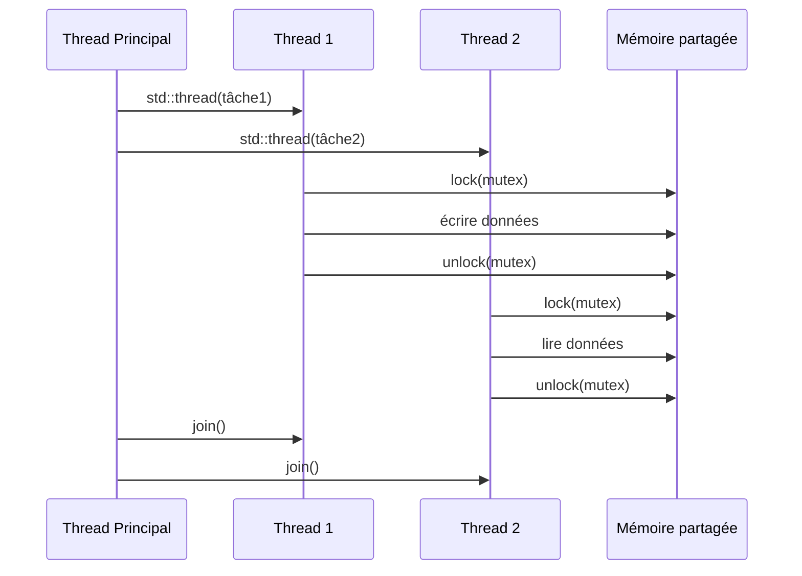

<!-- _class: title -->

# Formation C++ 🔐
## Jour 4 — C++ Moderne, Sécurité & Performance

*Lambdas · Concurrence · Multithreading · Monitoring*

---

<!-- _class: toc -->

# 📋 Sommaire — Jour 4

<ol>
  <li>Lambdas et fonctions anonymes</li>
  <li>Fonctionnalités modernes C++17/20</li>
  <li>Sécurité mémoire et vulnérabilités</li>
  <li>Validation des entrées et robustesse</li>
  <li>Introduction au multithreading</li>
  <li>Synchronisation et ressources partagées</li>
  <li>Futures, promises et async</li>
  <li>Monitoring et analyse de performance</li>
</ol>

---

<!-- _class: section -->

# 13 · Programmation Avancée en C++

Lambdas, fonctionnalités modernes et closures

---

# λ Lambdas — syntaxe complète

```cpp
// Syntaxe générale :
// [capture](paramètres) -> type_retour { corps }

// Lambda simple
auto carrer = [](int x) { return x * x; };
std::cout << carrer(5);  // 25

// Lambda avec capture par valeur
int facteur = 3;
auto multiplier = [facteur](int x) { return x * facteur; };

// Lambda avec capture par référence
int total = 0;
auto accumuler = [&total](int x) { total += x; };

// Capture tout par valeur [=] ou par référence [&]
auto mixte = [=, &total](int x) { total += x * facteur; };

// Lambda avec type de retour explicite
auto diviser = [](double a, double b) -> double {
    if (b == 0) throw std::invalid_argument("div/0");
    return a / b;
};
```

---

# λ Lambdas — utilisations avancées

```cpp
#include <functional>
#include <algorithm>

// Lambda comme paramètre de std::sort
std::vector<std::string> mots = {"banana", "apple", "cherry"};
std::sort(mots.begin(), mots.end(),
    [](const std::string& a, const std::string& b) {
        return a.length() < b.length();  // tri par longueur
    });

// Lambda stockée dans std::function
std::function<int(int, int)> operation;
operation = [](int a, int b) { return a + b; };

// Lambda récursive (auto + std::function)
std::function<int(int)> fib = [&fib](int n) -> int {
    if (n <= 1) return n;
    return fib(n-1) + fib(n-2);
};

// Lambda générique (C++14)
auto identite = [](auto x) { return x; };
std::cout << identite(42) << identite("hello");
```

---

# λ Closures et captures

```cpp
// Closure : lambda + son environnement capturé
std::function<int()> creerCompteur(int debut = 0) {
    int valeur = debut;  // capturée par valeur... mais mutable !
    return [valeur]() mutable {
        return valeur++;  // mutable permet de modifier la copie
    };
}

auto compteur1 = creerCompteur(0);
auto compteur2 = creerCompteur(100);

std::cout << compteur1();  // 0
std::cout << compteur1();  // 1
std::cout << compteur2();  // 100
std::cout << compteur1();  // 2

// Capture avec init (C++14) — move capture
auto ptr = std::make_unique<int>(42);
auto lambda = [p = std::move(ptr)]() {
    return *p;
};
// ptr est maintenant nullptr (moved into lambda)
```

---

# ⚡ auto et déduction de type

```cpp
// auto : le compilateur déduit le type
auto i = 42;               // int
auto d = 3.14;             // double
auto s = std::string{"hi"}; // std::string
auto v = std::vector<int>{1,2,3}; // vector<int>

// auto avec références
int x = 10;
auto& ref = x;    // int& — référence
auto* ptr = &x;   // int* — pointeur

// auto dans les boucles
std::map<std::string, int> m = {{"a", 1}, {"b", 2}};
for (const auto& [cle, val] : m) {  // structured bindings
    std::cout << cle << ": " << val << "\n";
}

// decltype — déduire le type d'une expression
int a = 5, b = 3;
decltype(a + b) somme = a + b;  // int

// auto pour le type de retour
auto calculer(int n) { return n * 2; }  // retourne int
```

---

# 🔗 Structured Bindings (C++17)

```cpp
#include <tuple>
#include <map>

// Déstructurer un std::pair
std::pair<std::string, int> p = {"Alice", 30};
auto [nom, age] = p;
std::cout << nom << " a " << age << " ans\n";

// Déstructurer un std::tuple
auto [x, y, z] = std::make_tuple(1.0, 2.0, 3.0);

// Déstructurer dans une boucle
std::map<int, std::string> codes = {
    {200, "OK"}, {404, "Not Found"}, {500, "Error"}
};
for (const auto& [code, message] : codes) {
    std::cout << code << " → " << message << "\n";
}

// Retourner plusieurs valeurs
auto minMax(const std::vector<int>& v) {
    auto [mi, ma] = std::minmax_element(v.begin(), v.end());
    return std::make_pair(*mi, *ma);
}
auto [minimum, maximum] = minMax({5, 2, 8, 1, 9});
```

---

# 🎯 if constexpr (C++17)

```cpp
#include <type_traits>

// Branches compilées conditionnellement selon le type
template<typename T>
std::string typeInfo(T val) {
    if constexpr (std::is_integral_v<T>) {
        return "Entier: " + std::to_string(val);
    } else if constexpr (std::is_floating_point_v<T>) {
        return "Flottant: " + std::to_string(val);
    } else if constexpr (std::is_same_v<T, std::string>) {
        return "String: " + val;
    } else {
        return "Type inconnu";
    }
}

// Différent de if normal : les branches non-sélectionnées
// NE SONT PAS compilées — élimine les erreurs de type
std::cout << typeInfo(42);       // "Entier: 42"
std::cout << typeInfo(3.14);     // "Flottant: 3.14"
std::cout << typeInfo(std::string("ok")); // "String: ok"
```

---

# 🔧 std::optional, std::variant, std::any

```cpp
#include <optional>
#include <variant>
#include <any>

// std::optional : valeur ou rien (C++17)
std::optional<int> trouver(int n) {
    if (n > 0) return n * 2;
    return std::nullopt;
}
auto r = trouver(-1);
if (r) std::cout << *r;  // ou r.value_or(0)

// std::variant : union typée (C++17)
std::variant<int, double, std::string> v;
v = 42;        // stocke int
v = 3.14;      // stocke double
v = "hello";   // stocke string
std::visit([](auto&& val) { std::cout << val; }, v);

// std::any : type quelconque (C++17)
std::any a = 42;
a = std::string("oui");
auto s = std::any_cast<std::string>(a);
```

---

# 🔀 Range-based for et boucles modernes

```cpp
#include <ranges>  // C++20

std::vector<int> v = {1, 2, 3, 4, 5, 6, 7, 8, 9, 10};

// C++20 Ranges — pipeline de transformations
auto resultat = v
    | std::views::filter([](int x) { return x % 2 == 0; })
    | std::views::transform([](int x) { return x * x; })
    | std::views::take(3);

for (int n : resultat) std::cout << n << " ";
// 4 16 36 (les 3 premiers carrés des pairs)

// Lazy evaluation : rien n'est calculé avant l'itération !

// iota_view : séquence entière
for (int i : std::views::iota(1, 11))
    std::cout << i << " ";  // 1 à 10
```

---

# 🧪 TP 13 — C++ Moderne en pratique

**Exercice A** : Réécrire du code C++98 en C++17
```cpp
// Code C++98 à moderniser :
bool chercher(std::vector<Produit>* produits,
              const std::string nom,
              Produit* resultat) { /* ... */ }

// Cible C++17 :
std::optional<Produit> chercher(
    const std::vector<Produit>& produits,
    const std::string& nom);
```

**Exercice B** : Pipeline de traitement avec Ranges
- Charger 1000 enregistrements CSV
- Filtrer par date (30 derniers jours)
- Grouper par catégorie
- Calculer la somme par groupe
- Afficher le top 5 des catégories (tout avec Ranges C++20)

---

# 🧪 TP 13 — Lambdas et closures avancées

**Exercice C** : Système d'événements avec lambdas
```cpp
class EventBus {
    std::map<std::string,
             std::vector<std::function<void(const std::any&)>>>
        handlers;
public:
    void subscribe(const std::string& event,
                   std::function<void(const std::any&)> handler);
    void publish(const std::string& event, const std::any& data);
};
```

**Exercice D** : Calculateur d'expression générique
- Parser des expressions `"2 + 3 * 4 - 1"`
- Lambdas pour chaque opérateur dans une `map<char, function<double(double,double)>>`
- Supporter : `+`, `-`, `*`, `/`, `^`, `sqrt()`

---

<!-- _class: section -->

# 14 · Sécurité et Robustesse en C++

Vulnérabilités mémoire, validation et bonnes pratiques

---

<!-- _class: cards -->

# 🔐 Catégories de vulnérabilités C++

<div class="card-grid">
<div class="card">

### 💥 Buffer Overflow
Écriture hors des bornes d'un tableau. CVE critiques dans des libs majeurs. Prévention : `std::array`, `at()`, bounds checking.

</div>
<div class="card">

### 👻 Use-After-Free
Accès à une mémoire déjà libérée. Comportement indéfini, exploitable. Prévention : smart pointers, RAII.

</div>
<div class="card">

### 🔢 Integer Overflow
Dépassement de capacité d'un entier. Résultats erronés, contournement de vérifs. Prévention : `safe_int`, vérifications explicites.

</div>
<div class="card">

### 💉 Injection
Données non validées injectées dans SQL, commandes shell. Prévention : requêtes préparées, validation stricte.

</div>
</div>

---

# 💥 Buffer Overflow — démonstration et prévention

```cpp
// ❌ VULNÉRABLE — buffer overflow classique
void vulnérable(const char* input) {
    char buffer[16];
    strcpy(buffer, input);  // DANGER : pas de vérification taille !
    // Si input > 15 chars → écrasement de la stack
}

// ❌ Mauvaise validation
void lireNom(char* buffer, int taille) {
    scanf("%s", buffer);    // DANGER : pas de limite !
}

// ✅ SÉCURISÉ — utiliser std::string
void securise(const std::string& input) {
    std::string buffer = input.substr(0, 15);  // tronquer si besoin
    // std::string gère sa propre mémoire
}

// ✅ Accès sécurisé aux tableaux
std::array<int, 16> arr{};
try {
    arr.at(20) = 5;  // lance std::out_of_range, pas de buffer overflow
} catch (const std::out_of_range& e) { /* gérer */ }
```

---

# 👻 Use-After-Free et Double Free

```cpp
// ❌ Use-after-free
int* p = new int(42);
delete p;
std::cout << *p;   // UNDEFINED BEHAVIOR — use-after-free

// ❌ Double free
int* q = new int(5);
delete q;
delete q;          // CRASH ou corruption

// ❌ Dangling reference
int* dangling;
{
    int local = 10;
    dangling = &local;
}   // local est détruit
*dangling = 99;    // UNDEFINED BEHAVIOR

// ✅ Solution : smart pointers
auto safe = std::make_unique<int>(42);
// safe est automatiquement détruit, jamais de double delete
// safe = nullptr après std::move() → accès refusé
```

---

# 🔢 Dépassements d'entiers

```cpp
#include <limits>
#include <stdexcept>

// ❌ Integer overflow silencieux
int max_int = std::numeric_limits<int>::max();  // 2 147 483 647
int overflow = max_int + 1;  // -2 147 483 648 ! (UB en C++)

// ✅ Vérification avant l'opération
int additionner_sur(int a, int b) {
    if (b > 0 && a > std::numeric_limits<int>::max() - b)
        throw std::overflow_error("Dépassement positif");
    if (b < 0 && a < std::numeric_limits<int>::min() - b)
        throw std::overflow_error("Dépassement négatif");
    return a + b;
}

// ✅ Utiliser des types appropriés
uint32_t compteur = 0;   // non-signé : overflow bien défini
int64_t grand = (int64_t)max_int + 1;  // utiliser un type plus grand
size_t taille = v.size();  // jamais négatif
```

---

# 🧹 Validation stricte des entrées

```cpp
#include <regex>
#include <stdexcept>

// Validation d'email
bool validerEmail(const std::string& email) {
    const std::regex pattern(
        R"(^[a-zA-Z0-9._%+-]+@[a-zA-Z0-9.-]+\.[a-zA-Z]{2,}$)");
    return std::regex_match(email, pattern);
}

// Validation de nombre dans une plage
int lireAge(const std::string& input) {
    try {
        size_t pos;
        int age = std::stoi(input, &pos);
        if (pos != input.size())  // caractères non numériques
            throw std::invalid_argument("Non numérique");
        if (age < 0 || age > 150)
            throw std::out_of_range("Age hors plage [0-150]");
        return age;
    } catch (const std::exception& e) {
        throw std::invalid_argument(
            "Age invalide : " + std::string(e.what()));
    }
}
```

---

# 💉 Prévention des injections SQL

```cpp
// ❌ INJECTION SQL possible
void rechercherVulnerable(const std::string& nom) {
    std::string query = "SELECT * FROM users WHERE name='" 
                        + nom + "'";
    // Si nom = "'; DROP TABLE users; --"
    // → destruction de la BDD !
    bdd.execute(query);
}

// ✅ Requêtes préparées (prepared statements)
void rechercherSecurise(sqlite3* db, const std::string& nom) {
    sqlite3_stmt* stmt;
    const char* sql = "SELECT * FROM users WHERE name=?";
    sqlite3_prepare_v2(db, sql, -1, &stmt, nullptr);
    sqlite3_bind_text(stmt, 1, nom.c_str(), -1, SQLITE_STATIC);

    while (sqlite3_step(stmt) == SQLITE_ROW) {
        const char* result = (const char*)sqlite3_column_text(stmt, 0);
        std::cout << result << "\n";
    }
    sqlite3_finalize(stmt);
}
```

---

# 🔧 Outils d'analyse de sécurité

```bash
# AddressSanitizer (ASan) — détecter les erreurs mémoire
g++ -fsanitize=address,undefined -g -o prog main.cpp
./prog  # rapporte les erreurs à l'exécution

# UndefinedBehaviorSanitizer
g++ -fsanitize=undefined -g -o prog main.cpp
./prog

# ThreadSanitizer (pour le multithreading)
g++ -fsanitize=thread -g -o prog main.cpp

# cppcheck — analyse statique
cppcheck --enable=all --std=c++17 src/

# Clang Static Analyzer
scan-build g++ -std=c++17 -o prog main.cpp

# Valgrind avec rapport XML
valgrind --xml=yes --xml-file=rapport.xml ./prog
```

---

# 🧪 TP 14 — Sécurité en pratique

**Exercice A** : Audit de code
Identifier et corriger les vulnérabilités :
```cpp
void traiterCommande(const char* cmd, int user_id) {
    char buffer[64];
    sprintf(buffer, "Commande: %s", cmd);  // Bug 1
    
    int* data = new int[user_id];
    for (int i = 0; i <= user_id; i++)  // Bug 2
        data[i] = i;
    
    std::string query = "DELETE FROM orders WHERE id="
                        + std::to_string(user_id);  // Bug 3 ?
    executeQuery(query);
}
```

**Exercice B** : Classe `InputValidator`
- Valider : email, URL, numéro de téléphone, date ISO
- Sanitiser les chaînes HTML (échapper `<`, `>`, `&`, `"`)
- Valider un JSON avec `nlohmann_json`

---

<!-- _class: section -->

# 15 · Performance et Multithreading

Threads, synchronisation et ressources partagées

---

<!-- _class: diagram-legend -->

# 🧵 Modèle de threads C++11

<div class="diag-wrap">



<div class="legend">

### 🧵 Concepts clés
- **Thread** : flux d'exécution indépendant
- **Mutex** : verrou d'exclusion mutuelle
- **Lock** : acquisition/libération du mutex
- **join()** : attendre la fin du thread
- **detach()** : thread indépendant

### ⚠️ Risques
- **Data race** : accès concurrent non protégé
- **Deadlock** : attente circulaire
- **Starvation** : thread jamais exécuté

</div>
</div>

---

# 🧵 std::thread — création et gestion

```cpp
#include <thread>
#include <iostream>

// Créer un thread avec une fonction
void tache(int id, const std::string& msg) {
    std::cout << "Thread " << id << " : " << msg << "\n";
}

int main() {
    // Lancement des threads
    std::thread t1(tache, 1, "Hello");
    std::thread t2(tache, 2, "World");

    // join() : attendre la fin du thread
    t1.join();
    t2.join();

    // Thread avec lambda
    std::thread t3([](int n) {
        for (int i = 0; i < n; i++)
            std::cout << i << " ";
    }, 5);
    t3.join();

    // Informations sur les threads
    std::cout << "Hardware threads : "
              << std::thread::hardware_concurrency() << "\n";
}
```

---

# 🔒 Mutex — exclusion mutuelle

```cpp
#include <mutex>
#include <thread>
#include <vector>

int compteur = 0;
std::mutex mtx;

// ❌ SANS mutex — data race !
void incrementerNonSur() {
    for (int i = 0; i < 1000; i++) compteur++;
}

// ✅ AVEC mutex
void incrementerSur() {
    for (int i = 0; i < 1000; i++) {
        std::lock_guard<std::mutex> lock(mtx);  // RAII lock
        compteur++;
        // lock libéré automatiquement à la fin du scope
    }
}

int main() {
    std::vector<std::thread> threads;
    for (int i = 0; i < 10; i++)
        threads.emplace_back(incrementerSur);
    for (auto& t : threads) t.join();
    std::cout << "Compteur : " << compteur << "\n";  // toujours 10000
}
```

---

# 🔐 Types de locks

```cpp
#include <mutex>
#include <shared_mutex>

std::mutex mtx;
std::shared_mutex sharedMtx;

// lock_guard — simple, scope-based (recommandé)
{
    std::lock_guard<std::mutex> lg(mtx);
    // section critique
}

// unique_lock — flexible, avec try_lock, timed_lock
{
    std::unique_lock<std::mutex> ul(mtx);
    ul.unlock();    // peut déverrouiller manuellement
    // ... travail sans le lock ...
    ul.lock();      // et reverrouiller
}

// shared_lock — lecture multiple / écriture exclusive
void lire() {
    std::shared_lock<std::shared_mutex> sl(sharedMtx);
    // Plusieurs threads peuvent lire simultanément
}
void ecrire() {
    std::unique_lock<std::shared_mutex> ul(sharedMtx);
    // Exclusif pour l'écriture
}
```

---

# ⚠️ Deadlock — détection et prévention

```cpp
std::mutex mtx1, mtx2;

// ❌ DEADLOCK possible
void thread1() {
    std::lock_guard<std::mutex> l1(mtx1);
    std::this_thread::sleep_for(std::chrono::milliseconds(10));
    std::lock_guard<std::mutex> l2(mtx2);  // attend mtx2
}

void thread2() {
    std::lock_guard<std::mutex> l2(mtx2);
    std::lock_guard<std::mutex> l1(mtx1);  // attend mtx1 → DEADLOCK
}

// ✅ PRÉVENTION : std::lock (atomique, sans deadlock)
void safe_thread1() {
    std::lock(mtx1, mtx2);  // acquiert les deux atomiquement
    std::lock_guard<std::mutex> l1(mtx1, std::adopt_lock);
    std::lock_guard<std::mutex> l2(mtx2, std::adopt_lock);
    // section critique
}
// ✅ C++17 : scoped_lock
void safe_thread2() {
    std::scoped_lock lock(mtx1, mtx2);  // acquiert les deux
}
```

---

# 📢 Variables de condition

```cpp
#include <condition_variable>
#include <queue>

std::queue<int> fileAttente;
std::mutex mtx;
std::condition_variable cv;

// Producteur
void producteur() {
    for (int i = 0; i < 10; i++) {
        {
            std::lock_guard<std::mutex> lock(mtx);
            fileAttente.push(i);
        }
        cv.notify_one();  // réveille un consommateur
    }
}

// Consommateur
void consommateur() {
    while (true) {
        std::unique_lock<std::mutex> lock(mtx);
        cv.wait(lock, []{ return !fileAttente.empty(); });
        int val = fileAttente.front();
        fileAttente.pop();
        lock.unlock();
        traiter(val);
    }
}
```

---

# ⚡ Variables atomiques

```cpp
#include <atomic>

// Opérations atomiques — sans mutex pour les types simples
std::atomic<int> compteurAtomique{0};
std::atomic<bool> stopSignal{false};

// Incrément atomique
void incrementer() {
    for (int i = 0; i < 1000; i++) {
        compteurAtomique.fetch_add(1);  // ou ++compteurAtomique
    }
}

// Flag atomique pour arrêter les threads
void travailleur() {
    while (!stopSignal.load()) {
        std::this_thread::sleep_for(
            std::chrono::milliseconds(10));
        // ...
    }
}

void arreter() {
    stopSignal.store(true);
}

// atomic<T> supporte : load, store, exchange,
// compare_exchange_weak/strong, fetch_add, fetch_sub
```

---

# 🔮 std::future et std::async

```cpp
#include <future>
#include <thread>

// async : lancer une tâche asynchrone
std::future<int> futur = std::async(std::launch::async, []() {
    std::this_thread::sleep_for(std::chrono::seconds(2));
    return 42;
});

// Faire autre chose pendant le calcul
std::cout << "Calcul en cours...\n";
traiterAutreChose();

// Récupérer le résultat (bloque si pas encore disponible)
int resultat = futur.get();  // attend et retourne 42
std::cout << "Résultat : " << resultat << "\n";

// Vérifier sans bloquer
if (futur.wait_for(std::chrono::milliseconds(100)) ==
    std::future_status::ready) {
    std::cout << "Prêt : " << futur.get() << "\n";
}
```

---

# 📬 std::promise — communication entre threads

```cpp
#include <future>
#include <thread>

void calculer(std::promise<int> promesse, int n) {
    try {
        if (n < 0) throw std::invalid_argument("Négatif !");
        int resultat = n * n;
        promesse.set_value(resultat);  // envoyer le résultat
    } catch (...) {
        promesse.set_exception(std::current_exception());
    }
}

int main() {
    std::promise<int> promesse;
    std::future<int> futur = promesse.get_future();

    std::thread t(calculer, std::move(promesse), 7);

    try {
        int val = futur.get();  // 49
        std::cout << "Résultat : " << val << "\n";
    } catch (const std::exception& e) {
        std::cerr << "Erreur : " << e.what() << "\n";
    }
    t.join();
}
```

---

# 🏊 Thread Pool — gestion efficace

```cpp
#include <thread>
#include <queue>
#include <functional>
#include <atomic>

class ThreadPool {
    std::vector<std::thread> workers;
    std::queue<std::function<void()>> tasks;
    std::mutex queueMtx;
    std::condition_variable cv;
    std::atomic<bool> stop{false};

public:
    ThreadPool(size_t nbThreads) {
        for (size_t i = 0; i < nbThreads; i++) {
            workers.emplace_back([this] {
                while (!stop) {
                    std::function<void()> task;
                    { std::unique_lock<std::mutex> lock(queueMtx);
                      cv.wait(lock, [this]{
                          return stop || !tasks.empty(); });
                      if (stop && tasks.empty()) return;
                      task = std::move(tasks.front());
                      tasks.pop(); }
                    task();
                }
            });
        }
    }
    void enqueue(std::function<void()> task) {
        { std::lock_guard<std::mutex> lock(queueMtx);
          tasks.push(std::move(task)); }
        cv.notify_one();
    }
    ~ThreadPool() {
        stop = true; cv.notify_all();
        for (auto& t : workers) t.join();
    }
};
```

---

# 🧪 TP 15 — Multithreading

**Exercice A** : Producteur-consommateur
- 2 producteurs génèrent des nombres aléatoires
- 3 consommateurs calculent leur carré
- File d'attente partagée protégée par mutex + condition_variable
- Arrêt propre avec signal atomique

**Exercice B** : Paralléliser un calcul
- Calculer la somme de 10 millions d'entiers
- Version séquentielle → mesurer
- Diviser en 4 tâches avec `std::async`
- Mesurer le speedup obtenu

**Exercice C** : Détecteur de data race
```bash
# Compiler avec ThreadSanitizer
g++ -fsanitize=thread -g -o prog main.cpp
./prog
# Identifier et corriger tous les data races reportés
```

---

<!-- _class: section -->

# 16 · Testing, Monitoring et Synthèse

Tests de performance, outils d'observation et analyse

---

# 📊 Tests de performance — benchmark

```cpp
#include <chrono>
#include <functional>

class Benchmark {
public:
    struct Resultat {
        double moyenne_us;
        double min_us;
        double max_us;
        double ecart_type;
    };

    static Resultat mesurer(const std::string& nom,
                            std::function<void()> fn,
                            int iterations = 1000) {
        std::vector<double> temps;
        temps.reserve(iterations);

        for (int i = 0; i < iterations; i++) {
            auto debut = std::chrono::high_resolution_clock::now();
            fn();
            auto fin = std::chrono::high_resolution_clock::now();
            temps.push_back(
                std::chrono::duration<double, std::micro>(
                    fin - debut).count());
        }
        // ... calculer stats ...
        return calculerStats(temps);
    }
};
```

---

# 🔍 Profiling avancé — perf et flamegraphs

```bash
# Compilation avec debug symbols
g++ -g -O2 -fno-omit-frame-pointer -o app main.cpp

# Enregistrement du profil (10 secondes)
perf record -g -F 1000 ./app
perf report --stdio

# Génération d'un flamegraph
perf script | stackcollapse-perf.pl | flamegraph.pl > flamegraph.svg
firefox flamegraph.svg

# Compteurs hardware
perf stat ./app
# cache-misses, branch-misses, cycles, instructions

# Valgrind callgrind pour l'analyse fine
valgrind --tool=callgrind ./app
callgrind_annotate callgrind.out.*
kcachegrind callgrind.out.*  # visualisation GUI
```

---

# 🔍 Valgrind — suite d'outils

```bash
# Memcheck — fuites et erreurs mémoire (vu au Jour 1)
valgrind --leak-check=full --show-leak-kinds=all ./app

# Helgrind — problèmes de threading
valgrind --tool=helgrind ./app
# Détecte : data races, lock ordering violations

# DRD — détecteur de data races alternatif
valgrind --tool=drd ./app

# Massif — profiler de mémoire (heap usage)
valgrind --tool=massif ./app
ms_print massif.out.* | head -50
# Ou visualiser avec massif-visualizer

# Cachegrind — simulation de cache CPU
valgrind --tool=cachegrind ./app
cg_annotate cachegrind.out.*
```

---

# 📝 Logging structuré avec spdlog

```cpp
#include <spdlog/spdlog.h>
#include <spdlog/sinks/rotating_file_sink.h>

// Configurer un logger avec rotation de fichiers
auto logger = spdlog::rotating_logger_mt(
    "app_log", "logs/app.log",
    1024 * 1024 * 5,  // 5 MB max
    3);               // 3 fichiers de rotation

logger->set_level(spdlog::level::debug);
logger->set_pattern("[%Y-%m-%d %H:%M:%S.%e] [%l] [%n] %v");

// Niveaux de log
logger->trace("Valeur détaillée : {}", valeur);
logger->debug("Requête SQL : {}", query);
logger->info("Connexion établie avec {}", serveur);
logger->warn("Tentative {} échouée", tentative);
logger->error("Erreur fatale : {}", e.what());
logger->critical("Arrêt du service !");

// Flush automatique sur erreur
logger->flush_on(spdlog::level::err);
```

---

# 📊 Analyse des logs et anomalies

```cpp
#include <regex>
#include <fstream>
#include <map>

// Analyser les logs pour détecter des patterns
struct Anomalie {
    std::string timestamp;
    std::string niveau;
    int occurrences;
};

class AnalyseurLog {
    std::map<std::string, int> compteurs;
    std::vector<Anomalie> anomalies;

public:
    void analyser(const std::string& fichier) {
        std::ifstream f(fichier);
        std::string ligne;
        std::regex pattern(R"(\[(\d{4}-\d{2}-\d{2})\] \[(\w+)\] (.+))");

        while (std::getline(f, ligne)) {
            std::smatch match;
            if (std::regex_match(ligne, match, pattern)) {
                std::string niveau = match[2];
                compteurs[niveau]++;
                if (niveau == "ERROR" || niveau == "CRITICAL")
                    signaler(match[1], niveau, match[3]);
            }
        }
    }
};
```

---

# 🧪 TP 16 — Tests de performance et monitoring

**Exercice A** : Benchmark comparatif
- Implémenter `rechercherLinéaire` et `rechercherBinaire`
- Benchmark sur 10K, 100K, 1M éléments (100 répétitions)
- Afficher : moyenne, min, max, écart-type
- Générer un rapport CSV

**Exercice B** : Monitoring en temps réel
- Application qui traite des requêtes (simulées)
- Logger structuré : chaque requête avec durée
- Analyser les logs : détecter les requêtes > 100ms
- Calculer P50, P95, P99 de la latence

**Exercice C** : Profiling complet
- Profiler avec Valgrind Callgrind
- Identifier la fonction la plus lente (top 3)
- Optimiser et mesurer le gain

---

# 🔧 Optimisations avancées

```cpp
// 1. Réserver la capacité des conteneurs
std::vector<int> v;
v.reserve(10000);  // évite les réallocations

// 2. Utiliser emplace_back au lieu de push_back
struct Point { double x, y; };
std::vector<Point> points;
points.emplace_back(1.0, 2.0);  // construit en place

// 3. Cache-friendly : parcours de lignes
int mat[1000][1000];
for (int i = 0; i < 1000; i++)      // ✅ row-major (cache-friendly)
    for (int j = 0; j < 1000; j++)
        mat[i][j] = 0;

// for (int j = 0; ...) for (int i = ...)  ❌ column-major (cache miss)

// 4. Branch prediction hints (C++20)
[[likely]]   if (condition_frequente) { /* ... */ }
[[unlikely]] if (condition_rare)      { /* ... */ }

// 5. Inlining
[[nodiscard]] inline int square(int x) noexcept { return x * x; }
```

---

<!-- _class: list-cols -->

# 📝 Synthèse — Jour 4

- **Lambdas** : `[capture](params) { corps }`
- **auto** : déduction de type automatique
- **Structured bindings** : `auto [a, b] = paire`
- **if constexpr** : compilation conditionnelle
- **std::optional** : valeur ou absence
- **Ranges (C++20)** : pipelines de transformations
- **Buffer overflow** : utiliser `array`, `at()`, `string`
- **Use-after-free** : smart pointers, jamais de raw delete
- **Validation** : toujours valider les entrées extérieures
- **std::thread** : flux d'exécution indépendant
- **mutex / lock_guard** : protection des accès partagés
- **std::async/future** : résultats asynchrones
- **ThreadPool** : réutiliser les threads
- **perf / Valgrind** : profiler avant d'optimiser

---

# 🧵 std::jthread — thread avec annulation (C++20)

```cpp
#include <thread>
#include <stop_token>

// jthread : join automatique + mécanisme d'annulation
std::jthread worker([](std::stop_token stoken) {
    while (!stoken.stop_requested()) {
        traitement();
        std::this_thread::sleep_for(std::chrono::milliseconds(100));
    }
    std::cout << "Thread arrêté proprement\n";
});

// Demander l'arrêt
worker.request_stop();
// join() automatique à la destruction de worker !

// Callback sur l'arrêt
std::stop_source source;
std::stop_callback cb(source.get_token(), []() {
    std::cout << "Arrêt demandé !\n";
});
source.request_stop();  // déclenche le callback
```

---

# 🚦 std::latch et std::barrier (C++20)

```cpp
#include <latch>
#include <barrier>

// latch : compte à rebours, usage unique
std::latch pret(3);  // attend 3 signaux

std::thread t1([&]{ initialiser_module_A(); pret.count_down(); });
std::thread t2([&]{ initialiser_module_B(); pret.count_down(); });
std::thread t3([&]{ initialiser_bdd();      pret.count_down(); });

pret.wait();  // bloque jusqu'à ce que les 3 soient prêts
demarrer_application();

// barrier : synchronisation cyclique (réutilisable)
std::barrier<> sync(4, []() {
    std::cout << "--- Fin de phase ---\n";
});

// Dans chaque thread :
for (int phase = 0; phase < 10; phase++) {
    traiter_phase(phase);
    sync.arrive_and_wait();  // synchronise tous les threads
    // Tous les threads sont ici avant de passer à la phase+1
}
```

---

# 🔑 std::semaphore (C++20)

```cpp
#include <semaphore>

// Sémaphore de comptage : limite les accès concurrents
// Ici, maximum 3 connexions simultanées
std::counting_semaphore<3> connexions(3);

void accederBDD() {
    connexions.acquire();  // bloque si déjà 3 connexions actives
    {
        // Faire la requête BDD
        requete();
    }
    connexions.release();  // libère un slot
}

// binary_semaphore : comme un mutex mais peut être
// signalé depuis un autre thread
std::binary_semaphore signal(0);

std::thread producteur([&] {
    produire();
    signal.release();  // signaler depuis producteur
});

signal.acquire();  // attendre dans le thread principal
consommer();
```

---

# ⚛️ Memory Order — contrôle fin des atomiques

```cpp
#include <atomic>

std::atomic<int> data{0};
std::atomic<bool> pret{false};

// Thread producteur
void produire() {
    data.store(42, std::memory_order_relaxed);   // écriture relaxée
    pret.store(true, std::memory_order_release); // release fence
}

// Thread consommateur
void consommer() {
    while (!pret.load(std::memory_order_acquire)); // acquire fence
    // Garantit de voir data = 42 après acquire
    assert(data.load(std::memory_order_relaxed) == 42);
}
```

| Order | Description | Coût |
|---|---|---|
| `relaxed` | Aucune synchronisation | Minimal |
| `acquire` | Voir tout ce qu'un `release` a écrit avant | Moyen |
| `release` | Rendre visible aux `acquire` suivants | Moyen |
| `seq_cst` | Ordre total global (défaut) | Maximum |

---

# 🔓 Lock-Free Programming — intro

```cpp
#include <atomic>

// Pile lock-free simple (Treiber stack)
template<typename T>
class PileLockFree {
    struct Noeud {
        T val;
        Noeud* suivant;
    };
    std::atomic<Noeud*> sommet{nullptr};

public:
    void push(T val) {
        auto* n = new Noeud{val, nullptr};
        do {
            n->suivant = sommet.load();
        } while (!sommet.compare_exchange_weak(
                    n->suivant, n));
        // CAS : atomic Compare-And-Swap
        // Si sommet == n->suivant → sommet = n (succès)
        // Sinon → réessayer (loop)
    }
};
// ⚠️ Lock-free ≠ wait-free ≠ obstruction-free
// En pratique : utiliser std::atomic + mutex, éviter lock-free
// sauf si profiling prouve une nécessité absolue
```

---

# 🔮 Coroutines C++20 — introduction

```cpp
#include <coroutine>
#include <generator>  // C++23

// Générateur : coroutine qui yield des valeurs
std::generator<int> fibonacci() {
    int a = 0, b = 1;
    while (true) {
        co_yield a;          // suspend et retourne a
        auto next = a + b;
        a = b;
        b = next;
    }
}

// Utilisation
for (int n : fibonacci() | std::views::take(10)) {
    std::cout << n << " ";   // 0 1 1 2 3 5 8 13 21 34
}

// co_await : suspension asynchrone
// co_yield : suspension avec valeur
// co_return : fin de la coroutine
```

---

# 🔮 Coroutines — tâches asynchrones

```cpp
// Task<T> : coroutine asynchrone (simplifié)
Task<std::string> fetchUrl(std::string url) {
    auto reponse = co_await httpGet(url);    // suspend sans bloquer
    auto parsed  = co_await parseJson(reponse);  // suspend sans bloquer
    co_return parsed["titre"].get<std::string>();
}

// Pipeline asynchrone
Task<void> traiterDonnees() {
    auto t1 = fetchUrl("https://api1.com/data");
    auto t2 = fetchUrl("https://api2.com/data");

    // Lancer les deux en parallèle
    auto [r1, r2] = co_await whenAll(t1, t2);
    co_return process(r1, r2);
}

// Avantages des coroutines :
// ✅ Code séquentiel, exécution asynchrone
// ✅ Pas de callback hell
// ✅ Zéro allocation dans les cas simples (stackless)
```

---

# 🎮 C++ dans le développement de jeux vidéo

```cpp
// ECS : Entity-Component-System (architecture typique)
using EntityID = uint32_t;

// Composants (données pures)
struct Position { float x, y, z; };
struct Velocite  { float vx, vy, vz; };
struct Sante     { int points, max; };
struct Rendu     { MeshID mesh; TextureID tex; };

// Système : logique qui opère sur les composants
class SystPhysique {
public:
    void mise_a_jour(float dt,
                     std::span<Position> positions,
                     std::span<const Velocite> vitesses) {
        for (size_t i = 0; i < positions.size(); i++) {
            positions[i].x += vitesses[i].vx * dt;
            positions[i].y += vitesses[i].vy * dt;
            positions[i].z += vitesses[i].vz * dt;
        }
    }
};
// Cache-friendly : les données sont contiguës en mémoire
```

---

# 🚗 C++ embarqué et temps-réel

```cpp
// Contraintes temps-réel : pas d'allocation dynamique !
// MISRA C++ : sous-ensemble sûr de C++

// ❌ Interdit dans les systèmes embarqués critiques
std::vector<int> v;      // allocation dynamique
std::string s = "abc";   // allocation
throw std::exception();  // exceptions désactivées souvent

// ✅ Alternatives pour l'embarqué
std::array<int, 100> arr{};      // taille fixe
char buf[64] = "abc";            // pile ou segment statique
std::optional<int> resultat;     // optionnel sans allocation

// Memory pool pour éviter malloc/free
template<typename T, size_t N>
class MemoryPool {
    std::array<std::aligned_storage_t<sizeof(T)>, N> storage;
    std::array<bool, N> used{};
public:
    T* allouer() { /* trouver slot libre */ }
    void liberer(T* ptr) { /* marquer libre */ }
};
```

---

# ⚡ MISRA C++ — règles essentielles

| Règle | Description |
|---|---|
| **No dynamic** | Pas de `new`/`delete` après initialisation |
| **No exceptions** | `try/catch` interdit (overhead imprévisible) |
| **No recursion** | Profondeur de pile imprévisible |
| **No RTTI** | `dynamic_cast`, `typeid` interdits |
| **No virtual** | Souvent interdit (dispatch overhead) |
| **Strict types** | Pas de conversions implicites |
| **const partout** | Variables non-modifiées = const |

Utilisé dans : automobiles (ISO 26262), médical, aviation, défense, spatial.

---

# 📈 C++ dans le High-Frequency Trading

```cpp
// HFT : latence < 1 µs — chaque nanoseconde compte !

// CPU pinning : thread sur un cœur dédié
void pinnerThread(int cpu_id) {
    cpu_set_t cpuset;
    CPU_ZERO(&cpuset);
    CPU_SET(cpu_id, &cpuset);
    pthread_setaffinity_np(pthread_self(),
                           sizeof(cpuset), &cpuset);
}

// Lock-free queue pour la communication
// Huge pages pour réduire les TLB misses
// RDTSC pour mesurer en cycles CPU

// Techniques HFT C++ :
// ✅ Spinlock plutôt que mutex (pas de context switch)
// ✅ Branch hints __builtin_expect()
// ✅ Prefetch manuel _mm_prefetch()
// ✅ Bitfields pour les messages compacts
// ✅ SIMD pour le traitement parallèle des données
```

---

# 🤖 Machine Learning avec C++

```cpp
// libtorch : C++ frontend de PyTorch
#include <torch/torch.h>

// Définir un réseau de neurones
struct ResNet : torch::nn::Module {
    torch::nn::Linear fc1, fc2, fc3;

    ResNet() :
        fc1(784, 256), fc2(256, 128), fc3(128, 10) {
        register_module("fc1", fc1);
        register_module("fc2", fc2);
        register_module("fc3", fc3);
    }

    torch::Tensor forward(torch::Tensor x) {
        x = torch::relu(fc1(x));
        x = torch::relu(fc2(x));
        return fc3(x);
    }
};

// Inférence haute performance
ResNet model;
model->eval();
auto sortie = model->forward(entree);
auto prediction = sortie.argmax(1);
```

---

# 🌐 WebAssembly avec C++

```cpp
// Emscripten : compiler C++ → WebAssembly
// g++ remplacé par em++

// Exporter une fonction C++ vers JavaScript
#include <emscripten/emscripten.h>

extern "C" {
    EMSCRIPTEN_KEEPALIVE
    int additionner(int a, int b) {
        return a + b;
    }

    EMSCRIPTEN_KEEPALIVE
    void traiterImage(uint8_t* data, int width, int height) {
        // Traitement d'image en C++ appelé depuis JS
        for (int i = 0; i < width * height * 4; i += 4) {
            // Convertir en niveaux de gris
            uint8_t gris = (data[i] + data[i+1] + data[i+2]) / 3;
            data[i] = data[i+1] = data[i+2] = gris;
        }
    }
}
// Compilation : em++ -O3 -sEXPORTED_FUNCTIONS=_additionner ...
```

---

# 🌐 REST API avec cpp-httplib

```cpp
#include <httplib.h>
#include <nlohmann/json.hpp>

int main() {
    httplib::Server srv;

    // GET /api/livres
    srv.Get("/api/livres", [](const httplib::Request& req,
                               httplib::Response& res) {
        nlohmann::json livres = getLivres();
        res.set_content(livres.dump(), "application/json");
    });

    // POST /api/livres
    srv.Post("/api/livres", [](const httplib::Request& req,
                                httplib::Response& res) {
        auto body = nlohmann::json::parse(req.body);
        Livre livre = Livre::fromJson(body);
        catalogue.ajouter(livre);

        res.status = 201;
        res.set_content(livre.toJson().dump(), "application/json");
    });

    srv.listen("0.0.0.0", 8080);
}
```

---

# 🔐 Fuzzing — tester avec des inputs aléatoires

```cpp
// LibFuzzer : fuzzing intégré à Clang

// Compilation avec libFuzzer
// clang++ -fsanitize=fuzzer,address -g -o fuzzer fuzz.cpp

extern "C" int LLVMFuzzerTestOneInput(
    const uint8_t* data, size_t size) {

    // La fonction à fuzzer
    std::string input(reinterpret_cast<const char*>(data), size);

    try {
        // Parser qui pourrait crasher avec des inputs malformés
        auto resultat = parseConfig(input);
    } catch (const std::exception&) {
        // Les exceptions sont OK — pas les crashes !
    }

    return 0;
}
```

```bash
# Lancer le fuzzer (trouve des bugs en quelques secondes)
./fuzzer corpus/ -max_len=1000 -runs=1000000
# Rapporte les inputs qui causent des crashes
```

---

# 🛡️ Protections binaires

```cpp
// Stack canaries : détection de buffer overflow
// Activé par défaut avec -fstack-protector-strong

// ASLR : Address Space Layout Randomization
// L'OS randomise les adresses — rend les exploits difficiles
// Vérifier : cat /proc/sys/kernel/randomize_va_space (doit être 2)

// PIE : Position Independent Executable
// g++ -fPIE -pie -o app main.cpp

// RELRO : protection des sections de données
// g++ -Wl,-z,relro,-z,now -o app main.cpp

// Fortify Source : vérifie les fonctions C dangereuses
// g++ -D_FORTIFY_SOURCE=2 -O2 -o app main.cpp

// Vérifier les protections
// checksec --file=./app

// Résultat attendu :
// RELRO: Full  STACK CANARY: Canary found  NX: NX enabled
// PIE: PIE enabled  FORTIFY: Enabled
```

---

# 🔍 Intel VTune — profiling avancé

```bash
# Analyser les performances CPU
vtune -collect hotspots ./app
vtune -report summary -r ./vtune_results

# Analyse de cache
vtune -collect memory-access ./app
vtune -report top-down -r ./vtune_results

# Threading analysis
vtune -collect threading ./app

# Métriques importantes :
# - CPI (Cycles Per Instruction) → idéal < 1.0
# - L1/L2/L3 cache miss rate → optimiser l'accès mémoire
# - Branch misprediction rate → réorganiser les conditions
# - Memory bandwidth utilization
```

Alternatives libres : **perf** (Linux), **Instruments** (macOS), **AMD uProf**

---

# ⚡ SIMD — traitement vectoriel

```cpp
#include <immintrin.h>  // AVX2

// Additionner 8 floats en une seule instruction
void additionner_simd(float* a, float* b, float* c, int n) {
    int i = 0;
    for (; i <= n - 8; i += 8) {
        __m256 va = _mm256_loadu_ps(a + i);  // charger 8 floats
        __m256 vb = _mm256_loadu_ps(b + i);
        __m256 vc = _mm256_add_ps(va, vb);   // additionner 8 à la fois
        _mm256_storeu_ps(c + i, vc);          // stocker
    }
    for (; i < n; i++) c[i] = a[i] + b[i];  // reste
}

// Version scalaire équivalente (8× plus lente !)
void additionner_scalar(float* a, float* b, float* c, int n) {
    for (int i = 0; i < n; i++) c[i] = a[i] + b[i];
}

// En pratique : laisser le compilateur vectoriser avec -O3 -march=native
// Utiliser SIMD manuel seulement si le compilateur échoue à vectoriser
```

---

# 🚀 Link-Time Optimization (LTO)

```cmake
# Activer LTO dans CMake
include(CheckIPOSupported)
check_ipo_supported(RESULT ipo_supported)

if(ipo_supported)
    set_property(TARGET monApp
        PROPERTY INTERPROCEDURAL_OPTIMIZATION TRUE)
    message(STATUS "LTO activé")
endif()
```

```bash
# Manuellement
g++ -O2 -flto main.cpp utils.cpp -o app  # compilation
g++ -O2 -flto main.o utils.o -o app       # link avec LTO

# LTO permet :
# ✅ Inlining entre fichiers différents
# ✅ Dead code elimination globale
# ✅ Constante propagation cross-module
# Gain typique : 5-20% de performance
```

---

# 🎯 Profile-Guided Optimization (PGO)

```bash
# Étape 1 : compiler avec instrumentation
g++ -O2 -fprofile-generate -o app_profiled main.cpp

# Étape 2 : exécuter avec des données représentatives
./app_profiled < données_typiques.txt

# Étape 3 : recompiler avec les données de profil
g++ -O2 -fprofile-use -fprofile-correction -o app main.cpp

# Le compilateur utilise les données pour :
# ✅ Inliner les fonctions fréquemment appelées
# ✅ Optimiser les branches les plus prises
# ✅ Réorganiser le code pour la cache
# ✅ Déspécialiser les chemins rares

# Gain typique : 10-30% de performance !
```

---

# 💾 Cache Optimization — techniques

```cpp
// Problème : cache miss dans une matrice
int mat[1000][1000];

// ❌ Column-major : mauvaise localité cache
for (int j = 0; j < 1000; j++)     // colonne
    for (int i = 0; i < 1000; i++) // ligne
        somme += mat[i][j];  // saut de 1000*4 = 4000 octets !

// ✅ Row-major : bonne localité cache
for (int i = 0; i < 1000; i++)     // ligne
    for (int j = 0; j < 1000; j++) // colonne
        somme += mat[i][j];  // accès séquentiel

// Tiling : traiter par blocs tenant dans le cache L1
constexpr int TILE = 32;
for (int i = 0; i < N; i += TILE)
    for (int j = 0; j < N; j += TILE)
        for (int ii = i; ii < min(i+TILE, N); ii++)
            for (int jj = j; jj < min(j+TILE, N); jj++)
                c[ii][jj] += a[ii][jj] * b[jj][ii];
```

---

# 🏗️ Pimpl Idiom — réduire les dépendances de compilation

```cpp
// widget.hpp — header minimal, pas de dépendances impl
#pragma once
#include <memory>
#include <string>

class Widget {
public:
    Widget();
    ~Widget();
    void dessiner();
    void setTitre(const std::string& t);
private:
    struct Impl;  // déclaration forward seulement
    std::unique_ptr<Impl> pImpl;
};

// widget.cpp — implémentation cachée
#include "widget.hpp"
#include <qt/qwidget.h>    // QT seulement dans le .cpp !
#include <boost/whatever.h>

struct Widget::Impl {
    QWidget* qt_widget;
    std::string titre;
    void dessiner() { qt_widget->show(); }
};

Widget::Widget() : pImpl(std::make_unique<Impl>()) {}
Widget::~Widget() = default;  // must be in .cpp (Impl completeness)
void Widget::dessiner() { pImpl->dessiner(); }
```

---

# 🏗️ Type Erasure — polymorphisme sans héritage

```cpp
// std::function est un exemple de type erasure
// Peut contenir: lambda, fonction, foncteur, membre

class NimporteQuelDessinable {
    struct Concept {
        virtual void dessiner() = 0;
        virtual ~Concept() = default;
    };
    template<typename T>
    struct Modele : Concept {
        T obj;
        Modele(T o) : obj(std::move(o)) {}
        void dessiner() override { obj.dessiner(); }
    };
    std::unique_ptr<Concept> impl;

public:
    template<typename T>
    NimporteQuelDessinable(T obj)
        : impl(std::make_unique<Modele<T>>(std::move(obj))) {}

    void dessiner() { impl->dessiner(); }
};

// Accepte n'importe quoi ayant une méthode dessiner()
NimporteQuelDessinable d1(Cercle{5});
NimporteQuelDessinable d2(CarreSVG{3});
NimporteQuelDessinable d3([]{std::cout << "dessin!\n";});
```

---

# 🧪 TP Jour 4 — Bonus Multithreading avancé

**Exercice A** : Implémenter un ThreadPool avec futures

```cpp
class ThreadPool {
public:
    explicit ThreadPool(size_t threads);
    ~ThreadPool();

    // Envoyer une tâche et récupérer son résultat
    template<typename F, typename... Args>
    auto submit(F&& f, Args&&... args)
        -> std::future<std::invoke_result_t<F, Args...>>;
};

// Utilisation
ThreadPool pool(4);
auto f1 = pool.submit([]{ return calculer(1000000); });
auto f2 = pool.submit([](int n){ return fibonacci(n); }, 40);
int r1 = f1.get();
int r2 = f2.get();
```

- Utiliser `std::packaged_task` pour les futures
- Tester avec 10K tâches courtes (vérifier pas de deadlock)

---

# 🧪 TP Jour 4 — Bonus Sécurité avancée

**Exercice B** : Fuzzer pour un parser

- Écrire un parser de fichiers de configuration (format `key=value`)
- Compiler avec LibFuzzer : `clang++ -fsanitize=fuzzer,address`
- Lancer le fuzzer pendant 60 secondes
- Corriger tous les crashs trouvés

**Exercice C** : Benchmark cache-friendly

```cpp
// Mesurer l'impact du cache sur deux structures de données :

// Structure of Arrays (SoA) — cache-friendly
struct SoA { std::vector<float> x, y, z; };

// Array of Structures (AoS) — moins cache-friendly pour opérations SIMD
struct AoS { std::vector<std::array<float,3>> pts; };

// Calculer la distance totale entre points consécutifs
// Mesurer avec Google Benchmark pour 1M de points
// SoA devrait être 2-4× plus rapide pour les opérations vectorisées
```

---

# 📊 Comparatif de performance — résumé

| Technique | Gain typique | Quand utiliser |
|---|---|---|
| `reserve()` sur vector | 2-5× | Taille connue à l'avance |
| `emplace_back` vs `push_back` | 10-30% | Objets construits in-place |
| `string_view` vs `string&` | 20-50% | Paramètres read-only |
| Move semantics | 10-100× | Retourner de gros objets |
| LTO | 5-20% | Toujours en release |
| PGO | 10-30% | Code CPU-intensif |
| SIMD | 4-16× | Calcul parallèle de données |
| Cache-friendly layout | 2-10× | Structures accédées séquentiellement |
| ThreadPool (4 cœurs) | 3-4× | Tâches indépendantes |

---

# 🔧 TP Jour 4 — Optimisation complète

**Exercice D** : Optimiser un pipeline de traitement d'images

```cpp
// Code initial : filtrer + redimensionner 100 images 4K
for (auto& img : images) {
    auto filtrée = appliquerFiltre(img, GaussianBlur{5});
    auto redim   = redimensionner(filtrée, 1920, 1080);
    sauvegarder(redim, "output/");
}

// Optimisations à appliquer :
// 1. Paralléliser avec ThreadPool
// 2. Éviter les copies (move semantics)
// 3. SoA pour les pixels (SIMD-friendly)
// 4. LTO + PGO en release
// 5. Mesurer chaque optimisation séparément
// Objectif : temps < 5 secondes pour 100 images 4K
```

---

# 📝 Synthèse étendue — Jour 4

**Panorama du C++ avancé maîtrisé :**

```
C++ Moderne
├── Lambdas, closures, std::function
├── auto, structured bindings, if constexpr
├── std::optional, std::variant, std::any
└── Ranges (C++20), coroutines (C++20)

Concurrence
├── std::thread / std::jthread
├── mutex, lock_guard, scoped_lock
├── condition_variable, semaphore, latch, barrier
├── std::atomic + memory order
└── std::async, std::future, std::promise

Sécurité
├── Buffer overflow, use-after-free, integer overflow
├── Sanitizers : ASan, UBSan, TSan
├── Fuzzing avec LibFuzzer
└── Protections binaires (ASLR, PIE, canaries)

Performance
├── Cache-friendly code, SIMD, LTO, PGO
├── Google Benchmark, Valgrind Callgrind
└── Type erasure, Pimpl, ThreadPool
```


---

# ⚡ std::execution — algorithmes parallèles (C++17)

```cpp
#include <algorithm>
#include <execution>

std::vector<int> v(10000000);
std::iota(v.begin(), v.end(), 0);

// Politique séquentielle (comportement classique)
std::sort(std::execution::seq, v.begin(), v.end());

// Politique parallèle (multithreading automatique)
std::sort(std::execution::par, v.begin(), v.end());

// Politique parallèle + vectorisation SIMD
std::sort(std::execution::par_unseq, v.begin(), v.end());

// Tous les algorithmes STL sont supportés
auto total = std::reduce(std::execution::par,
                          v.begin(), v.end(), 0LL);

auto pairs = std::count_if(std::execution::par,
    v.begin(), v.end(), [](int x){ return x % 2 == 0; });

// ✅ Speedup automatique sur les données volumineuses
// ⚠️ Requiert libtbb (Threading Building Blocks)
```

---

# 🔮 Coroutines — Task<T> complet

```cpp
#include <coroutine>

// Awaitable minimal
struct SuspendAlways {
    bool await_ready() { return false; }
    void await_suspend(std::coroutine_handle<>) {}
    void await_resume() {}
};

// Task<T> : coroutine asynchrone simple
template<typename T>
struct Task {
    struct promise_type {
        T result;
        Task get_return_object() {
            return Task{std::coroutine_handle<promise_type>
                       ::from_promise(*this)};
        }
        std::suspend_never initial_suspend() { return {}; }
        std::suspend_always final_suspend() noexcept { return {}; }
        void return_value(T v) { result = v; }
        void unhandled_exception() { std::terminate(); }
    };

    std::coroutine_handle<promise_type> h;
    T get() { return h.promise().result; }
    ~Task() { if (h) h.destroy(); }
};
```

---

# 🧪 ThreadSanitizer — data race examples

```cpp
// Exemple de data race détecté par TSan
int shared = 0;

void thread1() { shared = 1; }  // write
void thread2() { std::cout << shared; }  // read concurrent

// Rapport TSan :
// WARNING: ThreadSanitizer: data race
//   Write of size 4 at 0x... by thread T1:
//     #0 thread1() main.cpp:5
//   Previous read of size 4 at 0x... by thread T2:
//     #0 thread2() main.cpp:6

// ✅ Correction
std::atomic<int> shared{0};
void thread1() { shared.store(1); }
void thread2() { std::cout << shared.load(); }

// Ou avec mutex
std::mutex mtx;
int shared2 = 0;
void thread1() { std::lock_guard l(mtx); shared2 = 1; }
void thread2() { std::lock_guard l(mtx); std::cout << shared2; }
```

---

# 📊 Benchmarks réels — comparatifs publiés

```
Performances comparées sur 1M opérations (indicatif) :

INSERTION :
  vector::push_back (pré-alloué)  :   ~2 ns/op
  vector::push_back (dynamique)   :   ~5 ns/op
  unordered_map::insert           :  ~50 ns/op
  map::insert                     : ~150 ns/op

RECHERCHE :
  vector::operator[] (séquentiel) :   ~1 ns/op
  unordered_map::find             :  ~20 ns/op
  map::find                       : ~100 ns/op

ALLOCATION :
  Stack allocation                :   ~0 ns
  unique_ptr (make_unique)        :  ~50 ns
  shared_ptr (make_shared)        :  ~80 ns
  new/delete brut                 : ~100 ns
  malloc/free                     :  ~90 ns

Source : benchmarks CppCon 2019, mesurés sur Intel i7, -O2
```

---

# 🔒 Hardening — options de compilation sécurisées

```bash
# Options de compilation pour la sécurité en production

# GCC/Clang
g++ -O2 \
    -D_FORTIFY_SOURCE=2 \        # vérifie les fonctions C dangereuses
    -fstack-protector-strong \   # protège la pile contre les overflows
    -fstack-clash-protection \   # détecte les stack clashes
    -fPIE \                      # Position Independent Executable
    -Wformat -Wformat-security \ # warnings format string
    -Werror=format-security \    # erreur sur les formats dangereux
    -fno-delete-null-pointer-checks \ # moins d'optimisations agressives
    main.cpp -pie \              # lier comme PIE
    -Wl,-z,relro \               # segments de données en lecture seule
    -Wl,-z,now \                 # résolution des symboles au démarrage
    -o app

# Vérification
checksec --file=./app
```

---

# 🔐 Validation cryptographique — OpenSSL C++

```cpp
#include <openssl/sha.h>
#include <openssl/hmac.h>

// Calculer un SHA-256
std::string sha256(const std::string& data) {
    unsigned char hash[SHA256_DIGEST_LENGTH];
    SHA256(reinterpret_cast<const unsigned char*>(data.c_str()),
           data.size(), hash);

    std::ostringstream hex;
    for (auto b : hash)
        hex << std::hex << std::setw(2) << std::setfill('0')
            << static_cast<int>(b);
    return hex.str();
}

// HMAC-SHA256 pour l'authentification de messages
std::string hmac256(const std::string& cle,
                    const std::string& message) {
    unsigned char result[EVP_MAX_MD_SIZE];
    unsigned int len;
    HMAC(EVP_sha256(), cle.c_str(), cle.size(),
         reinterpret_cast<const unsigned char*>(message.c_str()),
         message.size(), result, &len);
    return std::string(reinterpret_cast<char*>(result), len);
}
```

---

# 📊 Analyse de performance — métriques CPU

```bash
# perf stat — compteurs matériels
perf stat -e cycles,instructions,cache-misses,\
              branch-misses,context-switches ./app

# Exemple de sortie :
#  Performance counter stats for './app':
#   10,234,567      cycles
#    8,456,123      instructions    # IPC = 0.83 (OK si > 1.0)
#      123,456      cache-misses    # 1.5% (OK si < 3%)
#       12,345      branch-misses   # 0.15% (OK si < 1%)
#            5      context-switches

# Flamegraph — visualiser les hotspots
perf record -g ./app
perf script | ~/FlameGraph/stackcollapse-perf.pl | \
             ~/FlameGraph/flamegraph.pl > flamegraph.svg
open flamegraph.svg
```

---

# 🏗️ Type Erasure avancé — std::any vs variant

```cpp
#include <any>
#include <variant>

// std::any : stocke n'importe quel type (avec allocation potentielle)
std::any a = 42;
a = std::string("hello");
a = std::vector<int>{1,2,3};

// Récupération avec type check
try {
    int n = std::any_cast<int>(a);          // lance si mauvais type
    auto& s = std::any_cast<std::string&>(a); // par référence
} catch (const std::bad_any_cast&) {}

// std::variant : union typée, types connus à la compilation
using Valeur = std::variant<int, double, std::string, bool>;
Valeur v = 3.14;

// Visite exhaustive (le compilateur vérifie l'exhaustivité)
std::visit(overload{
    [](int n)         { std::cout << "int: " << n; },
    [](double d)      { std::cout << "double: " << d; },
    [](std::string s) { std::cout << "string: " << s; },
    [](bool b)        { std::cout << "bool: " << b; },
}, v);
```

---

# 🔄 Ranges avancés — views chaînables (C++20)

```cpp
#include <ranges>

std::vector<int> v = {1,2,3,4,5,6,7,8,9,10};

// Pipeline de transformations paresseux
auto resultat = v
    | std::views::filter([](int x) { return x % 2 == 0; })  // pairs
    | std::views::transform([](int x) { return x * x; })     // carrés
    | std::views::reverse                                      // inversé
    | std::views::drop(1)                                      // -1er
    | std::views::take(3);                                     // 3 max

// Rien n'est calculé encore — lazy evaluation !
for (int n : resultat) std::cout << n << " ";  // 64 36 16

// Créer ses propres views
auto enumerate = std::views::zip(
    std::views::iota(0), v);  // (0,1), (1,2), (2,3)...

// join_view : aplatir un vector<vector<T>>
std::vector<std::vector<int>> nested{{1,2},{3,4},{5}};
for (int n : nested | std::views::join) std::cout << n;
```

---

# 🔍 AddressSanitizer — types d'erreurs détectées

```cpp
// ASan détecte toutes ces erreurs à l'exécution :

// 1. Heap buffer overflow
int* p = new int[5];
p[5] = 1;  // ← ASan: heap-buffer-overflow

// 2. Stack buffer overflow
int arr[5];
arr[5] = 1;  // ← ASan: stack-buffer-overflow

// 3. Use-after-free
int* q = new int(42);
delete q;
*q = 1;  // ← ASan: heap-use-after-free

// 4. Double-free
delete q;  // ← ASan: attempting double-free

// 5. Use-after-return
int* r;
{ int local = 5; r = &local; }
*r = 1;  // ← ASan: stack-use-after-return
         // (nécessite ASAN_OPTIONS=detect_stack_use_after_return=1)

// 6. Memory leak
int* l = new int(42);
// pas de delete ← ASan: detected memory leaks
```

---

# 🧵 Patterns concurrents avancés

```cpp
// Active Object : découplement appel / exécution
class ActiveObject {
    std::queue<std::function<void()>> mailbox;
    std::mutex mtx;
    std::condition_variable cv;
    std::jthread worker;

public:
    ActiveObject() : worker([this](std::stop_token st) {
        while (!st.stop_requested()) {
            std::unique_lock lock(mtx);
            cv.wait(lock, [this, &st]{
                return !mailbox.empty() || st.stop_requested();
            });
            if (!mailbox.empty()) {
                auto task = std::move(mailbox.front());
                mailbox.pop();
                lock.unlock();
                task();  // exécution dans le thread dédié
            }
        }
    }) {}

    void send(std::function<void()> task) {
        { std::lock_guard lock(mtx); mailbox.push(std::move(task)); }
        cv.notify_one();
    }
};
```

---

# 🏋️ TP Jour 4 — Projet concurrence

**Simulateur de cours de bourse multi-threadé :**

```cpp
// Architecture :
// - 5 threads "ticker" : génèrent des cours aléatoires
// - 1 thread "aggregator" : calcule les stats en temps réel
// - 1 thread "alert" : surveille les seuils
// - 1 thread "logger" : persiste les données (async)

struct Tick {
    std::string symbol;
    double prix;
    long volume;
    std::chrono::system_clock::time_point timestamp;
};

// Contraintes :
// - Zéro data race (TSan propre)
// - Latence ticker → aggregator < 1 ms
// - Lock-free queue pour les ticks
// - Atomic pour les stats (prix moyen, volume)
// - Résultats reproductibles avec seed fixé
```

---

# 📊 Synthèse benchmarks — tableau de bord final

```
PROFIL DE PERFORMANCE ATTENDU EN PRODUCTION :

Latence :
  read/write mémoire L1 cache  :   ~1 ns
  read/write mémoire L2 cache  :   ~3 ns
  read/write mémoire RAM       :  ~60 ns
  appel de fonction virtuelle  :   ~3 ns (vs 1 ns direct)
  allocation new/delete        : ~100 ns
  mutex lock/unlock            : ~20-50 ns (non-contended)
  std::async lancer thread     : ~10 µs
  système de fichiers (SSD)    : ~100 µs

Débit :
  STL sort 1M ints             : ~50 ms
  STL sort 1M ints (par_unseq) : ~15 ms (4 cœurs)
  Copy vector<int> 1M          :  ~1 ms
  unordered_map 1M lookups     : ~20 ms

Règle : mesurer avec perf/benchmark avant toute optimisation !
```

---

# 📝 Plan d'action Jour 4

**Cette semaine :**
- Activer `std::execution::par` sur un algorithme existant
- Compiler un projet avec tous les flags hardening
- Lancer TSan sur un projet multithread existant

**Ce mois :**
- Lire *C++ Concurrency in Action* (Williams) — chapitres 1-4
- Implémenter un ThreadPool réutilisable dans un projet
- Essayer les coroutines C++20 avec le framework cppcoro

**Ressources spécifiques :**
- CppCon 2020 : "Concurrency patterns" (Rainer Grimm)
- Blog : modernescpp.com (concurrence C++20)
- Github: google/sanitizers — documentation ASan/TSan
- Cours : "High Performance C++" (Meeting C++ 2023)


---

# ⚡ std::atomic_ref (C++20)

```cpp
#include <atomic>

// atomic_ref : rendre atomique un objet non-atomique
// Utile pour les arrays de données partagées

std::vector<int> compteurs(10, 0);

// Incrémenter de façon thread-safe sans verrouiller le tableau entier
void incrementer(int idx) {
    std::atomic_ref<int> ref(compteurs[idx]);
    ref.fetch_add(1, std::memory_order_relaxed);
}

// Avantages vs std::atomic<int> dans le vector :
// ✅ vector<int> reste standard (pas de spécialisation atomic)
// ✅ Opérations atomiques uniquement quand nécessaire
// ✅ Compatible avec les algorithmes STL normaux

// Utilisation typique : histogrammes, compteurs par catégorie
std::array<int, 256> histogram{};
void compterOctet(uint8_t octet) {
    std::atomic_ref<int> ref(histogram[octet]);
    ++ref;
}
```

---

# 🔄 Patterns de messaging — Pub/Sub

```cpp
// Publisher-Subscriber découplé (pas de référence directe)
class EventBus {
    std::unordered_map<
        std::type_index,
        std::vector<std::function<void(const std::any&)>>
    > handlers;
    std::mutex mtx;

public:
    template<typename T>
    void subscribe(std::function<void(const T&)> handler) {
        std::lock_guard lock(mtx);
        handlers[std::type_index(typeid(T))].push_back(
            [h = std::move(handler)](const std::any& e) {
                h(std::any_cast<const T&>(e));
            });
    }

    template<typename T>
    void publish(T event) {
        std::lock_guard lock(mtx);
        auto it = handlers.find(std::type_index(typeid(T)));
        if (it != handlers.end())
            for (auto& h : it->second) h(event);
    }
};

// Usage
bus.subscribe<LivreEmprunte>([](const LivreEmprunte& e){
    std::cout << "Emprunt: " << e.isbn << "\n";
});
```

---

# 🔐 Secure coding — input sanitization

```cpp
// Sanitisation complète des entrées pour une API REST

struct InputValidator {
    // Valider et nettoyer une chaîne (XSS prevention)
    static std::string sanitiserHTML(const std::string& input) {
        std::string result;
        result.reserve(input.size());
        for (char c : input) {
            switch(c) {
                case '<':  result += "&lt;";   break;
                case '>':  result += "&gt;";   break;
                case '&':  result += "&amp;";  break;
                case '"':  result += "&quot;"; break;
                case '\'': result += "&#x27;"; break;
                default:   result += c;
            }
        }
        return result;
    }

    // Limiter la longueur
    static std::string limiterTaille(const std::string& s,
                                      size_t max) {
        return s.substr(0, std::min(s.size(), max));
    }

    // Valider un entier dans une plage
    static int validerEntier(const std::string& s,
                              int min, int max) {
        int val = std::stoi(s);
        if (val < min || val > max)
            throw std::out_of_range("Hors plage [" +
                std::to_string(min) + "," + std::to_string(max) + "]");
        return val;
    }
};
```

---

# 📊 Quiz — Concurrence C++

**Questions flash (3 minutes) :**

1. Quelle est la différence entre `std::thread` et `std::jthread` ?
2. Quand utiliser `shared_mutex` plutôt que `mutex` ?
3. Que se passe-t-il si on oublie `t.join()` sur un `std::thread` ?
4. Quel memory order garantit qu'un `store` est visible après un `load` sur le même flag ?
5. Pourquoi `unique_lock` est-il plus flexible que `lock_guard` ?
6. Que détecte `ThreadSanitizer` que `AddressSanitizer` ne détecte pas ?
7. Quelle est la différence entre `std::async(launch::async, ...)` et `std::async(launch::deferred, ...)` ?
8. Pourquoi `std::atomic<int>` est préféré à `volatile int` pour le multithreading ?

---

# 📝 Bilan Jour 4 — Points d'attention

**Erreurs communes à éviter :**

```cpp
// ❌ 1. Deadlock classique
std::lock_guard<std::mutex> l1(mtx1);
std::lock_guard<std::mutex> l2(mtx2);  // risque si autre thread inverse !
// ✅ Solution : std::scoped_lock(mtx1, mtx2);

// ❌ 2. Détacher un thread qui accède à des locales
std::thread t([&local_var]{ use(local_var); });
t.detach();
// ← local_var peut être détruite avant la fin du thread !

// ❌ 3. Supposer que volatile = thread-safe
volatile bool stop = false;  // PAS thread-safe !
// ✅ std::atomic<bool> stop{false};

// ❌ 4. Oublier que shared_ptr n'est pas thread-safe
// Le compteur de référence est atomique, mais les données non !
// ✅ Protéger l'accès aux données avec un mutex séparé

// ❌ 5. Lambda capturant par référence dans un thread
auto v = std::vector<int>{1,2,3};
std::thread t([&v]{ process(v); });
v.clear();  // data race !
```

---

# 🔧 Benchmark template vs virtual dispatch

```cpp
// Comparer le coût du polymorphisme statique vs dynamique

struct Base { virtual int compute(int x) { return x; } };
struct Derived : Base { int compute(int x) override { return x*2; } };

template<typename T>
int template_compute(const T& obj, int x) { return obj.compute(x); }

// Benchmark :
// virtual dispatch  : ~3-5 ns/appel (indirection vtable)
// template statique : ~0-1 ns/appel (inliné par le compilateur)
// Différence visible seulement pour des millions d'appels dans hot loops

// Règle pratique :
// Polymorphisme virtuel pour les API publiques et la flexibilité
// Templates/CRTP pour les hot paths critiques en performance
// Mesurer avant de choisir !

// CppBench résultat typique (1M appels, -O2) :
// virtual_call  :  5.2 ms
// template_call :  0.8 ms  (6.5× plus rapide)
// Mais: virtual_call peut être dévirtualisé par le compilateur !
```


---

# 🔮 Coroutines — générateur de fichier ligne par ligne

```cpp
#include <coroutine>
#include <fstream>
#include <optional>

// Générateur de lignes d'un fichier — lazy, zéro mémoire
std::generator<std::string> lireLignes(const std::string& path) {
    std::ifstream f(path);
    std::string ligne;
    while (std::getline(f, ligne)) {
        co_yield ligne;  // retourne une ligne à la fois
    }
    // Fichier fermé automatiquement (RAII)
}

// Utilisation : traitement ligne par ligne sans charger en RAM
for (const auto& ligne : lireLignes("huge_file.csv")) {
    auto [id, prix, stock] = parseLigne(ligne);
    if (prix > 100.0) traiter(id, prix);
}

// Avantage : fichier de 10 Go traité avec O(1) mémoire
// Sans coroutine : vector<string> → 10 Go en RAM !
```

---

# 🧵 Concurrence — patterns producteur/consommateur

```cpp
// Pattern producteur-consommateur avec file bornée thread-safe
template<typename T, size_t CAPACITE = 256>
class FileBornee {
    std::array<T, CAPACITE> buffer;
    size_t lecture{0}, ecriture{0}, compte{0};
    std::mutex mtx;
    std::condition_variable non_pleine, non_vide;

public:
    void produire(T val) {
        std::unique_lock lock(mtx);
        non_pleine.wait(lock, [this]{ return compte < CAPACITE; });
        buffer[ecriture] = std::move(val);
        ecriture = (ecriture + 1) % CAPACITE;
        ++compte;
        non_vide.notify_one();
    }

    T consommer() {
        std::unique_lock lock(mtx);
        non_vide.wait(lock, [this]{ return compte > 0; });
        T val = std::move(buffer[lecture]);
        lecture = (lecture + 1) % CAPACITE;
        --compte;
        non_pleine.notify_one();
        return val;
    }
};
```

---

# 📊 Profiling — interpréter les flamegraphs

```
Lecture d'un flamegraph :

┌─────────────────────────────────────────────────┐
│                    main()                        │  ← racine
├──────────────────┬──────────────────────────────┤
│   traitement()   │        attente_IO()           │
│      (60%)       │           (40%)               │
├────┬─────────────┤                               │
│str1│   calcul()  │                               │
│(8%)│   (52%)     │                               │
│    ├───┬─────────┤                               │
│    │fn1│  sort() │                               │
│    │   │  (48%)  │                               │
└────┴───┴─────────┴───────────────────────────────┘

Interprétation :
- La largeur = % temps CPU
- La hauteur = profondeur de la pile d'appels
- Les plateaux larges = fonctions lentes à optimiser
- sort() consomme 48% du temps total → cible principale
```

---

# 🔐 Analyse de code avec Semgrep

```yaml
# Règles Semgrep pour C++ sécurisé
# semgrep.yml

rules:
  - id: no-strcpy
    patterns:
      - pattern: strcpy(...)
    message: "Utiliser strncpy ou std::string à la place de strcpy"
    severity: ERROR
    languages: [cpp]

  - id: no-sprintf
    patterns:
      - pattern: sprintf(...)
    message: "Utiliser snprintf ou std::format"
    severity: ERROR

  - id: no-null-raw-pointer
    patterns:
      - pattern: $T * $VAR = NULL;
      - pattern: $T * $VAR = 0;
    message: "Utiliser nullptr (C++11)"
    severity: WARNING

  - id: prefer-make-unique
    patterns:
      - pattern: std::unique_ptr<$T>(new $T(...))
    fix: std::make_unique<$T>(...)
    message: "Préférer std::make_unique"
    severity: WARNING
```

```bash
semgrep --config semgrep.yml src/
```

---

# 🔬 Exercice — déchiffrer du code assembleur

```cpp
// Ce code C++ simple...
int carrer(int n) { return n * n; }

// ...compilé avec g++ -O2 génère :
// carrer(int):
//   imul edi, edi    ; edi = n * n
//   mov eax, edi     ; retourner dans eax
//   ret

// Avec -O3 + inlining sur le site d'appel :
int main() {
    int r = carrer(5);  // remplacé par la constante 25 !
    std::cout << r;
}
// main:
//   mov esi, 25      ; constante directement !
//   ...
```

**Exercice** : Utiliser godbolt.org (Compiler Explorer) pour voir l'asm généré par `std::sort`, `unique_ptr` et une boucle range-for. Observer les différences entre `-O0`, `-O2` et `-O3`.

---

# 📝 Quiz final Jour 4 — consolidation

**Répondre en 5 minutes :**

1. Quel est le principal avantage de `std::jthread` sur `std::thread` ?
2. Que garantit `memory_order_release` sur un `store` atomique ?
3. Pourquoi `compare_exchange_weak` peut échouer spurieusement ?
4. Dans quel cas préférer `std::counting_semaphore` à un `mutex` ?
5. Qu'est-ce qu'un data race ? Donnez un exemple en 3 lignes.
6. Que mesure précisément ThreadSanitizer (-fsanitize=thread) ?
7. Quelle est la différence entre `std::async(launch::async)` et créer un `std::thread` directement ?
8. Expliquer la différence `volatile` vs `std::atomic` pour le multithreading.

*Auto-évaluation : ≥6/8 → niveau solide pour la concurrence*

---

# 🔧 TP Avancé — Lock-free stack avec hazard pointers

```cpp
// Introduction aux hazard pointers (C++26 preview)
// Résoudre le problème ABA des structures lock-free

// Problème ABA :
// Thread 1 : lit valeur A au sommet
// Thread 2 : pop A, push B, push A → même adresse !
// Thread 1 : CAS réussit car adresse inchangée → CORROMPU

// Solution : hazard pointers (marquer les pointeurs en cours d'utilisation)
// #include <hazard_pointer>  // C++26

// Disponible maintenant avec Folly/Facebook ou implémentation custom
// Alternative courante : tagged pointers (version + adresse dans 64 bits)

// Version avec compteur de version (tagged pointer)
template<typename T>
struct TaggedPtr {
    T* ptr;
    uint64_t tag;

    bool operator==(const TaggedPtr&) const = default;
};

std::atomic<TaggedPtr<Noeud>> sommet;
// CAS compare ptr ET tag → impossible d'avoir faux positif ABA
```


---

# 🔄 Récapitulatif sécurité — quiz Jour 4

**Identifiez la vulnérabilité et la correction :**

```cpp
// 1 — Quelle vulnérabilité ?
char nom[32];
gets(nom);

// 2 — Quelle vulnérabilité ?
std::string q = "SELECT * FROM users WHERE id=" + id_param;

// 3 — Quelle vulnérabilité ?
int taille = atoi(input);
char* buf = malloc(taille);

// 4 — Quelle vulnérabilité ?
int* ptr = new int(42);
delete ptr;
std::cout << *ptr;

// 5 — Quelle vulnérabilité ?
int a = INT_MAX;
int b = a + 1;
```

*Réponses : buffer overflow, SQL injection, integer overflow → bad alloc, use-after-free, integer overflow UB*


---

<!-- _class: end -->

# 🎯 Fin du Jour 4

Demain : Projet de synthèse et consolidation finale !

*Formation C++ · Jour 4 / 5 · C++ Moderne, Sécurité & Performance*
