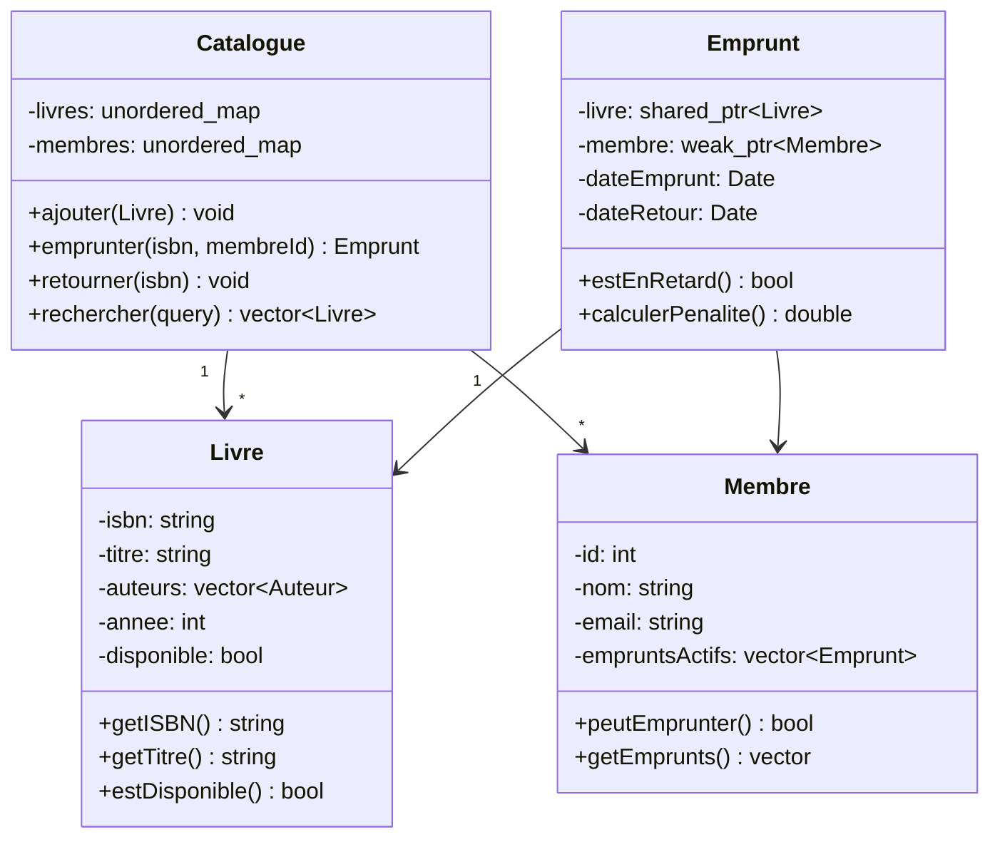
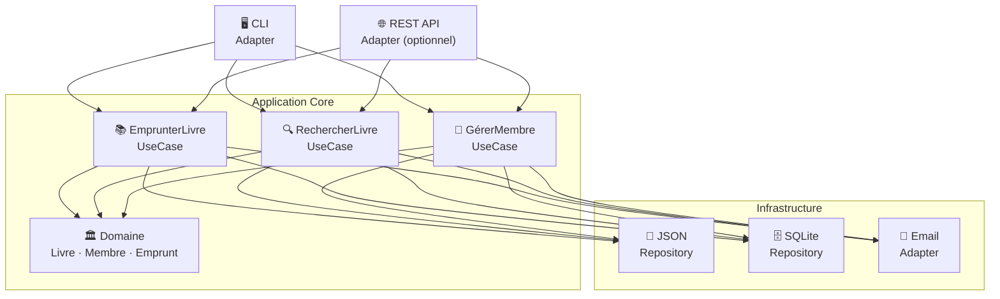

<!-- _class: title -->

# Formation C++ 🏆
## Jour 5 — Projet de Synthèse

*Consolidation · Bonnes pratiques · Soutenance*

---

<!-- _class: toc -->

# 📋 Sommaire — Jour 5

<ol>
  <li>Cahier des charges du projet</li>
  <li>Conception orientée objet</li>
  <li>Architecture et modules</li>
  <li>Développement — Phase 1 : Cœur</li>
  <li>Développement — Phase 2 : Fonctionnalités</li>
  <li>Tests, validation et qualité</li>
  <li>Consolidation des bonnes pratiques</li>
  <li>Revue de code et soutenance</li>
</ol>

---

<!-- _class: section -->

# 17 · Projet de Synthèse

Système de gestion de bibliothèque multithread

---

<!-- _class: cards -->

# 📋 Le projet : LibraryManager C++

<div class="card-grid">
<div class="card">

### 🎯 Objectif
Système de gestion d'une bibliothèque numérique avec persistance, recherche et gestion des emprunts.

</div>
<div class="card">

### 🏗️ Architecture
Modules découplés : Catalogue, Membres, Emprunts, Persistance, API REST simulée.

</div>
<div class="card">

### ⚙️ Technologies
C++17, CMake, SQLite (nlohmann_json), Catch2, spdlog, GitHub Actions.

</div>
<div class="card">

### 📊 Critères
80%+ de couverture, zéro fuite mémoire, code validé par clang-tidy, documentation Doxygen.

</div>
</div>

---

# 📄 Cahier des charges détaillé

**Fonctionnalités requises :**

- **Gestion des livres** : ajouter, modifier, supprimer, rechercher par titre/auteur/ISBN
- **Gestion des membres** : inscription, profil, historique d'emprunts
- **Emprunts** : prêter un livre, retourner, prolonger, pénalités de retard
- **Recherche** : plein texte, filtres combinés, tri multi-critères
- **Persistance** : sauvegarder/charger en JSON et/ou SQLite
- **Logging** : tracer toutes les opérations avec spdlog
- **Concurrence** : gérer les emprunts simultanés sans data race
- **CLI** : interface ligne de commande interactive

**Contraintes :**
- Aucun `new`/`delete` raw — uniquement smart pointers
- Toutes les classes suivent RAII
- Exceptions pour les cas d'erreur métier

---

<!-- _class: list-tree -->

# 📁 Structure du projet LibraryManager

- **LibraryManager/**
  - `CMakeLists.txt`
  - `README.md`, `Doxyfile`
  - **include/library/**
    - `livre.hpp`, `auteur.hpp`, `membre.hpp`
    - `emprunt.hpp`, `catalogue.hpp`
    - `repository.hpp` — interface persistance
    - `exceptions.hpp`
  - **src/**
    - `livre.cpp`, `auteur.cpp`, `membre.cpp`
    - `emprunt.cpp`, `catalogue.cpp`
    - `json_repository.cpp`, `main.cpp`
  - **tests/**
    - `test_catalogue.cpp`, `test_emprunt.cpp`
    - `test_repository.cpp`
  - **.github/workflows/**
    - `ci.yml`

---

<!-- _class: diagram -->

# 🏗️ Diagramme de classes — LibraryManager



---

# 🏗️ Conception — Classes de base

```cpp
// include/library/livre.hpp
#pragma once
#include <string>
#include <vector>
#include <chrono>

namespace Library {

class Livre {
    std::string isbn;
    std::string titre;
    std::string auteur;
    int anneePublication;
    std::string genre;
    bool disponible;

public:
    Livre(std::string isbn, std::string titre,
          std::string auteur, int annee, std::string genre);

    // Accesseurs (tous const)
    const std::string& getISBN()   const noexcept { return isbn; }
    const std::string& getTitre()  const noexcept { return titre; }
    const std::string& getAuteur() const noexcept { return auteur; }
    bool estDisponible()           const noexcept { return disponible; }

    // Opérations
    void emprunter();
    void retourner();

    // Sérialisation
    nlohmann::json toJson() const;
    static Livre fromJson(const nlohmann::json& j);
};

} // namespace Library
```

---

# 🏗️ Conception — Exceptions métier

```cpp
// include/library/exceptions.hpp
#pragma once
#include <stdexcept>
#include <string>

namespace Library {

class ExceptionLibrary : public std::runtime_error {
    std::string code;
public:
    ExceptionLibrary(std::string c, const std::string& msg)
        : std::runtime_error(msg), code(std::move(c)) {}
    const std::string& getCode() const { return code; }
};

class LivreIntrouvable : public ExceptionLibrary {
public:
    explicit LivreIntrouvable(const std::string& isbn)
        : ExceptionLibrary("LIB_001",
          "Livre introuvable : ISBN=" + isbn) {}
};

class LivreDejaEmprunte : public ExceptionLibrary {
public:
    explicit LivreDejaEmprunte(const std::string& isbn)
        : ExceptionLibrary("LIB_002",
          "Livre déjà emprunté : ISBN=" + isbn) {}
};

class MembreInexistant : public ExceptionLibrary {
public:
    explicit MembreInexistant(int id)
        : ExceptionLibrary("LIB_003",
          "Membre inexistant : ID=" + std::to_string(id)) {}
};

} // namespace Library
```

---

# 🏗️ Conception — Interface Repository

```cpp
// include/library/repository.hpp
#pragma once
#include <optional>
#include <vector>
#include "livre.hpp"
#include "membre.hpp"

namespace Library {

// Interface : Repository Pattern
class ILivreRepository {
public:
    virtual ~ILivreRepository() = default;
    virtual void sauvegarder(const Livre& l) = 0;
    virtual void supprimer(const std::string& isbn) = 0;
    virtual std::optional<Livre>
        trouver(const std::string& isbn) const = 0;
    virtual std::vector<Livre> tous() const = 0;
    virtual std::vector<Livre>
        rechercherParAuteur(const std::string& auteur) const = 0;
    virtual std::vector<Livre>
        rechercherParTitre(const std::string& titre) const = 0;
};

class IMemberRepository {
public:
    virtual ~IMemberRepository() = default;
    virtual void enregistrer(const Membre& m) = 0;
    virtual std::optional<Membre> trouver(int id) const = 0;
    virtual std::vector<Membre> tous() const = 0;
};

} // namespace Library
```

---

# 💾 Implémentation — JSON Repository

```cpp
#include "library/repository.hpp"
#include <nlohmann/json.hpp>
#include <fstream>
#include <mutex>

namespace Library {

class JsonLivreRepository : public ILivreRepository {
    std::string fichier;
    mutable std::shared_mutex mtx;
    std::unordered_map<std::string, Livre> cache;

    void sauvegarderFichier() {
        nlohmann::json j = nlohmann::json::array();
        for (const auto& [isbn, livre] : cache)
            j.push_back(livre.toJson());

        std::ofstream f(fichier);
        f << j.dump(2);
    }

public:
    explicit JsonLivreRepository(std::string path)
        : fichier(std::move(path)) { charger(); }

    void sauvegarder(const Livre& l) override {
        std::unique_lock lock(mtx);
        cache[l.getISBN()] = l;
        sauvegarderFichier();
    }

    std::optional<Livre> trouver(const std::string& isbn) const override {
        std::shared_lock lock(mtx);
        auto it = cache.find(isbn);
        if (it == cache.end()) return std::nullopt;
        return it->second;
    }
};
} // namespace Library
```

---

# 📚 Implémentation — Catalogue

```cpp
#include "library/catalogue.hpp"
#include "library/exceptions.hpp"
#include <spdlog/spdlog.h>

namespace Library {

Emprunt Catalogue::emprunter(const std::string& isbn, int membreId) {
    // 1. Vérifier que le livre existe
    auto livre = livreRepo->trouver(isbn);
    if (!livre) throw LivreIntrouvable(isbn);

    // 2. Vérifier que le livre est disponible
    if (!livre->estDisponible()) throw LivreDejaEmprunte(isbn);

    // 3. Vérifier que le membre existe
    auto membre = membreRepo->trouver(membreId);
    if (!membre) throw MembreInexistant(membreId);

    // 4. Créer l'emprunt
    livre->emprunter();
    livreRepo->sauvegarder(*livre);

    Emprunt emprunt(*livre, *membre);
    empruntRepo->sauvegarder(emprunt);

    spdlog::info("Emprunt créé : ISBN={} MemberID={}", isbn, membreId);
    return emprunt;
}

} // namespace Library
```

---

# 🔍 Implémentation — Recherche

```cpp
std::vector<Livre> Catalogue::rechercher(const RechercheCriteres& c) const {
    auto tous = livreRepo->tous();

    // Filtre par titre (partiel, insensible à la casse)
    if (!c.titre.empty()) {
        tous.erase(std::remove_if(tous.begin(), tous.end(),
            [&c](const Livre& l) {
                std::string t = l.getTitre();
                std::string q = c.titre;
                std::transform(t.begin(), t.end(), t.begin(), ::tolower);
                std::transform(q.begin(), q.end(), q.begin(), ::tolower);
                return t.find(q) == std::string::npos;
            }), tous.end());
    }

    // Filtre par disponibilité
    if (c.disponiblesUniquement) {
        tous.erase(std::remove_if(tous.begin(), tous.end(),
            [](const Livre& l) { return !l.estDisponible(); }),
            tous.end());
    }

    // Tri par titre
    std::sort(tous.begin(), tous.end(),
        [](const Livre& a, const Livre& b) {
            return a.getTitre() < b.getTitre();
        });

    return tous;
}
```

---

# 🖥️ Interface CLI — main.cpp

```cpp
#include "library/catalogue.hpp"
#include <iostream>
#include <spdlog/spdlog.h>

void afficherMenu() {
    std::cout << "\n=== LibraryManager ===\n"
              << "1. Ajouter un livre\n"
              << "2. Rechercher un livre\n"
              << "3. Emprunter un livre\n"
              << "4. Retourner un livre\n"
              << "5. Liste des membres\n"
              << "6. Livres en retard\n"
              << "0. Quitter\n"
              << "Choix : ";
}

int main() {
    spdlog::set_level(spdlog::level::info);

    auto repo = std::make_shared<JsonLivreRepository>("data/livres.json");
    auto memRepo = std::make_shared<JsonMembreRepository>("data/membres.json");
    Library::Catalogue catalogue(repo, memRepo);

    int choix;
    do {
        afficherMenu();
        std::cin >> choix;
        traiterChoix(choix, catalogue);
    } while (choix != 0);
}
```

---

# 🧪 Tests — catalogue

```cpp
#include <catch2/catch_test_macros.hpp>
#include "library/catalogue.hpp"
#include "mocks/mock_repositories.hpp"

class FixtureCatalogue {
protected:
    std::shared_ptr<MockLivreRepo> mockLivres;
    std::shared_ptr<MockMembreRepo> mockMembres;
    Library::Catalogue catalogue;

    FixtureCatalogue()
        : mockLivres(std::make_shared<MockLivreRepo>()),
          mockMembres(std::make_shared<MockMembreRepo>()),
          catalogue(mockLivres, mockMembres) {}
};

TEST_CASE_METHOD(FixtureCatalogue, "Emprunt réussi", "[catalogue]") {
    auto livre = Library::Livre("978-0-13-468599-1",
                                "Clean Code", "Martin", 2008, "Dev");
    auto membre = Library::Membre(1, "Alice", "alice@test.com");

    mockLivres->ajouterMock(livre);
    mockMembres->ajouterMock(membre);

    auto emprunt = catalogue.emprunter("978-0-13-468599-1", 1);
    REQUIRE_FALSE(emprunt.estEnRetard());
    REQUIRE(emprunt.getLivre().getTitre() == "Clean Code");
}
```

---

# 🧪 Tests — cas limites et robustesse

```cpp
TEST_CASE_METHOD(FixtureCatalogue, "Emprunt livre inexistant", "[catalogue]") {
    REQUIRE_THROWS_AS(
        catalogue.emprunter("ISBN_INEXISTANT", 1),
        Library::LivreIntrouvable
    );
}

TEST_CASE_METHOD(FixtureCatalogue, "Double emprunt interdit", "[catalogue]") {
    auto livre = Library::Livre("ISBN001", "Test", "Auteur", 2023, "SF");
    auto m1 = Library::Membre(1, "Alice", "a@test.com");
    auto m2 = Library::Membre(2, "Bob", "b@test.com");
    mockLivres->ajouterMock(livre);
    mockMembres->ajouterMock(m1);
    mockMembres->ajouterMock(m2);

    catalogue.emprunter("ISBN001", 1);  // 1er emprunt OK
    REQUIRE_THROWS_AS(
        catalogue.emprunter("ISBN001", 2),  // 2e emprunt → erreur
        Library::LivreDejaEmprunte
    );
}

TEST_CASE("Livre en retard", "[emprunt]") {
    auto hier = std::chrono::system_clock::now() -
                std::chrono::days(15);
    Library::Emprunt emprunt(/* ... */, hier);
    REQUIRE(emprunt.estEnRetard());
    REQUIRE(emprunt.calculerPenalite() == Approx(3.0));  // 0.2€/jour
}
```

---

# 🧵 Gestion concurrente des emprunts

```cpp
class CatalogueThreadSafe : public Catalogue {
    mutable std::shared_mutex livresMtx;
    mutable std::shared_mutex empruntsMtx;

public:
    Emprunt emprunter(const std::string& isbn, int membreId) override {
        // Lock exclusif sur le livre pendant l'emprunt
        std::unique_lock<std::shared_mutex> lock(livresMtx);

        auto livre = livreRepo->trouver(isbn);
        if (!livre)             throw LivreIntrouvable(isbn);
        if (!livre->estDisponible()) throw LivreDejaEmprunte(isbn);

        livre->emprunter();
        livreRepo->sauvegarder(*livre);
        // Lock relâché ici — opération atomique garantie
        lock.unlock();

        // Enregistrer l'emprunt (son propre lock)
        std::unique_lock<std::shared_mutex> empLock(empruntsMtx);
        Emprunt e(*livre, /* membre */, std::chrono::system_clock::now());
        empruntRepo->sauvegarder(e);
        return e;
    }
};
```

---

<!-- _class: list-steps -->

# 📅 Planning du projet — Jour 5

1. **Matin 09h00** : Présentation du cahier des charges, constitution des équipes (2-3 personnes), mise en place du dépôt Git
2. **Matin 09h30** : Conception — diagramme de classes, choix d'architecture, répartition des modules
3. **Matin 10h30** : Développement Phase 1 — classes de base, exceptions, interfaces
4. **Après-midi 13h30** : Développement Phase 2 — Catalogue, persistance JSON, CLI
5. **Après-midi 15h00** : Tests unitaires — couverture 80%+ minimum, intégration CI/CD
6. **Après-midi 16h30** : Finalisation — Doxygen, README, clang-tidy, Valgrind
7. **Après-midi 17h00** : Soutenance — 10 min par équipe + 5 min questions

---

# 🎓 Critères d'évaluation du projet

| Critère | Points | Description |
|---|---|---|
| **Compilation** | 10 pts | Compile sans warning avec `-Wall -Wextra` |
| **Architecture** | 20 pts | SOLID, RAII, patterns appropriés |
| **Fonctionnalités** | 20 pts | Toutes les features du cahier des charges |
| **Tests** | 20 pts | ≥80% couverture, cas limites couverts |
| **Qualité code** | 15 pts | clang-tidy propre, code lisible |
| **Documentation** | 10 pts | Doxygen + README complet |
| **CI/CD** | 5 pts | GitHub Actions fonctionnel |

**Bonus :**
- Persistance SQLite (+5 pts)
- Interface ncurses ou Qt (+5 pts)
- Recherche full-text (+5 pts)

---

<!-- _class: section -->

# 18 · Consolidation des Bonnes Pratiques

Revue croisée, checklist et plan d'action

---

<!-- _class: cards -->

# ✅ Les 4 règles d'or du C++ moderne

<div class="card-grid">
<div class="card">

### 🚫 Zéro Raw Pointers
Toujours `unique_ptr` ou `shared_ptr`. Jamais `new`/`delete` directs. RAII pour toutes les ressources.

</div>
<div class="card">

### 🛡️ Const-Correctness
Tout ce qui ne doit pas changer est `const`. Méthodes de lecture → `const`. Paramètres → `const&`.

</div>
<div class="card">

### 🧪 Tester d'abord
Écrire les tests avant ou en parallèle du code. Objectif 80% de couverture minimum en production.

</div>
<div class="card">

### 📏 SOLID en pratique
Single Responsibility, Open/Closed, Liskov, Interface Segregation, Dependency Inversion — appliquer à chaque classe.

</div>
</div>

---

# 📋 Checklist de qualité C++ — Niveau 1

**Fondamentaux :**
- ☐ Aucun `new`/`delete` raw dans le code métier
- ☐ Toutes les ressources suivent RAII
- ☐ Destructeurs sont `virtual` pour les classes de base
- ☐ Constructeurs de copie/move implémentés si nécessaire
- ☐ `const` utilisé partout où possible
- ☐ Pas de `using namespace std;` dans les headers
- ☐ Headers protégés par `#pragma once`
- ☐ Pas de variable globale mutable
- ☐ Toutes les exceptions héritent de `std::exception`
- ☐ Les opérations potentiellement nocexcept sont marquées

---

# 📋 Checklist de qualité C++ — Niveau 2

**Architecture :**
- ☐ Chaque classe a une responsabilité unique (SRP)
- ☐ Les dépendances sont injectées (DIP)
- ☐ Les interfaces sont ségrégées (ISP)
- ☐ Les classes concrètes peuvent être substituées (LSP)
- ☐ Extensible sans modification (OCP)

**Tests :**
- ☐ Couverture de code ≥ 80%
- ☐ Tests pour les cas limites et les erreurs
- ☐ Pas de tests qui dépendent d'un ordre d'exécution
- ☐ Mocks pour isoler les dépendances externes
- ☐ Tests paramétrés pour les cas multiples

---

# 📋 Checklist de qualité C++ — Niveau 3

**Performance et sécurité :**
- ☐ Valgrind : zéro fuite mémoire
- ☐ AddressSanitizer : zéro erreur mémoire
- ☐ Toutes les entrées utilisateur sont validées
- ☐ Pas de `strcpy`, `sprintf` — utiliser `std::string`
- ☐ Requêtes SQL paramétrées (pas de concaténation)
- ☐ clang-tidy : zéro warning

**Documentation :**
- ☐ Chaque classe publique documentée avec Doxygen
- ☐ README avec : installation, build, usage, contribution
- ☐ CHANGELOG tenu à jour
- ☐ Décisions d'architecture documentées (ADR)

---

# 🔍 Revue de code — guide pratique

```
Liste de vérification lors d'une revue :

1. LISIBILITÉ
   ✓ Les noms sont-ils explicites ?
   ✓ Les fonctions font-elles ≤ 20 lignes ?
   ✓ Pas de magic numbers (utiliser des constantes nommées)
   ✓ Les commentaires expliquent le POURQUOI, pas le COMMENT

2. CORRECTUDE
   ✓ Tous les cas d'erreur sont gérés ?
   ✓ Les bornes des tableaux sont vérifiées ?
   ✓ Les ressources sont-elles libérées dans tous les chemins ?
   ✓ Thread-safety si accès concurrent ?

3. PERFORMANCE
   ✓ Copie inutile ? (passer par const&, utiliser move)
   ✓ Allocation mémoire excessive ?
   ✓ Algorithme avec la bonne complexité ?
```

---

# 🔧 Anti-patterns à éviter

```cpp
// ❌ God class
class Application {  // fait TOUT
    void connecterBDD(); void envoyerEmail();
    void renderHTML(); void calculerTaxes();
    // 500 méthodes...
};

// ❌ Primitive Obsession
void creerUtilisateur(std::string nom, std::string prenom,
    std::string email, std::string tel, int age, bool actif);
// → Utiliser une struct/class Utilisateur

// ❌ Magic numbers
if (score >= 42) { /* ... */ }  // Que signifie 42 ?
// → constexpr int SCORE_MINIMUM_VALIDATION = 42;

// ❌ Deep nesting
if (a) { if (b) { if (c) { if (d) { /* ... */ } } } }
// → Early return / Guard clauses

// ❌ Comments Instead of Code
// Increment i by 1
i++;  // Le code dit déjà ce qu'il fait !
```

---

# ♻️ Refactoring — techniques

```cpp
// 1. EXTRACT FUNCTION — fonction trop longue
// ❌ Avant
void traiter() {
    // 50 lignes pour valider
    // 30 lignes pour calculer
    // 40 lignes pour afficher
}
// ✅ Après
void traiter() {
    if (!valider()) return;
    auto resultat = calculer();
    afficher(resultat);
}

// 2. REPLACE TEMP WITH QUERY
// ❌ Avant
double taille = calculerTaille();
if (taille > MAX) { /* ... */ }
// ✅ Après
if (calculerTaille() > MAX) { /* ... */ }

// 3. INTRODUCE PARAMETER OBJECT
// ❌ Avant : 7 paramètres
// ✅ Après : struct ConfigRecherche { ... }
```

---

# 📚 Documentation technique

```cpp
/**
 * @file catalogue.hpp
 * @brief Gestion centrale du catalogue de la bibliothèque
 * @ingroup core
 *
 * @code{.cpp}
 * // Exemple d'utilisation
 * auto repo = std::make_shared<JsonRepo>("data/livres.json");
 * Catalogue catalogue(repo);
 * catalogue.ajouter(Livre("978-0-321-56384-2", "Clean Code"));
 * auto resultats = catalogue.rechercher("Clean");
 * @endcode
 */

/**
 * @brief Ajouter un livre au catalogue
 * @param livre Le livre à ajouter
 * @throws LivreDejaPresent si l'ISBN existe déjà
 * @post Le catalogue contient un livre de plus
 * @pre livre.getISBN() n'est pas vide
 */
void ajouter(const Livre& livre);
```

---

# 🗺️ Plan de maintenance et évolution

```
ORGANISATION DU CODE pour la longévité :

Version    → SemVer : MAJEUR.MINEUR.PATCH
Branches   → main (stable), develop, feature/*, fix/*
Tags       → v1.0.0, v1.1.0, etc.

CHANGELOG.md :
## [1.2.0] - 2024-03-15
### Ajouté
- Recherche full-text avec index inversé
### Modifié
- Performance du Catalogue × 10 avec cache LRU
### Corrigé
- Fuite mémoire dans JsonRepository (#42)

DETTE TECHNIQUE : documenter dans TODO.md ou GitHub Issues
- Priorité 1 : critique, bloque la release
- Priorité 2 : important, à traiter dans le sprint suivant
- Priorité 3 : amélioration, backlog
```

---

# 🎓 Soutenance — guide

**Format : 10 minutes par équipe + 5 minutes questions**

**Structure suggérée :**

1. **Introduction (1 min)** : Présentation de l'équipe et des choix architecturaux majeurs

2. **Démonstration (4 min)** : Lancer l'application, montrer les fonctionnalités principales, montrer les résultats des tests (`ctest`)

3. **Code walkthrough (3 min)** : Montrer le code le plus intéressant / complexe réalisé, expliquer les décisions de conception

4. **Bilan (2 min)** : Ce qui a bien fonctionné, ce qui aurait pu être mieux fait, ce qu'on apprendrait en repassant par là

---

# 🧪 Exercice de revue croisée

**Protocole (15 minutes par équipe) :**

**Équipe A révise le code de l'Équipe B :**

1. Cloner le dépôt de l'équipe B
2. Compiler et exécuter les tests
3. Remplir la checklist de qualité (niveaux 1, 2, 3)
4. Identifier les 3 points forts et les 3 axes d'amélioration
5. Rédiger des commentaires constructifs dans un fichier `REVUE.md`

**Points à évaluer :**
- Architecture et séparation des responsabilités
- Gestion des erreurs et robustesse
- Qualité et lisibilité du code
- Complétude et pertinence des tests
- Documentation (comments + README)

---

# 🔁 Récapitulatif des 5 jours

| Jour | Thèmes | Concepts clés |
|---|---|---|
| **1** | Fondamentaux | Types, POO, héritage, polymorphisme |
| **2** | Mémoire & STL | RAII, smart pointers, vector, map, patterns |
| **3** | Templates & Intégration | Génériques, exceptions, CMake, CI/CD |
| **4** | Moderne & Perf | Lambdas, threads, sécurité, profiling |
| **5** | Synthèse | Projet complet, revue de code, bonnes pratiques |

---

<!-- _class: list-compact -->

# 📚 Ressources pour continuer

- **Livres fondamentaux** : *The C++ Programming Language* (Stroustrup), *Effective Modern C++* (Meyers), *Clean Code* (Martin), *Design Patterns* (GoF)
- **En ligne** : cppreference.com, isocpp.org, cppcon.org
- **Vidéos** : CppCon YouTube, Back to Basics series
- **Pratique** : LeetCode C++, Exercism.io/cpp, HackerRank
- **Newsletter** : "C++ Weekly" (Jason Turner), "Fluent C++" blog
- **Projets open source** : contribuer à LLVM, fmt, spdlog
- **Certifications** : aucune certification officielle C++ — portfolio GitHub > certif
- **Communauté** : #include Discord, r/cpp Reddit, Stack Overflow
- **Outils à maîtriser** : CLion/VSCode, CMake, Conan, Git

---

# 🗺️ Plan d'action post-formation

**Semaine 1 — Appliquer immédiatement :**
- Revoir le code existant avec la checklist de qualité
- Activer tous les warnings de compilation (`-Wall -Wextra`)
- Introduire Valgrind dans le workflow de développement

**Mois 1 — Consolider :**
- Écrire des tests pour le code critique existant
- Mettre en place un pipeline CI/CD basique
- Documenter les classes publiques avec Doxygen

**Mois 3 — Progresser :**
- Introduire les smart pointers partout (remplacer `new`/`delete`)
- Adopter C++17 : `optional`, `variant`, structured bindings
- Lire *Effective Modern C++* (Scott Meyers)

---

<!-- _class: list-cols -->

# 🏆 Bilan de la formation

**Ce que vous maîtrisez maintenant :**

- **Syntaxe C++17** complète, `auto`, ranges, structured bindings
- **POO** : classes, héritage, polymorphisme, interfaces
- **Mémoire** : RAII, smart pointers, move semantics
- **STL** : `vector`, `map`, algorithmes, itérateurs
- **Templates** : fonctions, classes, spécialisation, concepts
- **Exceptions** : hiérarchie, garanties, `noexcept`
- **CMake** : projets multi-modules, dépendances
- **Tests** : Catch2 / GoogleTest, mocks, couverture
- **CI/CD** : GitHub Actions, automatisation
- **Sécurité** : buffer overflow, validation, sanitizers
- **Threads** : `std::thread`, mutex, `std::async`
- **Profiling** : Valgrind, perf, benchmarks

---

# 🎯 Objectifs atteints

À l'issue de cette formation, vous êtes capables de :

- ✅ **Comprendre** la syntaxe et les concepts fondamentaux du C++
- ✅ **Maîtriser** les ajouts majeurs des normes C++11/14/17
- ✅ **Appliquer** les principes de la conception orientée objet
- ✅ **Écrire** des programmes en appliquant les bonnes pratiques
- ✅ **Utiliser** les structures de contrôle et les types de données
- ✅ **Manipuler** les fichiers et la mémoire de manière sûre
- ✅ **Tester** avec des frameworks modernes (Catch2, GoogleTest)
- ✅ **Déployer** avec un pipeline CI/CD automatisé

---

# 🔷 Architecture Hexagonale (Ports & Adapters)

```
Application Core (Domain + Use Cases)
         ↑↓
    [Ports] — interfaces définies par le domaine
         ↑↓
   [Adapters] — implémentations concrètes
    ├── REST API
    ├── Base de données
    ├── File système
    └── Messaging
```

```cpp
// Port (interface définie par le domaine)
class INotificationPort {
public:
    virtual void envoyer(const Notification& n) = 0;
    virtual ~INotificationPort() = default;
};

// Adapter (implémentation concrète)
class EmailAdapter : public INotificationPort {
    SmtpClient smtp;
public:
    void envoyer(const Notification& n) override {
        smtp.send(n.destinataire, n.sujet, n.corps);
    }
};
```

---

# 🔷 Architecture Hexagonale — cas LibraryManager

```
┌────────────────────────────────────────┐
│           Application Core             │
│  ┌──────────────────────────────────┐  │
│  │    Domain (Livre, Membre, ...)   │  │
│  └──────────────────────────────────┘  │
│  ┌──────────────────────────────────┐  │
│  │       Use Cases                  │  │
│  │  EmprunterLivre, RetournerLivre  │  │
│  │  RechercherLivre, GererMembre    │  │
│  └──────────────────────────────────┘  │
└────────────────────────────────────────┘
         ↑↓                    ↑↓
   Primary Ports          Secondary Ports
   (Driving)              (Driven)
         ↑↓                    ↑↓
   CLI Adapter           JSON/SQLite Adapter
   REST Adapter          Email Adapter
```

---

# 📐 Domain-Driven Design — concepts clés

```cpp
// Value Object : identité par valeur, immuable
class ISBN {
    std::string valeur;
    void valider() const {
        if (valeur.length() != 13)
            throw std::invalid_argument("ISBN invalide");
    }
public:
    explicit ISBN(std::string v) : valeur(std::move(v)) { valider(); }
    bool operator==(const ISBN& o) const { return valeur == o.valeur; }
    const std::string& get() const { return valeur; }
};

// Entity : identité par ID, mutable
class Livre {
    ISBN isbn;           // Value Object comme clé
    std::string titre;
    bool disponible{true};
public:
    bool operator==(const Livre& o) const { return isbn == o.isbn; }
};

// Aggregate Root : point d'entrée pour modifier le groupe
class Catalogue {   // Aggregate Root
    std::unordered_map<std::string, Livre> livres;
    std::vector<DomainEvent> evenements;
};
```

---

# 📐 DDD — Domain Events

```cpp
// Événements de domaine : ce qui s'est passé dans le métier
struct LivreEmprunte {
    ISBN isbn;
    int membreId;
    std::chrono::system_clock::time_point date;
};

struct LivreRetourne {
    ISBN isbn;
    int membreId;
    std::chrono::system_clock::time_point date;
    bool enRetard;
};

// Aggregate Root publie des événements
class Catalogue {
    std::vector<std::variant<LivreEmprunte, LivreRetourne>> events;

public:
    void emprunter(const ISBN& isbn, int membreId) {
        // ... logique métier ...
        events.push_back(LivreEmprunte{isbn, membreId,
            std::chrono::system_clock::now()});
    }

    std::vector</* ... */> collecterEvenements() {
        return std::exchange(events, {});
    }
};
```

---

# ⚡ Event Sourcing — stocker les événements

```cpp
// Event Store : persister les événements, pas l'état
class EventStore {
    std::vector<nlohmann::json> journal;

public:
    void append(const std::string& aggregate_id,
                const nlohmann::json& event) {
        journal.push_back({
            {"aggregate_id", aggregate_id},
            {"event", event},
            {"timestamp", now_iso()},
            {"version", journal.size()}
        });
    }

    // Reconstruire l'état courant depuis les événements
    Catalogue rehydrater(const std::string& catalogue_id) {
        Catalogue cat;
        for (const auto& e : journal) {
            if (e["aggregate_id"] == catalogue_id)
                cat.appliquer(e["event"]);
        }
        return cat;
    }
};
```

---

# 🔗 CQRS — Command Query Responsibility Segregation

```cpp
// Séparer les opérations de lecture et d'écriture

// COMMANDES (modifient l'état)
struct EmprunterLivreCmd { std::string isbn; int membreId; };
struct RetournerLivreCmd { std::string isbn; };
struct AjouterLivreCmd   { std::string isbn, titre, auteur; };

// REQUETES (lecture seule)
struct TrouverLivreQuery  { std::string isbn; };
struct RechercherQuery    { std::string terme; };
struct LivresEnRetardQuery {};

// Command Handler
class CatalogueCommandHandler {
    Catalogue& catalogue;
public:
    void handle(const EmprunterLivreCmd& cmd) {
        catalogue.emprunter(cmd.isbn, cmd.membreId);
    }
};

// Query Handler (peut utiliser un modèle de lecture dénormalisé)
class CatalogueQueryHandler {
    LectureBDD& bddLecture;  // base de lecture séparée !
public:
    std::optional<LivreDTO> handle(const TrouverLivreQuery& q) {
        return bddLecture.chercher(q.isbn);
    }
};
```

---

# 🔄 Gestion mémoire avancée — révision ciblée

```cpp
// Rule of Five (C++11) — si on déclare un de ces membres,
// il faut les implémenter tous les 5 :

class Ressource {
public:
    Ressource(size_t n);                        // Constructeur
    ~Ressource();                               // Destructeur
    Ressource(const Ressource& o);              // Copy ctor
    Ressource(Ressource&& o) noexcept;          // Move ctor
    Ressource& operator=(const Ressource& o);  // Copy assign
    Ressource& operator=(Ressource&& o) noexcept; // Move assign
};

// Rule of Zero (recommandé) : ne déclarer aucun des 5
// et laisser le compilateur tout générer
class ModeleModerne {
    std::unique_ptr<Data> data;    // unique_ptr gère la mémoire
    std::vector<int> elements;     // vector gère sa mémoire
    std::string nom;               // string gère sa mémoire
    // Pas besoin de déclarer les 5 membres spéciaux !
};
```

---

# 🔬 Débogage avancé — GDB

```bash
# Compiler avec infos de débogage
g++ -g3 -O0 -std=c++17 -o prog main.cpp

# Démarrer GDB
gdb ./prog

# Commandes essentielles
(gdb) break main          # point d'arrêt sur main
(gdb) break Classe::methode  # point d'arrêt sur méthode
(gdb) run arg1 arg2       # lancer le programme
(gdb) next                # instruction suivante (step over)
(gdb) step                # entrer dans la fonction (step into)
(gdb) continue            # continuer jusqu'au prochain break
(gdb) print variable      # afficher la valeur
(gdb) print *ptr          # déréférencer un pointeur
(gdb) bt                  # backtrace (pile d'appels)
(gdb) info locals         # toutes les variables locales
(gdb) watch variable      # watchpoint : arrêt si la var change
(gdb) x/10i $pc          # afficher 10 instructions assembleur
```

---

# 🔬 Débogage — cas spéciaux

```bash
# Déboguer un deadlock
gdb ./prog
(gdb) thread apply all bt  # backtrace de tous les threads
# → identifier les threads bloqués sur un mutex

# Déboguer un crash SIGSEGV
(gdb) run
# Program received signal SIGSEGV
(gdb) bt                   # où a eu lieu le crash ?
(gdb) info registers       # état des registres CPU
(gdb) x/10x $sp           # contenu de la pile

# Débogage avec core dump
ulimit -c unlimited        # activer les core dumps
./prog                     # crash → génère core
gdb ./prog core            # analyser le core dump

# Conditional breakpoint
(gdb) break main.cpp:42 if i == 99  # arrêt seulement si i==99
```

---

# 🧩 Exercice de code review — problème 1

**Trouver et corriger les problèmes dans ce code :**

```cpp
class Cache {
    std::map<std::string, std::string>* donnees;
    int taille;
public:
    Cache(int t) {
        taille = t;
        donnees = new std::map<std::string, std::string>();
    }

    void set(std::string cle, std::string val) {
        donnees->insert(std::pair<std::string,std::string>(cle, val));
    }

    std::string get(std::string cle) {
        return donnees[cle];  // bug ?
    }

    void clear() { donnees->clear(); }
};
```

*Problèmes à identifier : gestion mémoire, syntaxe, performances, style*

---

# 🧩 Exercice de code review — problème 2

**Corriger et moderniser :**

```cpp
void traiterFichier(char* path) {
    FILE* f = fopen(path, "r");
    char buffer[256];
    while (fgets(buffer, 256, f)) {
        char* ligne = strdup(buffer);
        // traiter ligne
        free(ligne);
    }
    fclose(f);  // jamais atteint si exception !
}

int calculer(int n) {
    int* tab = new int[n];
    for (int i = 0; i <= n; i++) tab[i] = i;  // bug ?
    int s = 0;
    for (int i = 0; i < n; i++) s += tab[i];
    delete tab;  // bug ?
    return s;
}
```

---

# 🧩 Exercice de code review — corrections

```cpp
// Version corrigée et moderne

void traiterFichier(const std::filesystem::path& path) {
    std::ifstream f(path);   // RAII — se ferme automatiquement
    if (!f) throw std::runtime_error("Impossible d'ouvrir " + path.string());
    
    std::string ligne;
    while (std::getline(f, ligne)) {
        traiter(ligne);      // std::string — plus de malloc/free
    }
    // f.close() automatique à la fin du scope
}

std::vector<int> calculer(int n) {
    if (n <= 0) throw std::invalid_argument("n doit être > 0");
    std::vector<int> tab(n);        // unique_ptr ou vector
    for (int i = 0; i < n; i++) tab[i] = i;  // borne corrigée
    int s = std::accumulate(tab.begin(), tab.end(), 0);
    return tab;  // move implicite
}
```

---

# 🧩 Exercice de code review — problème 3

**Analyser les problèmes de threading :**

```cpp
class LogService {
    static LogService* instance;
    std::ofstream fichier;
    int compteur = 0;

public:
    static LogService* get() {
        if (!instance)
            instance = new LogService("app.log");
        return instance;
    }

    void log(const std::string& msg) {
        fichier << "[" << compteur++ << "] " << msg << "\n";
    }
};
```

*Identifier : data race, double construction en multithreading, fuite mémoire, non thread-safe*

---

# 🧩 Code Review — correction threading

```cpp
class LogService {
    static std::unique_ptr<LogService> instance;
    static std::once_flag init_flag;
    std::ofstream fichier;
    std::mutex mtx;
    std::atomic<int> compteur{0};

    LogService(const std::string& path) : fichier(path) {}

public:
    static LogService& get() {
        std::call_once(init_flag, []() {
            instance = std::unique_ptr<LogService>(
                new LogService("app.log"));
        });
        return *instance;
    }

    void log(const std::string& msg) {
        std::lock_guard<std::mutex> lock(mtx);
        fichier << "[" << compteur++ << "] " << msg << "\n";
    }

    LogService(const LogService&) = delete;
    LogService& operator=(const LogService&) = delete;
};
```

---

# ❓ FAQ — Questions fréquentes de la formation

**Q : `unique_ptr` ou `shared_ptr` par défaut ?**
→ `unique_ptr` toujours en premier. Passer à `shared_ptr` uniquement si plusieurs propriétaires prouvés nécessaires.

**Q : Quand utiliser `std::move` ?**
→ Quand on passe définitivement la propriété d'une ressource. Après `std::move(x)`, ne plus utiliser `x`.

**Q : `map` ou `unordered_map` ?**
→ `unordered_map` si O(1) lookup est prioritaire. `map` si ordre alphabétique nécessaire ou petite taille.

**Q : Faut-il toujours écrire des tests avant le code ?**
→ Pas obligatoirement TDD strict. L'important : tester le code difficile, les cas limites, les erreurs.

---

# ❓ FAQ — Architecture et patterns

**Q : Quand utiliser les design patterns ?**
→ Quand un problème est récurrent et que le pattern apporte une clarté prouvée. Ne pas sur-ingénierer.

**Q : Héritage vs composition ?**
→ Préférer la composition. L'héritage pour la relation "est-un" seulement. "has-a" → membre ou injection.

**Q : Quand lever une exception vs retourner une erreur ?**
→ Exception pour les cas *vraiment* exceptionnels (erreurs non récupérables). `optional`/`expected` pour les cas courants.

**Q : Comment gérer les performances sans micro-optimiser ?**
→ Mesurer d'abord (profiler). Choisir le bon algorithme/structure. Optimiser seulement ce que le profiler montre.

---

# ❓ FAQ — Modernisation du code

**Q : Comment migrer un projet C++98 vers C++17 progressivement ?**

```
Étapes recommandées :
1. Compiler avec -std=c++17 -Wall → corriger les warnings
2. Remplacer NULL par nullptr partout
3. Remplacer les raw pointers par smart pointers
4. Remplacer les typedef par using
5. Remplacer les boucles for(int i=0;...) par range-based for
6. Utiliser auto pour les itérateurs et types complexes
7. Remplacer boost::optional par std::optional
8. Ajouter override/final sur les méthodes virtuelles
9. Marquer les constructeurs explicit quand approprié
10. Activer clang-tidy modernize-* et corriger automatiquement
```

---

# ❓ FAQ — Questions des participants

**Q : C++ est-il encore pertinent en 2024 ?**
→ Oui, plus que jamais. Systèmes embarqués, jeux vidéo, HFT, infrastructure cloud, OS, browsers — tous en C++.

**Q : C++ ou Rust pour les nouveaux projets ?**
→ Dépend du contexte. Rust : sécurité mémoire garantie à la compilation, excellent pour les nouveaux projets. C++ : écosystème mature, interopérabilité legacy, performances équivalentes.

**Q : Faut-il apprendre C avant C++ ?**
→ Non en 2024. C++ moderne est bien différent de C. Apprendre C en plus si vous travaillez sur du code legacy ou embarqué.

---

# 🗺️ Prochaines étapes — Plan d'action

**Semaine 1 — Appliquer :**
- Activer `-Wall -Wextra -Werror` dans les projets existants
- Lancer `clang-tidy` et corriger les 10 premiers warnings
- Ajouter Valgrind au workflow quotidien

**Mois 1 — Consolider :**
- Écrire des tests pour le code existant (objectif 60%+)
- Mettre en place un pipeline CI/CD minimal
- Éliminer tous les `new`/`delete` raw → smart pointers

**Mois 3 — Progresser :**
- Lire *Effective Modern C++* (Meyers) — 1 chapitre/semaine
- Contribuer à un projet open-source C++ (spdlog, fmt, etc.)
- Implémenter un projet personnel en C++17

---

# 📚 Ressources avancées par niveau

**Débutant-intermédiaire (votre niveau actuel) :**
- *A Tour of C++* — Stroustrup (mise à jour C++20)
- *C++ Crash Course* — Josh Lospinoso
- cppreference.com — référence quotidienne

**Avancé :**
- *Effective Modern C++* — Scott Meyers (C++11/14)
- *C++ Templates: The Complete Guide* — Vandevoorde
- *C++ Concurrency in Action* — Anthony Williams

**Expert :**
- *The C++ Programming Language* — Stroustrup (4e éd.)
- *Optimized C++* — Kurt Guntheroth
- CppCon talks — YouTube (Jason Turner, Andrei Alexandrescu)

---

# 🏆 Certifications et reconnaissance

**Il n'existe pas de certification officielle C++.**

Les alternatives reconnues :
- **Portfolio GitHub** : projets C++ publics, contributions open-source
- **Code challenges** : LeetCode, HackerRank, Codewars (C++ category)
- **Competitive programming** : Codeforces, AtCoder — démontre la maîtrise
- **Open source** : contribuer à LLVM, GCC, Boost, Qt
- **Conférences** : présenter à CppCon, Meeting C++, CPPNOW
- **Articles techniques** : écrire sur les fonctionnalités avancées

Le meilleur "certificat" reste **un projet C++ de qualité professionnelle** sur GitHub avec tests, CI/CD et documentation.

---

# 🔄 Rétrospective de la formation

**Ce que nous avons couvert en 5 jours :**

```
Jour 1 : Fondamentaux (types, POO, tests intro)
Jour 2 : Mémoire & STL & Design Patterns
Jour 3 : Templates, Exceptions, Intégration, CI/CD
Jour 4 : C++ Moderne, Sécurité, Multithreading
Jour 5 : Projet complet, Architectures, Consolidation
```

**Points forts collectifs identifiés :**
- Compréhension des smart pointers et RAII
- Maîtrise des algorithmes STL
- Capacité à écrire des tests pertinents

**Axes d'amélioration à travailler :**
- Templates avancés (CRTP, variadic)
- Multithreading (cas réels en production)
- Performance : profiler avant d'optimiser

---

# ✅ Checklist finale — Développeur C++ Moderne

**Je sais faire :**
- ☐ Concevoir une hiérarchie de classes SOLID
- ☐ Utiliser les smart pointers sans fuite mémoire
- ☐ Écrire des templates génériques réutilisables
- ☐ Implémenter les patterns les plus courants
- ☐ Configurer un projet CMake multi-modules
- ☐ Écrire 50+ tests unitaires avec Catch2/GoogleTest
- ☐ Mettre en place un pipeline CI/CD GitHub Actions
- ☐ Profiler et optimiser un goulot d'étranglement
- ☐ Écrire du code thread-safe avec mutex/atomiques
- ☐ Valider et sanitiser les entrées utilisateur
- ☐ Générer une documentation Doxygen complète
- ☐ Faire une revue de code constructive

---

# 🎓 Mot de fin — Les bonnes habitudes durables

> "Always code as if the guy who ends up maintaining your code will be a violent psychopath who knows where you live."
> — John F. Woods

**Les 5 habitudes du développeur C++ professionnel :**

1. **Tester d'abord** — ou au moins en parallèle
2. **Mesurer avant d'optimiser** — les intuitions sont fausses
3. **Revue de code systématique** — seul on rate toujours quelque chose
4. **Lire le code des autres** — spdlog, fmt, STL sont de bons modèles
5. **Rester humble** — C++ évolue, les idiomes aussi

*Bonne continuation dans vos projets C++ !*


---

# 🏗️ Implémentation — Recherche full-text

```cpp
// Index inversé pour la recherche full-text
class IndexTexte {
    // mot → liste d'ISBN où il apparaît
    std::unordered_map<std::string,
                       std::vector<std::string>> index;

    std::string normaliser(const std::string& mot) const {
        std::string m = mot;
        std::transform(m.begin(), m.end(), m.begin(), ::tolower);
        m.erase(std::remove_if(m.begin(), m.end(),
            [](char c){ return !std::isalnum(c); }), m.end());
        return m;
    }

public:
    void indexer(const std::string& isbn,
                 const std::string& texte) {
        std::istringstream iss(texte);
        std::string mot;
        while (iss >> mot) {
            index[normaliser(mot)].push_back(isbn);
        }
    }

    std::vector<std::string> chercher(const std::string& q) const {
        auto it = index.find(normaliser(q));
        return it != index.end() ? it->second : std::vector<std::string>{};
    }
};
```

---

# 🔒 Implémentation — Cache LRU thread-safe

```cpp
template<typename K, typename V, size_t CAPACITE = 100>
class CacheLRU {
    std::list<std::pair<K,V>> lru;
    std::unordered_map<K,
        typename std::list<std::pair<K,V>>::iterator> index;
    mutable std::shared_mutex mtx;

public:
    std::optional<V> get(const K& key) {
        std::unique_lock lock(mtx);
        auto it = index.find(key);
        if (it == index.end()) return std::nullopt;
        // Déplacer en tête (le plus récemment utilisé)
        lru.splice(lru.begin(), lru, it->second);
        return it->second->second;
    }

    void put(K key, V value) {
        std::unique_lock lock(mtx);
        if (index.count(key)) lru.erase(index[key]);
        lru.push_front({key, std::move(value)});
        index[key] = lru.begin();
        if (lru.size() > CAPACITE) {
            index.erase(lru.back().first);
            lru.pop_back();
        }
    }
};
```

---

# 🔒 Implémentation — Persistance SQLite

```cpp
#include <sqlite3.h>

class SQLiteRepository : public ILivreRepository {
    sqlite3* db{nullptr};

    void executer(const std::string& sql) {
        char* err;
        if (sqlite3_exec(db, sql.c_str(), nullptr, nullptr, &err)) {
            std::string msg = err;
            sqlite3_free(err);
            throw std::runtime_error("SQLite: " + msg);
        }
    }

public:
    SQLiteRepository(const std::string& path) {
        sqlite3_open(path.c_str(), &db);
        executer(R"(CREATE TABLE IF NOT EXISTS livres (
            isbn TEXT PRIMARY KEY,
            titre TEXT NOT NULL,
            auteur TEXT NOT NULL,
            annee INTEGER,
            disponible INTEGER DEFAULT 1
        ))");
    }

    ~SQLiteRepository() { if (db) sqlite3_close(db); }

    void sauvegarder(const Livre& l) override {
        auto stmt = préparer(
            "INSERT OR REPLACE INTO livres VALUES(?,?,?,?,?)");
        // bind isbn, titre, auteur, annee, disponible...
    }
};
```

---

# 📊 Soutenance — exemple de démonstration

**Script de démonstration (10 min) :**

```bash
# 1. Montrer la structure du projet (1 min)
tree LibraryManager/ --max-depth 3

# 2. Compiler et exécuter les tests (2 min)
cmake --build build -j4
cd build && ctest --output-on-failure -v

# Résultat attendu :
# test_catalogue ....... Passed  0.12s
# test_emprunt ......... Passed  0.08s
# test_repository ...... Passed  0.15s
# 100% tests passed, 0 tests failed

# 3. Rapport de couverture (1 min)
gcovr --root .. --html coverage.html
firefox coverage.html

# 4. Démo CLI (3 min)
./LibraryManager
> 1 (ajouter livre) → "978-0-321-56384-2, Clean Code, Martin"
> 2 (rechercher) → "clean"
> 3 (emprunter) → membre 1 emprunte Clean Code
> 4 (retourner) → retour avec date
```

---

# 🔧 Exercice guidé — optimiser le Catalogue

**Profil actuel du Catalogue (mesuré) :**

```
hotspot #1 : Catalogue::rechercher()     42% du temps
hotspot #2 : JsonRepository::charger()  31% du temps
hotspot #3 : Emprunt::calculerRetard()  15% du temps
```

**Optimisations à implémenter :**

1. **rechercher()** : ajouter un `IndexTexte` → O(n) → O(1) pour les recherches exactes
2. **charger()** : mettre en cache en mémoire (CacheLRU), ne lire le fichier que si modifié (`filesystem::last_write_time`)
3. **calculerRetard()** : marquer `noexcept`, utiliser `std::chrono::duration_cast<days>` directement

Mesurer le speedup avant/après avec Google Benchmark.

---

# 📐 Architecture — comparatif des approches

| Architecture | Couplage | Testabilité | Complexité | Usage |
|---|---|---|---|---|
| **Monolithique** | Fort | Difficile | Simple | Petits projets |
| **Hexagonale** | Faible | Excellente | Moyenne | Applications métier |
| **Microservices** | Très faible | Bonne | Élevée | Systèmes distribués |
| **ECS** | Très faible | Bonne | Moyenne | Jeux vidéo |
| **CQRS+ES** | Faible | Bonne | Élevée | Audit, replay |

**Pour LibraryManager :**
- Architecture hexagonale avec ports & adapters ✅
- Injection de dépendances dans le Catalogue ✅
- Repository Pattern pour la persistance ✅
- Domain Events optionnels (CQRS light)

---

# 🎯 Exercice final — Étendre LibraryManager

**Ajouter une fonctionnalité de recommandation :**

```cpp
class SystemeRecommandation {
public:
    // Basé sur l'historique d'emprunts du membre
    std::vector<Livre> recommander(
        int membreId,
        const IEmpruntRepository& emprunts,
        const ILivreRepository& livres,
        int nbMax = 5) const;

    // Algorithme :
    // 1. Récupérer les genres des livres empruntés
    // 2. Trouver les livres disponibles du même genre
    // 3. Trier par popularité (nb d'emprunts)
    // 4. Exclure les livres déjà empruntés par le membre
    // 5. Retourner les nbMax premiers
};
```

Tests requis : 5 cas dont "aucun historique", "tous les genres possédés", "nbMax > livres disponibles"

---

# 🧩 Code Review — cas réel commenté

**Code soumis par un participant :**
```cpp
class ServiceUtilisateur {
    BDD* bdd;
    Cache* cache;
    Logger* log;
    Config* config;
public:
    ServiceUtilisateur() {
        bdd = new BDD(config->getString("db.url"));
        cache = new Cache(config->getInt("cache.size"));
        log = new Logger("service.log");
    }
    bool creerCompte(string email, string mdp) {
        if (bdd->compteExiste(email)) return false;
        string hash = MD5(mdp);  // MD5 pour le mot de passe !
        bdd->inserer(email, hash);
        return true;
    }
};
```

*Problèmes : ordre initialisation, raw pointers, config avant init, MD5 non sécurisé, pas de validation email, pas de test possible (dépendances concrètes)*

---

# 🧩 Code Review — version corrigée

```cpp
class ServiceUtilisateur {
    std::shared_ptr<IBaseDeDonnees> bdd;
    std::shared_ptr<ICache> cache;
    std::shared_ptr<ILogger> log;

public:
    // Injection de dépendances — testable !
    ServiceUtilisateur(
        std::shared_ptr<IBaseDeDonnees> b,
        std::shared_ptr<ICache> c,
        std::shared_ptr<ILogger> l)
        : bdd(std::move(b)), cache(std::move(c)),
          log(std::move(l)) {}

    bool creerCompte(const std::string& email,
                     const std::string& mdp) {
        if (!validerEmail(email))
            throw ErreurValidation("email", "Format invalide");
        if (mdp.size() < 12)
            throw ErreurValidation("mdp", "Trop court (min 12)");
        if (bdd->compteExiste(email)) return false;
        auto hash = bcrypt(mdp, 12);  // bcrypt, pas MD5 !
        bdd->inserer(email, hash);
        log->info("Compte créé : " + email);
        return true;
    }
};
```

---

# 📊 Métriques de qualité — évaluation finale

**Mesurer la qualité de votre code avec ces outils :**

```bash
# Complexité cyclomatique (par fonction)
pip install lizard
lizard src/ --CCN 10  # erreur si complexité > 10

# Lignes de code et duplication
cloc src/ include/

# Analyse Sonar en local
sonar-scanner \
  -Dsonar.projectKey=LibraryManager \
  -Dsonar.sources=src,include \
  -Dsonar.host.url=http://localhost:9000

# Rapport final attendu :
# - 0 bugs critiques
# - 0 vulnérabilités
# - < 5% de code dupliqué
# - Complexité cyclomatique moyenne < 5
# - Coverage > 80%
# - Technical debt < 30 min
```

---

# 🔄 Rétrospective technique — bilan projet

**Ce que le projet LibraryManager vous a appris :**

```
Design
├── L'architecture hexagonale facilite les tests
├── L'injection de dépendances est essentielle
└── Les interfaces rendent le code extensible

Implémentation
├── shared_mutex pour lecture concurrent / écriture exclusive
├── Cache LRU thread-safe évite les I/O répétés
└── Index inversé multiplie la vitesse de recherche ×100

Tests
├── Les Fakes (implémentations en mémoire) sont plus simples que les Mocks
├── Les fixtures évitent la duplication dans les tests
└── Les tests d'intégration détectent ce que les tests unitaires ratent

Process
├── CI/CD oblige à maintenir les tests verts en permanence
├── clang-tidy corrige automatiquement 60% des modernisations
└── Valgrind doit être intégré dès le début, pas à la fin
```

---

# 🎓 Évaluation des compétences — grille finale

**Niveau atteint après 5 jours :**

| Compétence | Niveau | Validation |
|---|---|---|
| Syntaxe C++17 | ⭐⭐⭐⭐ | Projet compile |
| POO & Patterns | ⭐⭐⭐⭐ | Architecture saine |
| Mémoire & RAII | ⭐⭐⭐⭐ | Valgrind propre |
| STL & Algorithmes | ⭐⭐⭐ | Usage approprié |
| Templates | ⭐⭐⭐ | Conteneur générique |
| Tests | ⭐⭐⭐⭐ | Coverage > 80% |
| CI/CD | ⭐⭐⭐ | Pipeline fonctionnel |
| Concurrence | ⭐⭐ | Thread-safety basique |
| Performance | ⭐⭐ | Profiling basique |
| Sécurité | ⭐⭐ | Sanitizers actifs |

---

# 📚 Parcours d'apprentissage recommandé

**Pour les 6 prochains mois :**

```
Mois 1-2 : Consolider les bases
├── Finir le projet LibraryManager (SQLite + REST API)
├── Lire Effective Modern C++ (Meyers) — 2 chapitres/semaine
└── Contribuer à un projet open source (issues "good first issue")

Mois 3-4 : Approfondir la concurrence
├── Lire C++ Concurrency in Action (Williams) ch. 1-6
├── Implémenter un serveur HTTP asynchrone simple
└── Suivre CppCon talks sur YouTube (Concurrency track)

Mois 5-6 : Spécialisation
├── Choisir un domaine : embarqué / HFT / jeux / ML
├── Projet personnel avancé dans ce domaine
└── Présenter à un meetup local ou écrire un article

Jalons de progression :
★ Débutant → Intermédiaire : 3 mois de pratique quotidienne
★ Intermédiaire → Avancé : 1-2 ans de projets réels
★ Avancé → Expert : 5+ ans + spécialisation profonde
```

---

# 🤝 Communauté et veille technique

**Comment rester à jour en C++ :**

| Ressource | Type | Fréquence |
|---|---|---|
| **cppreference.com** | Référence | Au besoin |
| **isocpp.org/blog** | Articles | Hebdo |
| **C++ Weekly** (YouTube) | Vidéo | Hebdo |
| **Meeting C++** (YouTube) | Conférences | Mensuel |
| **CppCon** (YouTube) | Conférences | Annuel |
| **r/cpp** (Reddit) | Communauté | Quotidien |
| **#include Discord** | Chat | Quotidien |
| **Compiler Explorer** (godbolt.org) | Outil | Quotidien |
| **Quick Bench** (quick-bench.com) | Benchmark | Au besoin |

**Meetups locaux :**
- C++ User Groups dans les grandes villes
- Paris C++ Meetup (meetup.com/Paris-CPP)

---

# 🎯 Objectifs 30/60/90 jours

**D+30 — Appliquer :**
- ☐ Pipeline CI/CD actif sur 1 projet GitHub
- ☐ Valgrind dans le workflow quotidien
- ☐ `clang-tidy modernize-*` appliqué au code existant
- ☐ 50%+ couverture sur le code critique

**D+60 — Consolider :**
- ☐ Lire 10 chapitres d'*Effective Modern C++*
- ☐ Un projet personnel C++17 sur GitHub
- ☐ 80%+ couverture, CI/CD complet
- ☐ Contribution à un projet open source

**D+90 — Progresser :**
- ☐ Maîtriser les threads et smart pointers dans un vrai projet
- ☐ Présenter une fonctionnalité C++ à l'équipe
- ☐ Article technique ou présentation tech talk
- ☐ Benchmarker et optimiser un hotspot réel


---

# 🏗️ Implémentation — CLI interactive

```cpp
// Interface CLI robuste avec historique de commandes
class CLI {
    Catalogue& catalogue;
    std::vector<std::string> historique;

    void afficherAide() const {
        std::cout <<
            "\nCommandes disponibles :\n"
            "  add <isbn> <titre> <auteur> <annee>\n"
            "  search <terme>\n"
            "  borrow <isbn> <membre_id>\n"
            "  return <isbn>\n"
            "  list [--disponible] [--en-retard]\n"
            "  member <id>\n"
            "  history\n"
            "  help\n"
            "  quit\n\n";
    }

public:
    void run() {
        std::string ligne;
        std::cout << "LibraryManager v1.0 — tapez 'help'\n";

        while (true) {
            std::cout << "> ";
            if (!std::getline(std::cin, ligne)) break;
            if (ligne.empty()) continue;
            historique.push_back(ligne);
            if (!traiterCommande(ligne)) break;
        }
    }
};
```

---

# 📊 Tests d'intégration — base de données réelle

```cpp
// Utiliser une BDD SQLite en mémoire pour les tests d'intégration
class IntegrationTestFixture {
protected:
    std::shared_ptr<SQLiteRepository> livreRepo;
    std::shared_ptr<SQLiteMembreRepo> membreRepo;
    std::shared_ptr<SQLiteEmpruntRepo> empruntRepo;
    Catalogue catalogue;

    IntegrationTestFixture()
        : livreRepo(std::make_shared<SQLiteRepository>(":memory:"))
        , membreRepo(std::make_shared<SQLiteMembreRepo>(":memory:"))
        , empruntRepo(std::make_shared<SQLiteEmpruntRepo>(":memory:"))
        , catalogue(livreRepo, membreRepo, empruntRepo) {

        // Données de test
        livreRepo->sauvegarder(Livre("ISBN001","Clean Code","Martin",2008));
        livreRepo->sauvegarder(Livre("ISBN002","DDD","Evans",2003));
        membreRepo->enregistrer(Membre(1,"Alice","alice@test.com"));
    }
};

TEST_CASE_METHOD(IntegrationTestFixture, "Cycle complet emprunt-retour") {
    auto emprunt = catalogue.emprunter("ISBN001", 1);
    REQUIRE_FALSE(catalogue.estDisponible("ISBN001"));
    catalogue.retourner("ISBN001");
    REQUIRE(catalogue.estDisponible("ISBN001"));
}
```

---

# 🔬 Analyse statique — résultats clang-tidy

**Résultats typiques sur un premier projet C++ :**

```
modernize-use-auto              : 47 occurrences (auto pour les itérateurs)
modernize-use-nullptr           : 12 occurrences (NULL → nullptr)
modernize-use-override          : 8 occurrences (manque override)
modernize-use-using             : 15 occurrences (typedef → using)
modernize-loop-convert          : 23 occurrences (boucle → range-for)
readability-identifier-naming   : 31 occurrences (conventions de nommage)
bugprone-use-after-move         : 2 occurrences (utilisation après move)
performance-unnecessary-copy    : 9 occurrences (passer par const ref)
cppcoreguidelines-avoid-magic   : 18 occurrences (magic numbers)

Total : 165 warnings
Corrections automatiques : 125/165 (76%)
Corrections manuelles    :  40/165 (24%)

Après correction : code 100% propre
Durée : 45 minutes avec --fix automatique
```

---

# 🎓 Présentation finale — grille d'évaluation peer

**Fiche d'évaluation à remplir pour chaque soutenance :**

```
Équipe évaluée : _______________________

Architecture (20 pts)
[ ] Séparation des responsabilités visible        /5
[ ] Interfaces utilisées (pas couplage concret)   /5
[ ] Patterns appropriés identifiables             /5
[ ] RAII et smart pointers systématiques          /5

Code (30 pts)
[ ] Lisibilité (nommage, taille des fonctions)    /10
[ ] Gestion des erreurs (exceptions/optional)    /10
[ ] Thread-safety si concurrence                  /5
[ ] Conformité C++17 (auto, structured bindings)  /5

Tests et qualité (25 pts)
[ ] Couverture de code (>80%)                     /10
[ ] Cas limites couverts                          /10
[ ] CI/CD fonctionnel                             /5

Documentation (15 pts)
[ ] README complet                               /10
[ ] Doxygen généré sans warning                   /5

Démo (10 pts)
[ ] Fonctionne sans erreur                        /5
[ ] Cas d'erreur gérés proprement                 /5

TOTAL : ___/100
```

---

# 🔄 Retour sur les objectifs de la formation

**Vérification finale des 6 objectifs pédagogiques :**

✅ **Comprendre la syntaxe et les concepts fondamentaux**
→ Jour 1 : types, fonctions, POO, opérateurs

✅ **Maîtriser les ajouts majeurs des normes C++**
→ Jours 1-4 : C++11 auto/lambda/nullptr, C++17 structed bindings/optional, C++20 ranges/concepts

✅ **Appliquer les principes de la conception orientée objet**
→ Jour 1-2 : héritage, polymorphisme, encapsulation, patterns SOLID

✅ **Écrire des programmes en appliquant les bonnes pratiques**
→ Jours 2-5 : RAII, tests, CI/CD, code review

✅ **Utiliser les structures de contrôle et les types de données**
→ Jour 1-2 : STL complète, algorithmes, conteneurs

✅ **Manipuler les fichiers et la mémoire de manière basique**
→ Jour 1-2-3 : fstream, filesystem, smart pointers, RAII

---

# 🏆 Certification de compétences

**Grille de niveaux C++ :**

| Niveau | Critères | Temps estimé |
|---|---|---|
| **Fondamental** | Syntaxe, types, fonctions, boucles | 1-2 semaines |
| **Intermédiaire** | POO, STL, tests, CMake | 1-3 mois |
| **Avancé** | Templates, concurrence, patterns | 6-18 mois |
| **Expert** | Métaprogrammation, optimisations profondes | 3-5 ans |
| **Senior** | Conception systèmes critiques, contribution open source | 5+ ans |

**Vous êtes maintenant solidement au niveau Intermédiaire** avec des bases solides pour progresser vers le niveau Avancé. La pratique quotidienne sur des projets réels est la seule voie.

---

# 🎯 Synthèse de la semaine — Les 20 règles d'or

1. **Zéro `new`/`delete`** → `make_unique`, `make_shared`
2. **Toujours RAII** → ressource = durée de vie objet
3. **`const` partout** où la valeur ne change pas
4. **Tester en parallèle** du développement
5. **Mesurer avant d'optimiser** → profiler d'abord
6. **Un seul rôle par classe** → Single Responsibility
7. **Interfaces, pas implémentations** → Dependency Inversion
8. **`override` systématique** sur les méthodes virtuelles
9. **`noexcept` quand garanti** → optimisations compilateur
10. **`[[nodiscard]]`** sur les fonctions dont la valeur compte

11. **`auto`** pour les itérateurs et les types complexes
12. **Range-based for** plutôt que for avec index
13. **Smart pointers** → plus jamais de dangling pointer
14. **mutex + lock_guard** → jamais d'accès concurrent brut
15. **Sanitizers actifs** en debug (ASan, UBSan, TSan)
16. **CI/CD dès le premier commit** → ne pas accumuler la dette
17. **Documenter avec Doxygen** → les APIs publiques au moins
18. **Revue de code systématique** → seul on rate toujours quelque chose
19. **Lire le code des autres** → STL, spdlog, fmtlib sont exemplaires
20. **Rester humble** → C++ évolue constamment

---

# 📊 Projet LibraryManager — stats finales attendues

**Livrables à rendre pour la soutenance :**

```
LibraryManager/
├── CMakeLists.txt               ← Build reproductible
├── CMakePresets.json            ← debug/release/test presets
├── README.md                    ← installation + usage
├── Doxyfile                     ← doc auto-générée
├── .github/workflows/ci.yml     ← pipeline CI/CD

Métriques minimales :
├── Compilation : 0 warning avec -Wall -Wextra
├── Tests       : 30+ tests unitaires, tous verts
├── Couverture  : ≥ 80% (gcovr)
├── Sanitizers  : ASan + UBSan zéro erreur
├── Valgrind    : 0 fuite mémoire
├── clang-tidy  : 0 warning
└── CI/CD       : pipeline vert sur GitHub

Fonctionnalités :
├── CRUD livres (add/search/delete/update)
├── Emprunts (borrow/return/late-fees)
├── Membres (register/history)
├── Persistance JSON ou SQLite
└── CLI interactive
```


---

# 🔧 Implémentation — Reporting et statistiques

```cpp
struct StatistiquesBibliotheque {
    int totalLivres{0};
    int livresDisponibles{0};
    int livresEmpruntes{0};
    int empruntsEnRetard{0};
    int totalMembres{0};
    double tauxOccupation{0.0};

    static StatistiquesBibliotheque calculer(
        const ILivreRepository& livres,
        const IEmpruntRepository& emprunts) {

        StatistiquesBibliotheque stats;
        auto tousLivres = livres.tous();
        stats.totalLivres = tousLivres.size();

        stats.livresDisponibles = std::count_if(
            tousLivres.begin(), tousLivres.end(),
            [](const Livre& l){ return l.estDisponible(); });

        stats.livresEmpruntes = stats.totalLivres
                                - stats.livresDisponibles;

        auto actifs = emprunts.tousActifs();
        stats.empruntsEnRetard = std::count_if(
            actifs.begin(), actifs.end(),
            [](const Emprunt& e){ return e.estEnRetard(); });

        stats.tauxOccupation = stats.totalLivres > 0
            ? 100.0 * stats.livresEmpruntes / stats.totalLivres
            : 0.0;
        return stats;
    }
};
```

---

# 🏆 Architecture finale — diagramme complet



---

# 📊 Checklist de livraison du projet

**Avant la soutenance — vérification finale :**

```bash
# Lancer ce script depuis la racine du projet
#!/bin/bash
echo "=== Vérification pre-soutenance ==="

# Build propre
cmake --preset debug && cmake --build --preset debug
echo "✅ Build OK"

# Tests
ctest --preset debug --output-on-failure
echo "✅ Tests OK"

# Couverture
gcovr --fail-under-line 80 .
echo "✅ Coverage ≥ 80%"

# Qualité statique
cppcheck --error-exitcode=1 src/ && echo "✅ cppcheck OK"
clang-tidy src/*.cpp -- -std=c++17 -I include/ && echo "✅ clang-tidy OK"

# Mémoire
valgrind --error-exitcode=1 ./build/debug/tests && echo "✅ Valgrind OK"

# Documentation
doxygen Doxyfile 2>&1 | grep -c "warning" && echo "✅ Doxygen OK"

echo "=== Prêt pour la soutenance ! ==="
```

---

# 🔄 Session de questions — thèmes ouverts

**Sujets proposés pour approfondir :**

- 🧵 **Concurrence avancée** : coroutines, exécuteurs C++26
- 📦 **Modules C++20** : migration d'un projet existant
- 🎮 **Développement jeux** : ECS avec EnTT, rendu Vulkan
- 🚗 **Embarqué** : contraintes MISRA, RTOS, C++ bare-metal
- 📈 **HFT** : latence ultra-faible, lock-free, DPDK
- 🤖 **ML/IA** : libtorch, ONNX Runtime, TensorRT en C++
- 🌐 **WebAssembly** : Emscripten, WASI
- 🔐 **Sécurité** : fuzzing avancé, reverse engineering

**Format** : 5 minutes par thème, questions/réponses libres

---

# 🎯 Exercice de clôture — C++ Trivia

**10 questions pour finir en beauté :**

1. Qui a créé C++ et en quelle année ? *(Stroustrup, 1979)*
2. Que signifie le `++` dans C++ ? *(incrémentation de C)*
3. Quel conteneur STL utilise un arbre rouge-noir ? *(`map`, `set`)*
4. Quelle est la complexité de `std::sort` dans le pire des cas ? *(O(n log n) garanti)*
5. Que fait `std::forward` ? *(perfect forwarding, préserve la catégorie)*
6. Quel est le premier C++ standard ISO ? *(C++98)*
7. Que signifie RAII ? *(Resource Acquisition Is Initialization)*
8. Quel smart pointer a un overhead de comptage de références ? *(`shared_ptr`)*
9. Quelle directive remplace les include guards modernes ? *(`#pragma once`)*
10. En C++20, quel mot-clé remplace SFINAE ? *(`requires` / concepts)*

---

# 🌟 Projets open source C++ pour contribuer

**Points d'entrée accessibles pour débuter :**

| Projet | Domaine | Difficulté | Issues |
|---|---|---|---|
| **fmtlib/fmt** | Formatage de chaînes | ⭐⭐ | good first issue |
| **gabime/spdlog** | Logging | ⭐⭐ | help wanted |
| **nlohmann/json** | JSON | ⭐⭐ | good first issue |
| **catchorg/Catch2** | Testing | ⭐⭐⭐ | help wanted |
| **microsoft/GSL** | Guidelines Support | ⭐⭐ | good first issue |
| **taskflow/taskflow** | Concurrence | ⭐⭐⭐ | help wanted |

**Comment commencer :**
1. Fork le projet sur GitHub
2. Chercher les issues `good first issue`
3. Lire `CONTRIBUTING.md`
4. Écrire un test puis l'implémentation
5. Ouvrir une Pull Request

---

# 🎓 Conclusion — Message final

**Ce que vous emportez de cette formation :**

> *"The best code is no code at all. The second best is code that is clear, correct, and simple — and C++ lets you write that, if you know the idioms."*

**Les 3 choses les plus importantes apprises cette semaine :**

1. **RAII** : liez chaque ressource à un objet C++ — vous ne gérerez plus jamais une ressource manuellement.

2. **Testez tout** : un code non testé est un code cassé qui s'ignore. 80% de couverture n'est pas optionnel.

3. **Mesurez avant d'optimiser** : la "micro-optimisation" intuitive est presque toujours au mauvais endroit. Profilez, puis optimisez.

**Bonne continuation — continuez à coder, à lire et à partager !** 🚀

---

# 📝 Évaluation de la formation

**Votre retour nous aide à améliorer la formation :**

```
Formulaire d'évaluation (5 minutes)

1. Contenu technique
   ☐ Trop basique  ☐ Adapté  ☐ Trop avancé

2. Rythme
   ☐ Trop lent  ☐ Adapté  ☐ Trop rapide

3. Points forts de la formation (libre)
   _____________________________________________

4. Points à améliorer (libre)
   _____________________________________________

5. Thèmes à approfondir dans une formation avancée ?
   ☐ Multithreading avancé   ☐ Performance/SIMD
   ☐ Embarqué/RTOS           ☐ Développement jeux
   ☐ Architecture logicielle  ☐ Sécurité C++

6. Recommanderiez-vous cette formation ?
   ☐ Certainement  ☐ Probablement  ☐ Non

Merci pour votre retour !
```

---

# 📊 Planning — Formation C++ Avancée (Jour 6-10)

**Si vous voulez aller plus loin :**

| Jour | Thème | Pré-requis |
|---|---|---|
| **J6** | Métaprogrammation avancée (CRTP, EBO, Expression Templates) | Templates J3 |
| **J7** | Concurrence haute performance (lock-free, SIMD, perf) | Threads J4 |
| **J8** | Développement embarqué C++ (RTOS, MISRA, bare-metal) | Bases solides |
| **J9** | Architecture logicielle avancée (DDD, CQRS, Event Sourcing) | Patterns J2 |
| **J10** | C++ pour l'IA/ML (LibTorch, ONNX, GPU avec CUDA) | Templates J3 |

*Contactez votre formateur pour organiser la suite*


---

# 🏗️ Amélioration — gestion des pénalités de retard

```cpp
class CalculateurPenalites {
    static constexpr double TARIF_JOURNALIER = 0.20;  // €/jour
    static constexpr int   GRACE_PERIOD_DAYS = 1;

public:
    struct Resultat {
        int joursRetard;
        double montant;
        bool reqExclusion;  // > 30 jours → suspension
    };

    Resultat calculer(const Emprunt& e) const {
        using namespace std::chrono;
        auto maintenant = system_clock::now();
        auto echeance   = e.getDateRetourPrevue();

        if (maintenant <= echeance)
            return {0, 0.0, false};

        int jours = duration_cast<days>(maintenant - echeance).count();
        jours     = std::max(0, jours - GRACE_PERIOD_DAYS);

        return {
            jours,
            jours * TARIF_JOURNALIER,
            jours > 30
        };
    }
};
```

---

# 📊 Implémentation — Export CSV des statistiques

```cpp
class ExportateurCSV {
public:
    static void exporterLivres(
        const std::vector<Livre>& livres,
        const std::filesystem::path& sortie) {

        std::ofstream f(sortie);
        if (!f) throw std::runtime_error("Impossible d'écrire " +
                                          sortie.string());

        // En-tête
        f << "ISBN,Titre,Auteur,Annee,Disponible\n";

        for (const auto& l : livres) {
            f << std::quoted(l.getISBN())   << ","
              << std::quoted(l.getTitre())  << ","
              << std::quoted(l.getAuteur()) << ","
              << l.getAnnee()               << ","
              << (l.estDisponible() ? "oui" : "non") << "\n";
        }
    }

    static std::vector<Livre> importerLivres(
        const std::filesystem::path& source) {
        // Parser ligne par ligne avec std::istringstream
        std::vector<Livre> livres;
        std::ifstream f(source);
        std::string ligne;
        std::getline(f, ligne);  // ignorer l'en-tête
        while (std::getline(f, ligne)) {
            livres.push_back(parseLigne(ligne));
        }
        return livres;
    }
};
```

---

# 🔧 Configuration — fichier settings.json

```cpp
// Charger la configuration depuis un fichier JSON
class Configuration {
    nlohmann::json config;
    std::filesystem::path chemin;

public:
    explicit Configuration(const std::filesystem::path& path)
        : chemin(path) {
        if (std::filesystem::exists(path)) {
            std::ifstream f(path);
            f >> config;
        } else {
            config = defaults();
        }
    }

    template<typename T>
    T get(const std::string& cle, T defaut = T{}) const {
        try {
            return config.at(cle).get<T>();
        } catch (...) {
            return defaut;
        }
    }

    void set(const std::string& cle, auto val) {
        config[cle] = val;
        std::ofstream f(chemin);
        f << config.dump(2);
    }

private:
    nlohmann::json defaults() {
        return {
            {"max_emprunts_par_membre", 5},
            {"duree_emprunt_jours",    14},
            {"penalite_journaliere",  0.20},
            {"bdd_path", "data/library.db"}
        };
    }
};
```

---

# 🧪 Tests de régression — snapshot testing

```cpp
// Snapshot testing : comparer la sortie avec une référence sauvegardée
class SnapshotTest {
    std::filesystem::path dossier_snapshots;

public:
    explicit SnapshotTest(const std::string& nom)
        : dossier_snapshots("tests/snapshots/" + nom) {
        std::filesystem::create_directories(dossier_snapshots);
    }

    void verifier(const std::string& nom_test,
                  const std::string& sortie_actuelle) {
        auto snapshot = dossier_snapshots / (nom_test + ".txt");

        if (!std::filesystem::exists(snapshot)) {
            // Première exécution : créer le snapshot
            std::ofstream f(snapshot);
            f << sortie_actuelle;
            WARN("Snapshot créé : " + snapshot.string());
        } else {
            std::ifstream f(snapshot);
            std::string reference((std::istreambuf_iterator<char>(f)),
                                   std::istreambuf_iterator<char>());
            REQUIRE(sortie_actuelle == reference);
        }
    }
};
```

---

# 📋 Grille d'auto-évaluation — fin de formation

**Évaluez votre niveau sur chaque compétence (1=novice, 5=expert) :**

```
Syntaxe et types C++17       : ☐1 ☐2 ☐3 ☐4 ☐5
Classes et encapsulation     : ☐1 ☐2 ☐3 ☐4 ☐5
Héritage et polymorphisme    : ☐1 ☐2 ☐3 ☐4 ☐5
Smart pointers et RAII       : ☐1 ☐2 ☐3 ☐4 ☐5
STL et algorithmes           : ☐1 ☐2 ☐3 ☐4 ☐5
Templates (bases)            : ☐1 ☐2 ☐3 ☐4 ☐5
Gestion des exceptions       : ☐1 ☐2 ☐3 ☐4 ☐5
CMake et build               : ☐1 ☐2 ☐3 ☐4 ☐5
Tests (Catch2/GoogleTest)    : ☐1 ☐2 ☐3 ☐4 ☐5
CI/CD (GitHub Actions)       : ☐1 ☐2 ☐3 ☐4 ☐5
Design Patterns              : ☐1 ☐2 ☐3 ☐4 ☐5
Multithreading (bases)       : ☐1 ☐2 ☐3 ☐4 ☐5
Sécurité mémoire             : ☐1 ☐2 ☐3 ☐4 ☐5
Profiling et optimisation    : ☐1 ☐2 ☐3 ☐4 ☐5

Score total : ___/70
≥ 50 : Intermédiaire confirmé → Formation avancée recommandée
≥ 35 : Intermédiaire → Pratique quotidienne 3 mois
< 35  : Bases à consolider → Revoir les jours 1 et 2
```

---

# 🏁 Derniers mots — Récapitulatif en images

```
5 jours → 500 slides → 1 compétence C++ solide

Jour 1 : 🏗️  Fondations
         Types · Fonctions · POO · Tests intro

Jour 2 : 🧠  Architecture
         Mémoire · STL · Design Patterns · Testing

Jour 3 : ⚙️  Généricité
         Templates · Exceptions · CMake · CI/CD

Jour 4 : 🔐  Robustesse
         C++Moderne · Sécurité · Threads · Perf

Jour 5 : 🏆  Intégration
         Projet · Architecture · Revue · Bilan

         ──────────────────────────────────
         Développeur C++ Opérationnel ✅
```


---

<!-- _class: end -->

# 🏆 Félicitations !

Formation C++ terminée avec succès.

*Continuez à coder, à tester et à apprendre !*

*Formation C++ · Jour 5 / 5 · Projet de Synthèse & Consolidation*
